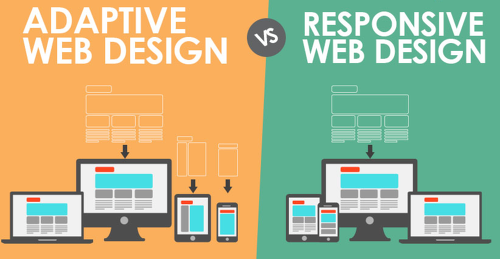
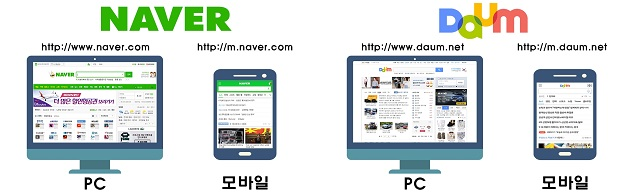

우선 반응형웹 말고도, `적응형웹`이라는 녀석도 있습니다.

적응형웹은 서버사이드에서 클라이언트의 정보를 받아 조건에따라 정해진 화면을 보여줍니다.

반응형 웹은 하나의 템플릿을 사용하여 모든 기기에 대응하는 반면, 적응형 웹은 기기 유형에 따라 별도의 `독립적인 템플릿` 이 요구됩니다.



<br>

네이버나 다음에서 적응형웹을 쉽게 볼 수 있는데요.

모바일환경에서 기존 사이트 주소로 접속할 경우, 서버 또는 브라우저에서 이를 감지하여 모바일 전용페이지로 redirection합니다.




예를들어 데스크탑에서 접속하는 "www.naver.com"과 모바일에서 접속하는 "m.naver.com"이 보여주는 화면, 구성요소들이 비슷하지만 전혀 다른 내용들인것을 생각하면 이해가 쉽습니다.

<br>


## 적응형웹과 반응형웹의 차이

---

### 기기감지

적응형웹 : 서버 또는 브라우저 기반의 기기 감지 방법을 사용하여 각 기기에 적합한 UI템플릿을 제공합니다.

반응형웹 : 미디어쿼리를 사용하여 기기의 화면 해상도크기를 감지한 후, 화면 크기에 맞게 하나의 UI템플릿을 변경합니다.

<br>


### 콘텐츠 최적화

적응형웹 : 감지된 기기에 최적화된 리소스만 다운받아서 사용합니다.

반응형웹 : 모든 콘텐츠를 다운로드한 후, 일부 콘텐츠만 사용합니다.

<br>


### 기기 특성별 처리 방법

적응형웹 : 준비된 템플릿이 기기의 크기에 따라 다르기 때문에 사이트 동작 또한 기기 유형에 맞게 변경됩니다.

반응형웹 : 하나의 템플릿이 기기에 상관없이 사용되기 때문에 사이트의 동작 또한 모두 동일하게 적용됩니다.

<br>


### 로딩 속도

적응형웹 : 감지된 기기에 최적화된 리소스만 다운받기때문에 로딩속도가 빠릅니다.

반응형웹 : 모든 콘텐츠를 다운로드하기에, 로딩속도가 느립니다.

<br>


### 개발 / 배포

적응형웹 : 기기별로 다른 템플릿을 생산해야합니다. 각 기기 별 기획/디자인이 다르기때문에 개발단계에서 비교적 많은 시간이 필요합니다.

반응형웹 : 하나의 템플릿을 생산하지만, 모든 기기에서의 사용자 인터렉션을 고려해야합니다. 

<br>

---

`음, 이런것들이 있구나` 하고 넘어가고 반응형 웹에 대해서 더 알아보고자 합니다.

<br>


## 뷰포트

---

뷰포트란, 웹페이지가 사용자에게 보여지는 영역을 의미합니다.

데스크탑에서 브라우저의 크기를 줄이면 스크롤이 생기면서 웹페이지 내용이 일부분만 표시됩니다!

이럴때에도 브라우저에 보여지는 부분이 뷰포트입니다!

이렇게 뷰포트를 조절할 수 있는 데스크탑과 달리, 모바일에서는 브라우저의 크기를 변경할 수 없습니다.

meta태그를 사용하여 이러한 뷰포트의 크기를 조절해서 모바일기기에서도 실제 렌더링되는 영역을 조절해줄 수 있습니다.

```html
<meta name="viewport" content="width=device-width", initial-scale=1.0">
```

- width=device-width : 페이지의 너비를 기기의 스크린너비로 설정합니다.

  즉, 렌더링 영역과 뷰포트의 크기를 같게 만들어 줍니다.

- initial-scale=1.0 : 첫 페이지 로딩시 확대/축소가 되지않은 원래 크기를 사용하도록 지정합니다.

- viewport를 지정해주지않는다면, 기본적으로 웹페이지는 980px을 기준으로 렌더링합니다.


아주 유용한 옵션이 또 있는데요.

사용자의 핀치 투 줌과같은 행동을 막기위한 옵션또한 존재합니다.

예를들어, 모바일 네이버에서 두손가락을 사용한 줌인/줌아웃이 안되는것을 떠올려보면 무엇인지 느낌이 올 것입니다!

또한, 구글맵에서 두 손가락으로 확대하면 지도만 확대되고 웹페이지 전체는 확대를 방지하는 경우에도 사용할 수 있습니다.

```html
<meta name="viewport" content="width=device-width, initial-scale=1.0, minimum-scale=1.0, maximum-scale=1.0, user-scalable=no"> 
```

<br>


## 미디어쿼리

---

출력장치의 여러 특징 가운데 일부를 참조하여 CSS코드를 분기처리함으로써, 하나의 HTML 소스가 여러가지 뷰를 갖도록 구현할 수 있는 명세입니다.

반응형 웹을 만들때 우선적으로 고려해야할 것이 있는데요. 

스타일을 작성하는 기준을 모바일을 우선으로 할 것인지, 데스크탑을 우선으로 할 것인지를 먼저 고려해야 합니다.

요즘엔 대부분 모바일을 우선으로 한다고 합니다.

CSS의 Override특징을 활용하여 코드를 작성하게 됩니다.

모바일을 우선할 경우에는 다음과 같은 순서로 CSS를 작성하게 됩니다!

```CSS
// style.css

1. 기본 CSS를 작성합니다.
/* 기본으로 작성하는 CSS는 min-width 576px보다 작은 화면에서 작동하게 됩니다! 즉, 모바일에서 적용될 css를 먼저 작성하는 것입니다. */

2. 
@media screen and (min-width: 576px) {
  /* 가로 해상도가 576px보다 큰 화면에 적용됩니다. */
}
@media screen and (min-width: 960px) {
  /* 가로 해상도가 960px보다 큰 화면에 적용됩니다!*/
}
```

- 미디어쿼리는 대부분의 최신 브라우저에서 잘 동작한다고 합니다!

  인터넷 익스플로러는 9버전부터 지원합니다!

미디어쿼리를 link태그에 미리 지정하는 방법도 있습니다.

```html
<link rel="stylesheet" media="(min-width: 960px)" href="desktop.css" />
```

<br>

<br>

---

반응형웹에대해 알아보며, 간단하게 적응형웹도 알아보았는데요.

사실 회사에서 사용하는 방식이 오롯이 반응형인줄 알았지만, 완전한 반응형은 아니고 적응형의 개념또한 섞여있었고.. 

또한 이 외에 Standalone mobile design의 개념까지 알게되었습니다!


------


### Reference

https://www.samsungsds.com/global/ko/support/insights/Responsive-Web-2.html

https://offbyone.tistory.com/110

https://junistory.blogspot.com/2017/06/n.html

[https://hashcode.co.kr/questions/5857/%EA%B0%95%EC%9D%98-3-7-%EB%B0%98%EC%9D%91%ED%98%95%EC%9B%B9%EA%B3%BC-%EC%A0%81%EC%9D%91%ED%98%95%EC%9B%B9%EC%9D%98-%EC%B0%A8%EC%9D%B4%EC%A0%90%EC%9D%80-%EB%AC%B4%EC%97%87%EC%9D%B4-%EC%9E%88%EB%82%98%EC%9A%94](https://hashcode.co.kr/questions/5857/강의-3-7-반응형웹과-적응형웹의-차이점은-무엇이-있나요)

https://m.blog.naver.com/PostView.nhn?blogId=moolsaess&logNo=221159667085&proxyReferer=https%3A%2F%2Fwww.google.com%2F

https://maroonmaro.tistory.com/23