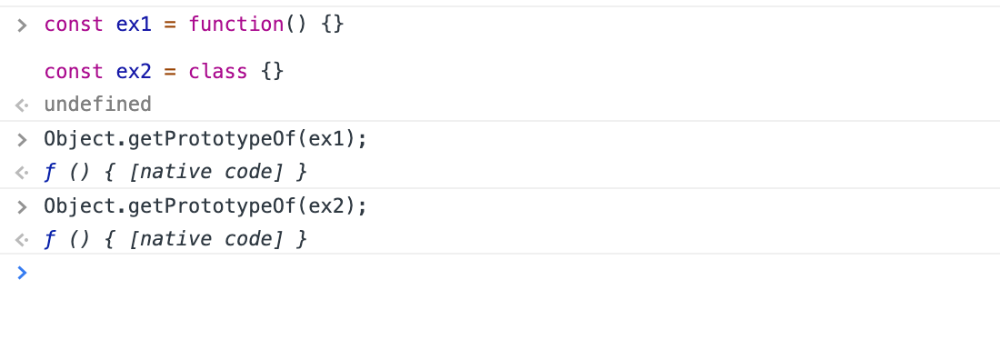
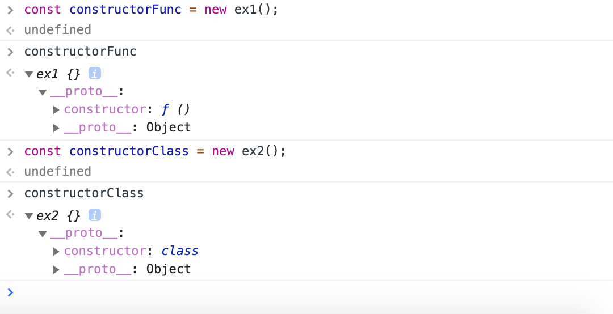
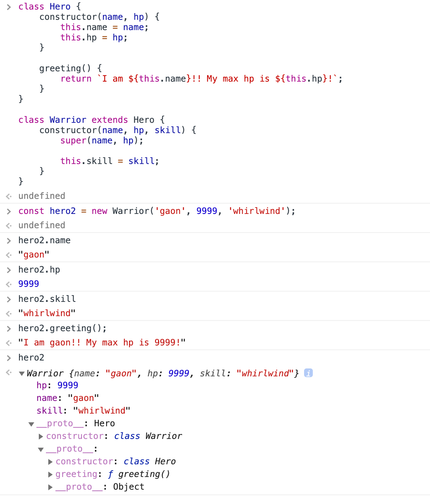

## 1. class도 function이다.

------

```javascript
const ex1 = function() {}

const ex2 = class {}
```

코드를 작성하기에 앞서, MDN에서 찾아본 **Object.getPrototypeOf(obj)** 의 사용법은 다음과 같습니다.

> " 지정된 객체의 프로토타입(  [[Prototype]]  )을 return 합니다. "

---

```javascript
var mother = {name: 'hahaha'};

var child = Object.create(mother);

Object.getPrototypeOf(child) === mother;	//true
```

---

```javascript
Object.getPrototypeOf(ex1);		// ƒ () { [native code] }
Object.getPrototypeOf(ex2);		// ƒ () { [native code] }
```


### function 과 class 모두 다 function [[Prototype]]을 return하고 있습니다.





### 이 때, ex1과 ex2로 constructor instance를 생성해보면 다음과 같습니다.





## 2. 클래스 선언

------

### es2015에서 class가 소개되기 이전엔 객체지향 디자인 패턴을 모방하기위해 **생성자 함수** 를 이용해 왔습니다.

```javascript
function Hero(name, hp) {
	this.name = name;
	this.hp = hp;
}
```

```javascript
class Hero {
	constructor(name, hp) {
		this.name = name;
		this.hp = hp;
	}
}
```


## 3. 메소드 선언

------

```javascript
function Hero(name, hp) {
	this.name = name;
	this.hp = hp;
}

Hero.prototype.greeting = function() {
	return `I am ${this.name}!! My max hp is ${this.hp}!`;
}
```

```javascript
class Hero {
	constructor(name, hp) {
		this.name = name;
		this.hp = hp;
	}
	
	greeting() {
		return `I am ${this.name}!! My max hp is ${this.hp}!`;
	}
}
```


## 4. 클래스 확장

------

```javascript
function Hero(name, hp) {
	this.name = name;
	this.hp = hp;
}

Hero.prototype.greeting = function() {
	return `I am ${this.name}!! My max hp is ${this.hp}!`;
}

function Warrior(name, hp, skill) {
	Hero.call(this, name, hp);
	
	this.skill = skill;
}
```

```javascript
const hero1 = new Warrior('junwoo', 150, 'dash');
```


```javascript
class Hero {
	constructor(name, hp) {
		this.name = name;
		this.hp = hp;
	}
	
	greeting() {
		return `I am ${this.name}!! My max hp is ${this.hp}!`;
	}
}

class Warrior extends Hero {
	constructor(name, hp, skill) {
		super(name, hp);
		
		this.skill = skill;
	}
}
```

```javascript
const hero2 = new Warrior('gaon', 9999, 'whirlwind');
```




## 5. 결론

------

class 재미지다..