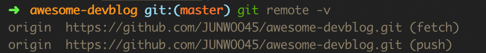
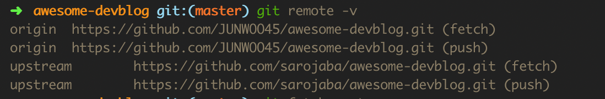
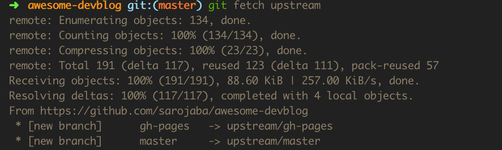
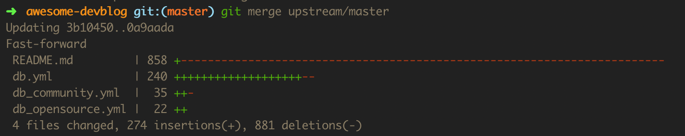
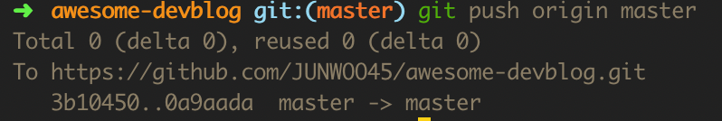

오픈소스를 Fork해서 만지작거리는 일이 많은데요.

이렇게 만지작거리는 사이에 원본 저장소가 업데이트되는 일이 빈번해서 곤란한 경우가 가끔 있습니다.

Fork를 삭제하고 다시 Fork했던 지난날의 모습을 부끄러워하고 반성하며,

Fork받은 저장소를 최신 원본으로 동기화하는 방법을 정리해보려고 합니다.

---


1.우선 현재 저장소의 원격 주소를 확인합니다.

```
$ git remote -v

origin  https://github.com/USERNAME/FORK_REPO.git (fetch)
origin  https://github.com/USERNAME/FORK_REPO.git (push)
```




2.원본 저장소의 원격 주소를 추가합니다.

```
$ git remote add upstream https://github.com/ORIGINAL_OWNER/ORIGINAL_REPO.git
```


3.원본 저장소의 원격 주소가 잘 추가되었는지 확인합니다.

```
$ git remote -v

origin  https://github.com/USERNAME/FORK_REPO.git (fetch)
origin  https://github.com/USERNAME/FORK_REPO.git (push)
upstream  https://github.com/ORIGINAL_OWNER/ORIGINAL_REPO.git (fetch)
upstream  https://github.com/ORIGINAL_OWNER/ORIGINAL_REPO.git (push)
```




4.원본을 fetch합니다.

```
$ git fetch upstream

remote: Enumerating objects: 134, done.
remote: Counting objects: 100% (134/134), done.
remote: Compressing objects: 100% (23/23), done.
remote: Total 191 (delta 117), reused 123 (delta 111), pack-reused 57
Receiving objects: 100% (191/191), 88.60 KiB | 257.00 KiB/s, done.
Resolving deltas: 100% (117/117), completed with 4 local objects.
From https://github.com/ORIGINAL_OWNER/ORIGINAL_REPO
 * [new branch]      master     -> upstream/master
```




5.upstream/master를 나의 master에 합치기

```
$ git merge upstream/master

Updating 3b10450..0a9aada
Fast-forward
 README.md         | 858 +-------
 db.yml            | 240 ++++--
 db_community.yml  |  35 ++-
 db_opensource.yml |  22 ++
 4 files changed, 274 insertions(+), 881 deletions(-)
```




6.나의 원격저장소에 push합니다.

```
$ git push origin master

Total 0 (delta 0), reused 0 (delta 0)
To https://github.com/USERNAME/FORK_REPO.git
   3b10450..0a9aada  master -> master
```

