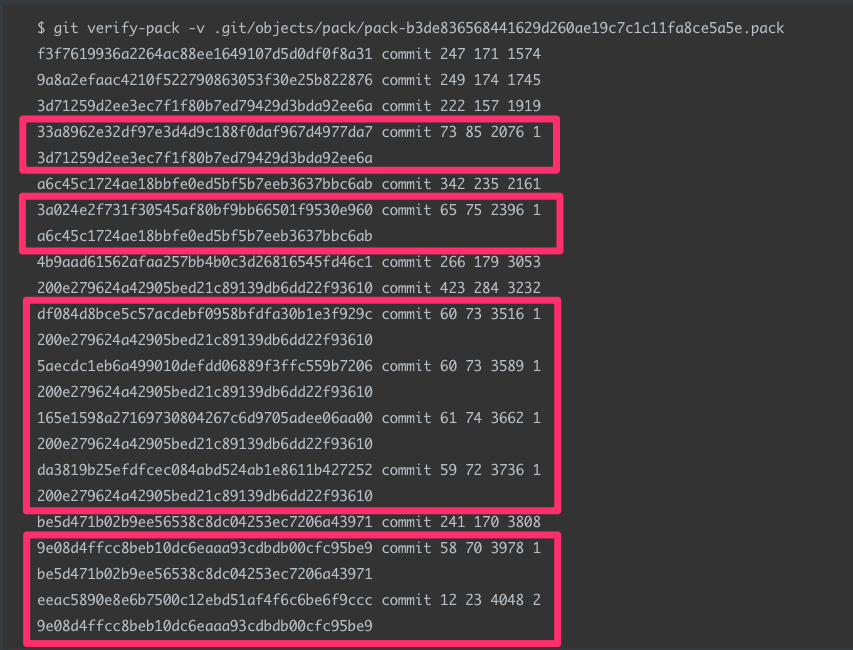

저는 git을 잘다루고 싶습니다.

그러려면 공부를 열심히 해야겠고, 평소에도 잘 사용해야겠져..

아, 좀 더 구체적으로 git을 CLI로 잘 다루고 싶습니다.

왜냐면 멋있어서....

 

# git의 저장방식

---

> "git이 단순히 스냅샷으로만 관리한다라는 말은 맞으면서도 잘못된 말입니다.
>
> git은 각 시점의 스냅샷을 저장하고, 또 그 스냅샷들 사이의 델타 또한 저장합니다."

  

커밋을 하면, git은 기본적으로 스냅샷을 저장합니다.

예를 들어보면,

처음 snapshot.txt파일을 커밋하면 rev1에 저장됩니다.

그리고 snapshot.txt파일을 수정한 뒤 또 커밋하게되면, 이젠 rev2에 저장이 됩니다.

이때 rev2에는 snapshot.txt파일이 통째로 저장이 됩니다.

즉, `.git` 저장소에는 rev1일 때의 snapshot.txt파일과 rev2일 때의 snapshot.txt가 모두 들어있는 것이죠.

그림으로 보면 다음과 같습니다.

하지만 git은 이렇게 스냅샷만 저장하지 않습니다.

앞서 말했듯이 델타도 저장하는데요.

델타란, 저장소의 이전버전과 다음버전의 변경내역의 차이라고 생각하면 됩니다.

사실 델타는 git을 사용한다면 매일매일 보아왔던 녀석인데요.. 

예를 들면 원격저장소에 코드를 push할 때… 

이렇게 우리는 매일 delta를 보고 있었습니다.

다시 본론으로 돌아가서...

git은 적절한 시점, 그리고 적절한 방식..... 즉 Garbage Collection이 실행되며 저장방식이 바뀌게 됩니다.

마지막 버전의 파일 하나만 스냅샷방식으로(**통째로**) 저장하고, 그 이전 버전들은 모두 델타를 저장하게 바뀝니다.

따라서 위 이미지같은 상황에서 rev4를 요구한다면, rev6의 스냅샷에서 rev5, rev4의 델타를 적용해서 보여주게 됩니다.

처음과 같은 방식에서는 1kb짜리 스냅샷을 계속 통째로 저장하기에, 100개의 수정과 저장을 반복하게된다면 100kb의 용량이 되버립니다.

하지만 이렇게 마지막 버전만 스냅샷으로 저장하고 그 이전버전들은 델타를 저장하게 된다면, 100번을 수정하더라도 1kb에서 크게 증가하지는 않게 됩니다.

게다가 gzip으로 압축을 진행하기때문에 더더욱 효율적입니다.

 

..로 끝나면 좋았겠지만,

**사실** git이 마지막 버전의 파일 하나만 스냅샷 방식으로 저장하고, 그 이전 버전들은 모두 델타를 저장한다는 말도 100% 맞는건 아닙니다.

400줄의 코드에서 4줄의 코드가 추가되는 등의 작은 변화같은 경우에는 델타로 저장해도 무리가 없습니다.

하지만 400줄의 코드에서 2000줄의 코드가 추가되는 변화같은 경우, 델타로만 저장하기에는 성능상의 이슈가 생기겠죠?

 

`$git push` 명령어를 사용할 때 마다, git은 파일을 하나 만드는데요.

기존의 `objects` 디렉토리 안에 저장되어있는 파일들을 바이너리 방식으로 저장하고 `pack` 이라는 하나의 파일로 압축합니다.

[git의 내부](https://junwoo45.github.io/2019-07-07-git의내부/){:target="_blank"} 포스팅에서 보았던 그 objects 디렉토리가 맞습니다!

(git gc가 동작할때도 pack파일이 만들어지지만 git gc는 왠만해서는 동작하지 않습니다.)

pack파일을 들여다보면 다음과 같은데요.

pack파일 내부의 객체들은 델타화된 객체와 그렇지 않은 객체(스냅샷)으로 구분할 수 있습니다.

저렇게 빨간 네모박스들은 델타화된 객체입니다. 마지막에 해시값이 또 써져있네요.

델타는 앞서 말했듯이 전체를 저장하는 대신, 오직 차이점(**diff**)만을 저장한다는 의미입니다.

실제로, `$ git verify-pack` 명령어를 사용하면 위 그림에서 다음 줄로 넘어가 보이는 마지막 SHA는 한 줄로 출력됩니다.

저 마지막 SHA는 델타의 base 객체를 뜻합니다.

구체적으로 살펴보겠습니다.

첫번째 네모박스의 `33a8962e32df97e3d4d9c188f0daf967d4977da7` 와 그 아래 박스의 `3a024e2f731f30545af80bf9bb66501f9530e960`는 델타입니다.

각각 `3d71259d2ee3ec7f1f80b7ed79429d3bda92ee6a`와 `a6c45c1724ae18bbfe0ed5bf5b7eeb3637bbc6ab` 를 base객체로 가지고 있습니다.

base 객체 이전에 쓰여있는 1과 2라는 수는 객체의 depth를 의미합니다.

가장 밑의 박스를 보면 이해하기 쉬운데요.

`eeac5890e8e6b7500c12ebd51af4f6c6be6f9ccc` 의 base 객체인 `9e08d4ffcc8beb10dc6eaaa93cdbdb00cfc95be9` 는 바로 윗줄을 보면 알 수 있듯이  `be5d471b02b9ee56538c8dc04253ec7206a43971` 를 base 객체로 가지고 있는 델타이기에 depth가 2입니다.

---
 

이렇듯 git은 스스로 비교하여 델타로 저장할지, 아니면 스냅샷으로 저장할지 판단하여 영리하게 저장을 합니다.

사실 저는 다들 git을 쓰니깐 git을 썼는데요. ~~뭔소리야;~~

근데 git의 똑똑함(?)을 알고나니깐, 왜 git이 이렇게 널리 쓰이게 되었는지 조금 알 것 같기도 합니다.

---

<small>참고로, push할 때 늘 보아왔던 저 밑줄의 의미는 Total 6개의 Objects 중 4개가 delta로 저장되어 있다는 의미입니다! 매일 push를 하면서 매일 저 단어들을 봤을텐데 이제서야 그 의미를 알게되었네요;</small>

---

### Reference

- [https://www.youtube.com/watch?v=sH5_uRbaWLo&list=PLq7lxfc2HLJCA99u0YHLGUeyCoeEaxRA7&index=1](https://www.youtube.com/watch?v=sH5_uRbaWLo&list=PLq7lxfc2HLJCA99u0YHLGUeyCoeEaxRA7&index=1){:target="_blank"}
- [http://dogfeet.github.io/articles/2012/git-delta.html](http://dogfeet.github.io/articles/2012/git-delta.html){:target="_blank"}
- [https://codewords.recurse.com/issues/three/unpacking-git-packfiles](https://codewords.recurse.com/issues/three/unpacking-git-packfiles){:target="_blank"}
- [https://git-scm.com/book/ko/v1/Git%EC%9D%98-%EB%82%B4%EB%B6%80-%EC%9A%B4%EC%98%81-%EB%B0%8F-%EB%8D%B0%EC%9D%B4%ED%84%B0-%EB%B3%B5%EA%B5%AC](https://git-scm.com/book/ko/v1/Git의-내부-운영-및-데이터-복구){:target="_blank"}

