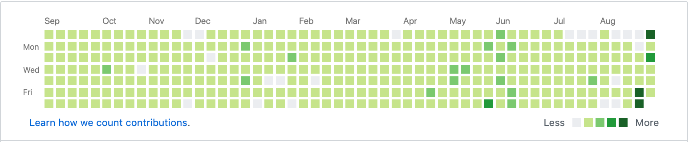
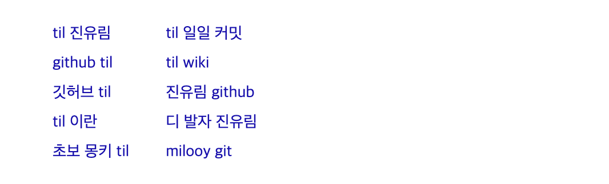
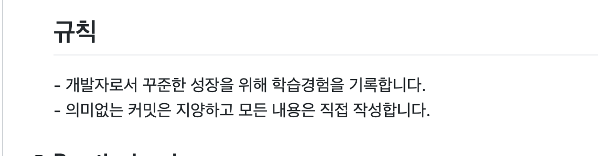
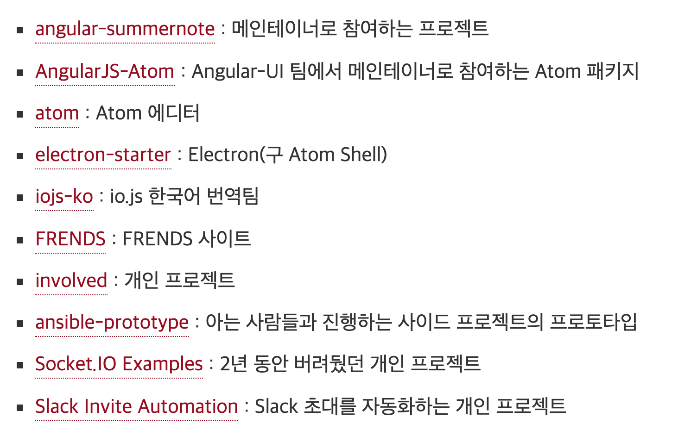
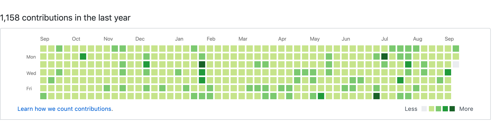

저는 개발자분들의 블로그나 NHN이나 네이버, 우아한형제들같은 회사 기술 블로그를 굉장히 좋아합니다.

개발 공부를 이제 막 시작한, 1년 전 어느날도 평소와 마찬가지로 여러 기술블로그들을 탐닉하는 와중.. 우연히 1일1커밋이라는 글을 봤습니다. 또 어디선가는 TIL이라는 글도 봤습니다.

이 TIL과 일일커밋에 관한 포스팅들이 웹에는 정말 많더라구요.

그래서!

저도 발가락을 담가봤습니다.

<small>
짜잔! 매우 옅은 커밋의 흔적 하하하!
</small>

이미 기존의 TIL이나 일일커밋에 관한 좋은 글들이 너무 많아서 `어떤 내용을 써봐야하나..`  생각하며 키보드에 손 올린 채 몇 분이나 생각해봤는데 딱히 `이거다!` 하는 게 없었습니다(...)

그래서 제가 TIL을 진행하면서 찾아봤던, 우연히 읽어봤던 좋은 글들과 함께 가보려고합니다. ~~얹혀가기~~

제가 도움을 받았던 TIL과 일일커밋에 관한 좋은 글들을 모아두고, 거기에 더해 제가 TIL을 진행하며 느낀점도 적어보려고합니다.

이 글이 이제 막 TIL이나 일일커밋을 시작하신 분들이나, 시작하시려는 분들에게도 조금이나마 도움이 되었으면 좋겠습니다.  

 

## 자극받아 시작하기

---

저는 Jbee님의 [나는 어떻게 개발 공부를 했나, 2편](https://jbee.io/essay/how_do_i_study_2/){:target="_blank"} 을 보고 TIL을 시작했습니다.

> 틀리면 뭐 어떤가요? 틀려도 됩니다. 다만 잘못된 정보를 공유하지 않기 위해 많이 노력해야 합니다. 

틀려도 된다니..

무얼 어디서부터 시작해야할지 모르는 사람에게 자신감을 가지고 글을 써보게하는 참으로 마법같은 문장입니다.

저도 저 문장을 보고 자신감을 얻어서 저장소를 만들었습니다. 

 

제가 다음으로 자극을 받았던 글은 초보몽키님의 [6개월간의 TIL 회고](https://wayhome25.github.io/til/2017/08/14/TIL-for-6-months/){:target="_blank"} 입니다.

초보몽키님은 구글에 `TIL` 을 검색하면 연관검색어로 뜰 정도로 유명하시죠.

초보몽키님은 정말 섬세하고 꾸준하게 TIL을 진행하며 기록을 남기셨는데요. TIL을 통해 면접기회를 얻고 덕분에 신입 개발자로서 일을 시작하게 되었다는 말에 `동기부여`를 받았습니다.  

 

초보몽키님과 더불어 TIL이라고 검색하면 연관검색어에 뜨는 진유림님 블로그.

진유림님의 블로그를 보다보면 언제 무엇에 관심이 있으셨는지 흐름을 알 수 있을만큼 기록을 잘, 그리고 많이 해놓으셨습니다. 보다보면 시간이 훌쩍가요..

진유림님의 글 [일일커밋- 100일 회고](https://milooy.wordpress.com/2015/10/08/daily-commit/){:target="_blank"} 와 [일일커밋 - 1년 회고](https://milooy.wordpress.com/2016/07/02/daily-commit-1-year/){:target="_blank"} 또한 읽고나면 `나도 얼른 시작해야겠다.` 라는 마음이 충만해집니다. 동기부여의 선봉장..

아마 많은 분들이 이 블로그 포스팅을 보고 TIL이나 일일커밋을 진행하셨을겁니다.

저는 진유림님의 포스팅을 읽고, `나도 TIL에 원칙을 정해야겠구나.` 라고 생각을 하여 저장소에 규칙을 적어놓았습니다.

<small>
부끄럽게도, 고작 2개뿐인 규칙은 일관성 있게 지켜지지 못했습니다.
</small>  

 

## 아직 멀었구나

---

Outsider's Dev Story는 정말 보물단지 블로그입니다. 글 하나하나에 깊은 내공이 느껴지는..

개인적으로 이 분의 생각, 철학을 많이 닮고 싶습니다. 

Outsider님도 [일일커밋에 관한 포스팅](https://blog.outsider.ne.kr/1141){:target="_blank"} 을 올리셨는데요. 

포스팅 한 줄 한 줄에 본인의 생각과 고민이 담겨있는 것이 굉장히 인상적입니다.

여담으로, 저도 앞으로 블로그에 저의 생각을 많이 담고 싶습니다.  

 

Outsider님이 진행하신 일일커밋은 제가 진행한 TIL과는 궤를 달리하는 어나더레벨 수준인데요.

<small>
outsider님은 mocha 메인테이너 이시기도 하다.
</small>

outsider님의 일일커밋 포스팅을 보며 너무 지식의 습득에만 한정된 TIL이 아닌, 현장감있는 코딩 그 자체에 집중해야함을 느껴 반성하는 계기가 되었습니다.  

 

joshua 님의 [2017년 회고](http://blog.devjoshua.me/2017/12/28/171228-2017년회고/){:target="_blank"} 에는 **1일 1커밋, 그리고 학습에 실패한 경험** 이라는 주제가 있습니다.

1년간 TIL을 진행한 지금에 와서야 더더욱 깨닫고 공감이 많이 가는 글입니다.

`학습에 실패한 경험`은 우아한형제들 기술 블로그의 [남규진님이 쓰신 글](http://woowabros.github.io/experience/2017/12/11/how-to-study.html){:target="_blank"} 에서도 뼈를 맞아서 많이 아팠던 내용인데요..🥊 

저도 단순히 1일1커밋을 채우기위해, 컨트리뷰션에 잔디를 심기위해 TIL을 작성한 경험이 있습니다.

사실 부끄럽게도 많습니다 -_-;;

너무 편안한 학습 방법을 버리고 앞으로는 더 귀찮고 힘든 학습 방법을 취해야함을 느낍니다.  

 

마지막으로, 이제 TIL을 시작했거나 시작하시려는 분들께 jojoldu님의 [일일커밋의 효용](https://jojoldu.tistory.com/402){:target="_blank"} 이라는 글을 추천합니다.

jojoldu님은 [주니어 개발자 채용 정보](https://github.com/jojoldu/junior-recruit-scheduler){:target="_blank"} 저장소를 운영하고 계시기도 합니다.

<small>
무려 2016년부터 지금까지 일일커밋을 진행중이신 jojoldu님. 정말 대단하시다.
</small>  

 

jojoldu님의 포스팅은 채찍보다는 당근과 케익 그리고 심지어 사탕까지 던져주시는데요.

아무래도 저는 당근파인가봅니다.

jojoldu님의 포스팅을 보고 힘도 나고 의욕도 많이 생겼습니다.

일일커밋의 효용 포스팅에 이런 내용이 있습니다.

> 오늘 뭐라도 하나 했다는 것,
>
> 조금씩이나마 진행되는게 있다는 것,
>
> 어제보다 나아지고 있다는 것,
>
> 경험치가 쌓이듯이 차곡차곡 쌓이는게 있다는 것

저도 이러한 심정으로 TIL을 진행한 것 같습니다.

어제보다 조금, 아주 조금씩이라도 나아지고 있다는게 눈에 보인다는 것.

성취가 눈에 보인다는 것은 훌륭한 기폭제이자 꾸준히 걷게 해주는 원동력같습니다.  

 

## 그래서 앞으론?

---

계속 해보려합니다.

사실 처음엔 100일만 해보려했습니다.

그러다 저도 모르게 100일이 지나서, `깔끔하게 200일까지 해보자.` 라고 하다보니 어느새 1년이 되었네요.

군데군데 커밋을 하나도 하지 않은 날도 많고 커밋양 자체도 많지 않지만.. 반성할 건 반성하고 앞으로 나아지면 되니깐요.

그래서 앞으로는 반성의 일환으로 TIL에서 일일커밋으로 방향을 조금 전환해보려합니다.

TIL은 `지식정리`의 느낌이 강한 반면, 일일커밋은 왠지 모르게 `코드 위의 전투적인 느낌`이 강해서요. ~~저는 강해질겁니다. 그리고 돌겨ㄱ...~~

 

매일 컨트리뷰션에 잔디를 심으며 `내가 잔디를 심으려고 TIL을 하는걸까? 아니면 TIL을 하다보니 잔디가 심어진걸까?` 라는 의문이 들기도 했습니다.

분명, 잔디를 심으려고 TIL을 억지로 진행한 날도 많았는데요.

스스로 혼란스러워 `이걸 이렇게라도 하는게 맞는건가.. 1년을 허송세월로 보낸건 아닐까?`라는 걱정이 들기도 했습니다.

그래도. 

그럼에도 이걸 계속 해보려는 이유는, `이렇게라도 꾸준히 무언가를 해보고 싶기 때문`입니다.

저 잔디 어딘가에서 배틀그라운드를 해보기도, 클래시오브클랜을 시작하기도 했는데요.

결국은 TIL이 게임을 이긴게 너무 기쁘고 심지어 자랑하고싶기도하네요;

저 잔디 어딘가에서 결혼을 하기도했고, 아주 귀여운 제 딸이 태어나기도 했습니다.

신혼여행에서 TIL을 할 수 있게 허락해준 와이프의 너그러운 허락도 저기 잔디 어딘가에 같이 심어져있기두 하겠네요. ~~지금은 새벽 3시.. 인간의 감성이 가장 풍부한 시간..~~

매일 저 작은 빈 칸을 채우기위해 무언가라도 공부하고 공부했던 것을 다시 정리해보는 것. 

그게 조금씩 습관이 되고 있다는게 뿌듯하고, 작지만 매일 성취감을 얻는다는게 발전에 도움이 되리라 믿습니다.

------

글을 어떻게 마무리 지어야 할지 모르겠네요.

읽어주셔서 감사합니다!

아, 문맥교정을 몇 번이나 거쳐야할 야생의 거친 글이어서 `어?이런 내용이 있었던거같은데 어디갔지??` 하실 수 있습니다.  

 

### Reference

- [Jbee님 블로그](https://jbee.io/essay/how_do_i_study_2/){:target="_blank"}

- [초보몽키의 개발공부로그](https://wayhome25.github.io/til/2017/08/14/TIL-for-6-months/){:target="_blank"}

- [진유림님 블로그](https://milooy.wordpress.com/2016/07/02/daily-commit-1-year/){:target="_blank"}

- [Outsider님 블로그](https://blog.outsider.ne.kr/1141){:target="_blank"}

- [joshua님 블로그](http://blog.devjoshua.me/2017/12/28/171228-2017년회고/){:target="_blank"}

- [우아한형제들 기술블로그](http://woowabros.github.io/experience/2017/12/11/how-to-study.html){:target="_blank"}

- [jojoldu님 블로그](https://jojoldu.tistory.com/402){:target="_blank"}

  

