지금이야 익숙해졌지만, 처음 터미널을 마주했을때는 이게뭔가..싶었습니다.

터미널에서 커맨드라인을 입력해서 무언가를 한다는것은 상상도 못했습니다.

익숙해진 지금도, 마우스나 트랙패드를 사용해서 파일을 생성하고, 이동시키고, 복사하고, 삭제하는 일이 빈번합니다.

---

### 커맨드라인이란 무엇일까요?

커맨드라인을 알기위해서는 우선 CLI와 GUI에대해 알고 넘어가는 것이 이해하기 좋습니다.

CLI(Command-Line Interface)는 텍스트기반의 응용프로그램입니다.

이와 반대로 GUI(Graphical User Interface)가 있는데요.
텍스트기반인 CLI와는 다르게 GUI는 그래픽기반의 응용프로그램입니다.

우리가 평소에 사용하는 Window의 제어판이나 MacOS의 파인더가 이러한 GUI의 대표적인 예입니다.

마우스로 클릭하고 들어가고, 그걸 눈으로 확인할 수 있게 시각화되어 보여지고. 아주 직관적입니다.

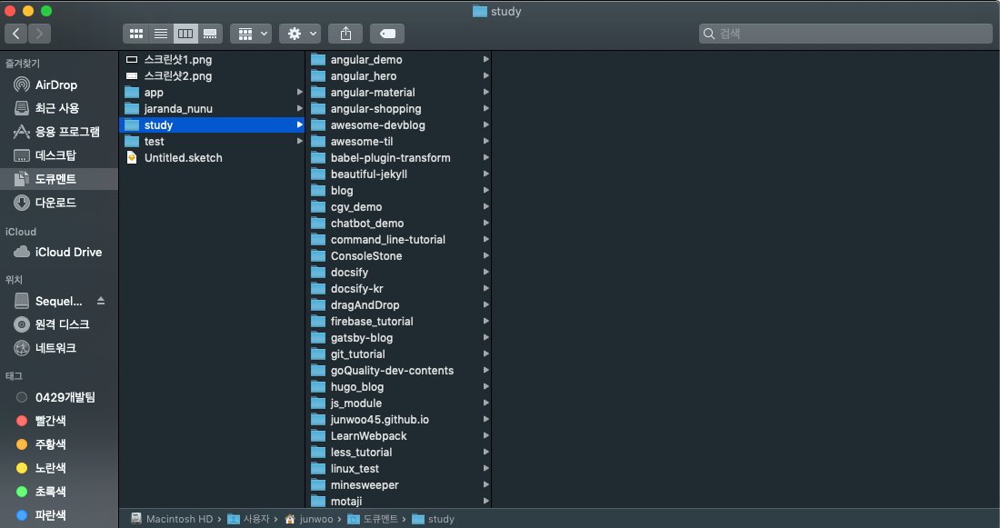

<center><small>바로 이런 finder가 GUI입니다.</small></center>
CLI는 이러한 일련의 과정이 그저 텍스트로 표현될 뿐, 하는 일은 같습니다.

이렇게 약속된 텍스트들을 명령어, 커맨드라인이라고 부릅니다.

위의 GUI에서는 `document/study` 디렉토리에 들어와있었는데요.

아래 터미널에서도 같은 디렉토리에 들어와있습니다.

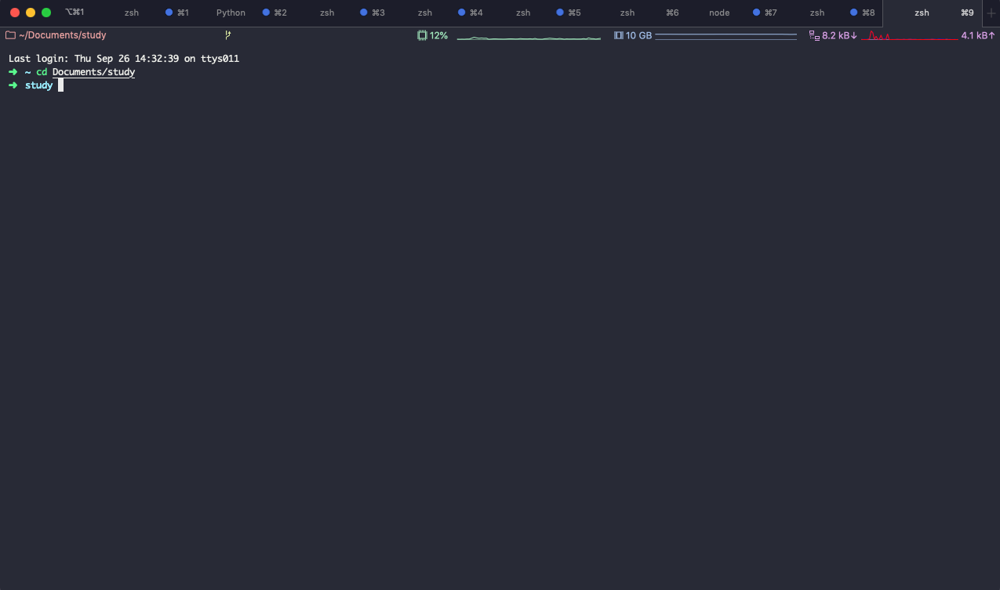

같은 study폴더 안으로 들어와있지만, GUI에서 폴더들이 보이는것과는 다르게 아무것도 안보입니다.

터미널에서는 다음과 같이 `ls` 명령어를 입력해야 내가 위치한 디렉토리에 어떠한 파일, 폴더들이 존재하는지 볼 수 있습니다.

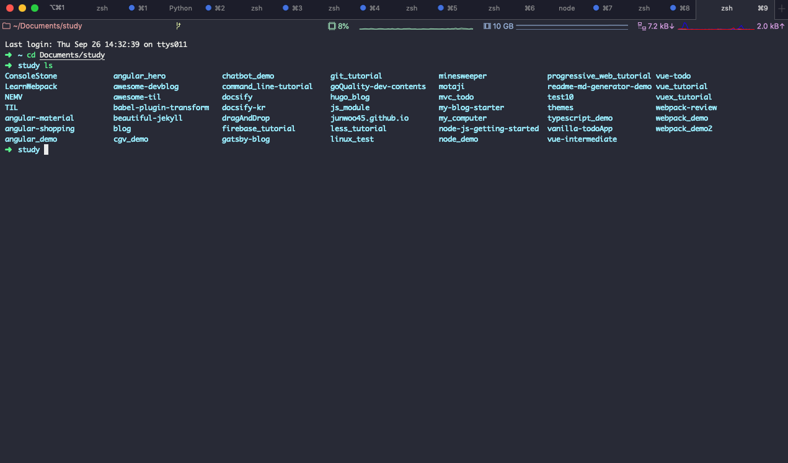

### 이번 포스팅에서는 터미널에서 자주 사용하는 이러한 **커맨드라인**에대해서 정리해보려고합니다.

<br>

------

## Commands

현재 내가 위치하고 있는 디렉토리를 보려면 터미널에 `pwd`라고 입력하고 엔터를 눌러주면 됩니다.

```
$ pwd
```


`pwd`는 **Print Working Directory** 의 약자입니다. 

> 낯설고 익숙하지도 않은 명령어들을 처음부터 준말로 외우려면 처음에야 괜찮지만 나중에는 헷갈립니다;
>
> 그래서 왠만하면 원말을 찾아보는편인데 이게 도움이 많이 됩니다.


`pwd` 명령어로 `내가 지금 위치`하고있는 장소를 알았다면, `이 장소에 무엇이 있는지` 알아야하겠죠.

이럴땐 처음 위에서 써봤던 `ls` 명령어를 사용합니다.


`ls` 는 **list** 의 준말입니다.


또한, 터미널에 명령어를 많이 입력해서 터미널이 굉장히 복잡해보일 수 있습니다.

이럴때는 `clear` 명령어를 입력하면 터미널이 깨끗해집니다. 


<center><small>편-안</small></center>
## 디렉토리 이동하기

------

지금 저는 `study` 폴더에 위치하고 있는데요.

다른 폴더로 이동하고 싶을때는 `cd` 명령어를 사용합니다.

`cd` 명령어는 **Change Directory** 의 약어입니다.

`TIL` 폴더로 이동해보겠습니다.

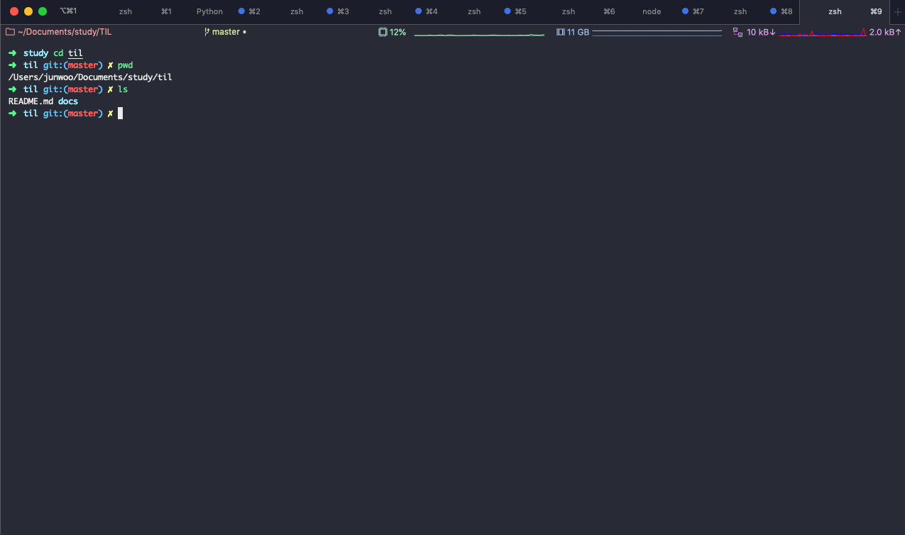

<center><small>참고로, 터미널에서는 대,소문자 구분을 하지 않으셔도됩니다.</small></center>
`pwd` 명령어와 `ls` 명령어를 사용해서 내가 어디있는지, 또 지금 여기엔 무엇이 있는지 확인해봤습니다. ~~나는누구 여긴어디~~

다시 이전 디렉토리로 되돌아가고 싶다면 `cd ..` 명령어를 입력해주면 됩니다.

```
$ cd ..
```

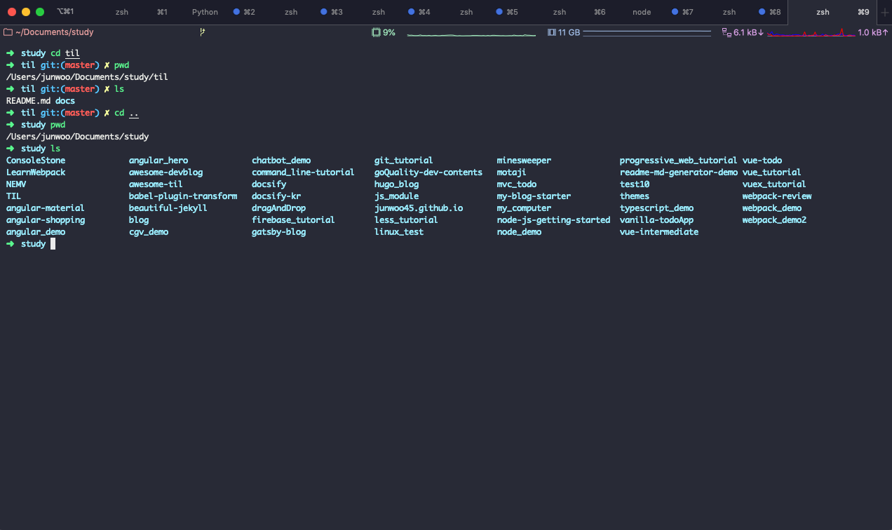

`cd ..` 명령어를 입력해주고 다시 `pwd` 와 `ls` 명령어를 입력해서 잘 되돌아온 것인지 확인해보았습니다. 이전 디렉토리로 잘 왔네요.

> 터미널에서 마침표 하나( . )는 현재 디렉토리를 의미하고, 마침표 두개( .. )는 이전 디렉토리를 의미합니다.


바로 이전 디렉토리로 이동하는것 뿐 아니라, 더 이전 디렉토리로 이동하는 것도 가능합니다.

`cd ../..` 를 입력해주면 전전 디렉토리로 이동할 수 있습니다.

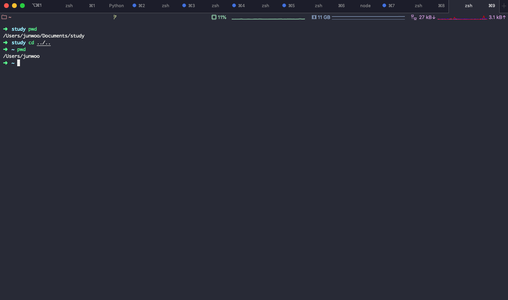

`pwd` 명령어로 현재 디렉토리를 확인해봅니다. `/Users/junwoo/Documents/study` 네요.

`cd ../..` 로 디렉토리를 이동한 다음 `pwd` 명령어를 사용해서 현재 디렉토리를 확인해봅니다. `/Users/junwoo` 입니다.

이제 어디든 이동할 수 있게되었습니다.

<br>

### 정리

---

| 명령어 | 의미                    | 설명                                 |
| ------ | ----------------------- | ------------------------------------ |
| pwd    | Print Working Directory | 현재 디렉토리 위치 확인              |
| ls     | List                    | 현재 디렉토리의 파일, 폴더 목록 출력 |
| cd     | Change Directory        | 디렉토리 이동                        |

<br>


## 폴더나 파일 만들기

------

우리가 마우스로 클릭하고 키보드로 폴더를 이동했던 모든 것들이 터미널에서도 가능합니다. 

~~단지 익숙해지기까지 불편할 뿐..~~

폴더를 만드려면 `mkdir` 명령어를 사용합니다.

`mkdir` 은 **Make Directory** 의 약어입니다.

저는 `command_line` 이라는 폴더를 만들겁니다.

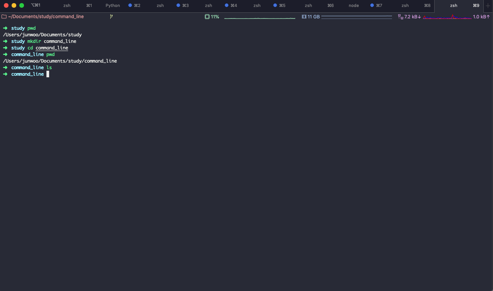

저는 지금 `study` 폴더에 들어와있구요. `pwd` 명령어를 사용해서 위치를 확인했습니다.

그리고 `mkdir command_line` 명령어를 사용해서 폴더를 생성했습니다.

그리고 `cd command_line` 명령어를 사용해서 `command_line` 폴더 안으로 이동했습니다.

`pwd` 로 폴더 내부로 잘 들어온 것을 확인했고, `ls` 로 어떤 파일들이 있는지 확인해봤지만 아무것도 안뜨는것을 보니 모든게 잘 동작했나봅니다.

폴더는 만들어봤으니, 이제 파일을 만들어보겠습니다.

파일은 `touch` 명령어로 생성할 수 있습니다.

```
$ touch index.html
```

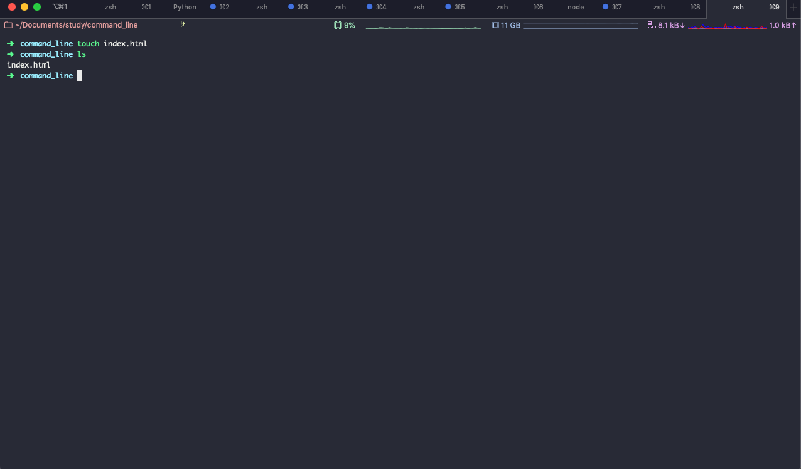

`touch` 명령어로 `index.html` 파일을 생성해주었고, `ls` 명령어로 현재 디렉토리에 어떤 파일들이 있는지 확인해보았습니다.

`index.html` 이 잘 생성되었습니다.

여러개의 파일을 한 번에 생성할 수 도 있습니다.

`touch one.txt two.txt three.txt four.txt` 처럼 띄어쓰기로 구분해주면 됩니다.

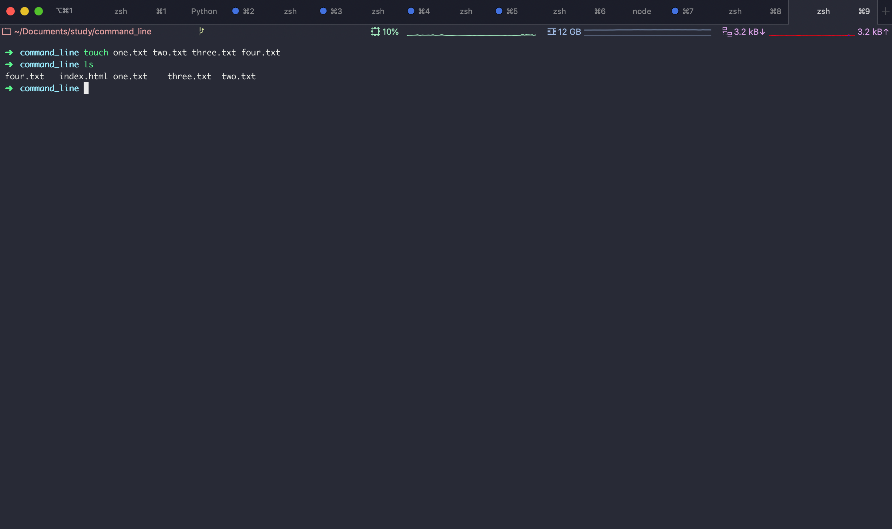

`ls` 로 확인해보니 잘 생성되었네요.

이렇게 생성한 파일들을 `cat` 명령어를 사용해서 읽을 수 있는데요.

`cat` 은 **Concatenate** 의 약어입니다.

```
$ cat one.txt
```

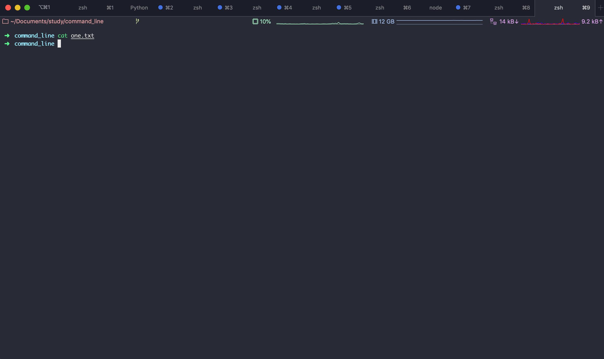

<center>
  <small>
  아무것도 작성한게 없으면 아무것도 없는게 세상 이치입니다..
  </small>
</center>

`echo` 명령어를 사용하면, 내용을 입력한 뒤에 파일을 생성할 수 있습니다.

```
$ echo "hello world" > five.txt
```

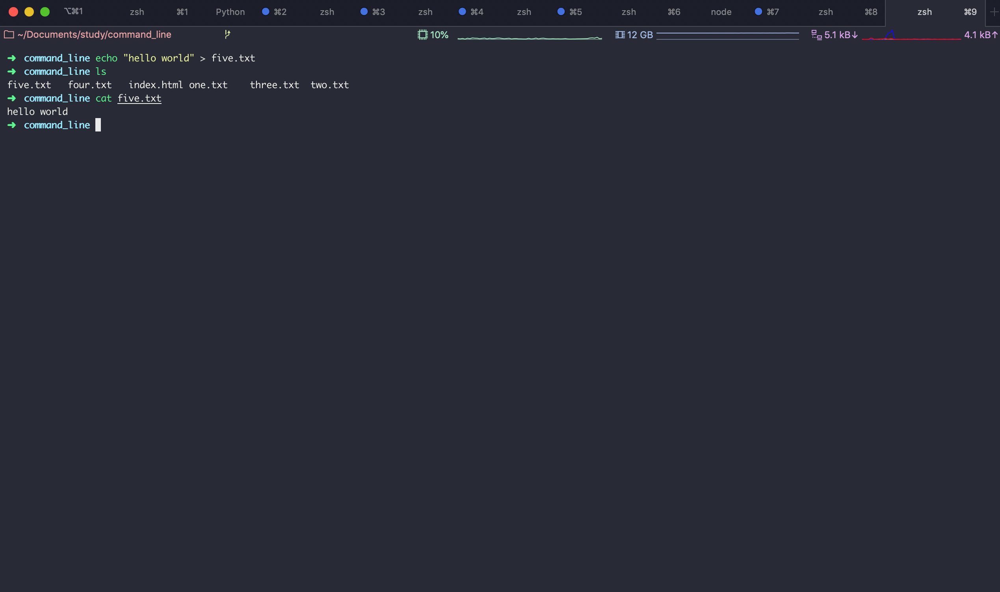

`echo` 명령어로 `hello world` 를 내용으로하는 `five.txt` 을 만들었습니다.

그리고 `cat` 명령어로 확인해보니 `hello world` 가 잘 출력됩니다.

 `five.txt` 를 또 덮어씌울 수 있는데요.

```
$ echo 'hi world' > five.txt
```

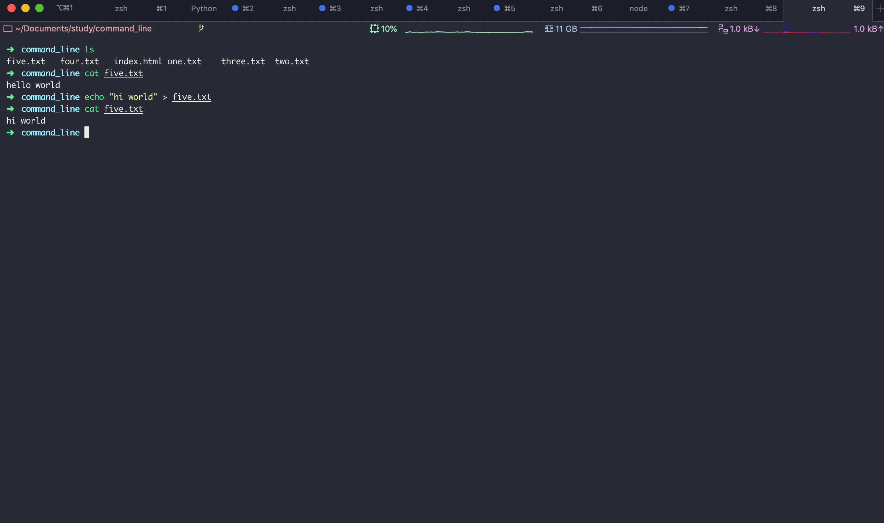

`echo` 는 사실 더 강력한 기능을 가지고 있지만, 여기서는 이 정도만 경험해보고 넘어갈게요!

<br>

### 정리

---

| 명령어 | 의미           | 설명               |
| ------ | -------------- | ------------------ |
| mkdir  | Make Directory | 폴더 생성          |
| touch  | Touch          | 파일 생성          |
| echo   | Echo           | 파일에 텍스트 추가 |
| cat    | Concatenate    | 파일 내용 보기     |

<br>

##  파일이나 폴더 삭제하기

파일은 `rm` 명령어로 지울 수 있습니다.

`rm` 은 ~~랩몬스터~~ **Remove** 의 약어입니다.

```
$ rm four.txt
```

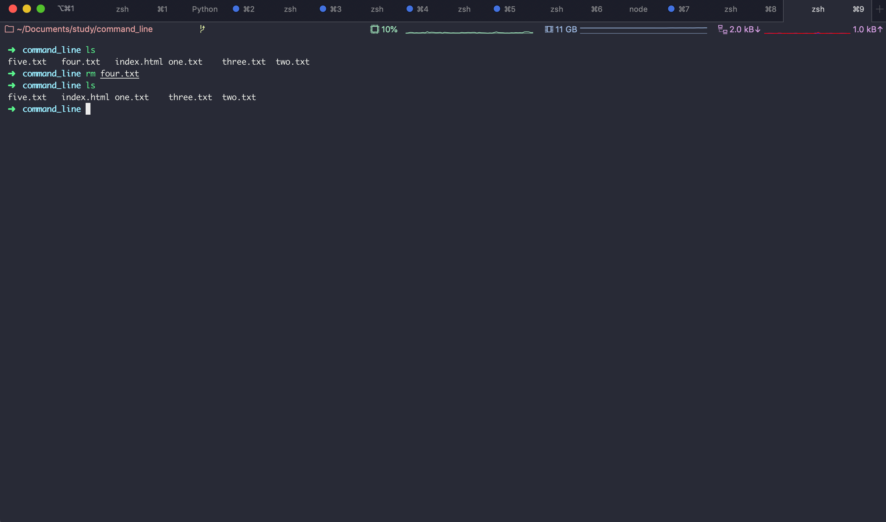

`rm` 명령어로 `four.txt` 파일을 삭제하고, `ls` 명령어로 지워졌는지 확인해보았습니다.

<br>

폴더는 `rmdir` 명령어로 지울 수 있습니다.

`rmdir` 은 **Remove Directory** 의 약어입니다.

```
$ rmdir customer
```

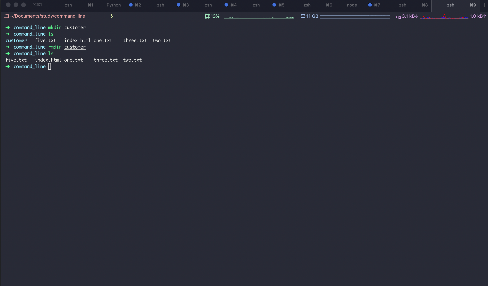

`command_line` 디렉토리에는 파일만 존재해서, `mkdir customer` 명령어로 폴더를 하나 생성해주었습니다.

그리고 `rmdir` 명령어로 폴더를 지우고 확인해보았습니다.

지금은 `customer` 폴더 안에 아무 파일도 없어서 쉽게 지울 수 있었습니다.

폴더 안에 파일이 있을때 지우는 방법은 조금 다른데요.

`rm -r` 명령어를 사용합니다.

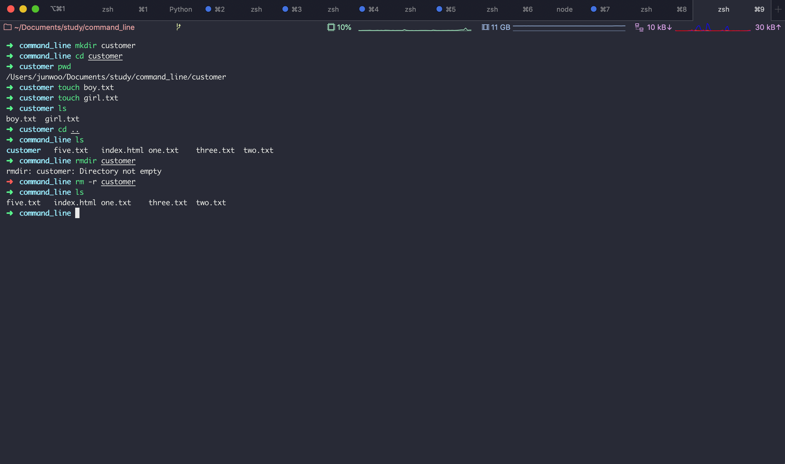

`customer` 폴더를 생성해주고, 그 안으로 들어갑니다.

그리고 `touch` 명령어로 `boy.txt`, `girl.txt` 파일을 생성해주고 확인합니다.

`cd ..` 명령어로 빠져나온 다음 `rmdir customer` 명령어를 실행해봤더니 `rmdir: customer: Directory not empty` 라는 문구가 출력되었습니다.

`rm -r` 명령어로 `customer` 폴더를 지웠더니 잘 동작합니다.

<br>

`rm` 명령어는 `touch` 와 마찬가지로 여러파일을 한번에 지울 수 있습니다.

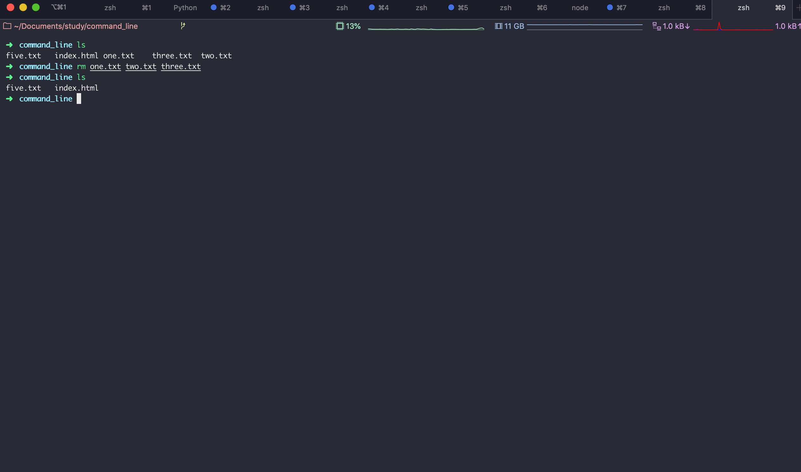

<center>
  <small>
  짜잔!</small>
</center>

<br>

### 정리

---

| 명령어 | 의미             | 설명      |
| ------ | ---------------- | --------- |
| rm     | Remove           | 파일 삭제 |
| rmdir  | Remove Directory | 폴더 삭제 |

<br>

## 파일이나 폴더 복사하기

------

제가 엄청 안쓰고, 이번 포스팅을 작성한 이유입니다. 이렇게라도 써보려구요.

파일은 `cp` 명령어로 복사합니다.

**Copy** 의 약어입니다.

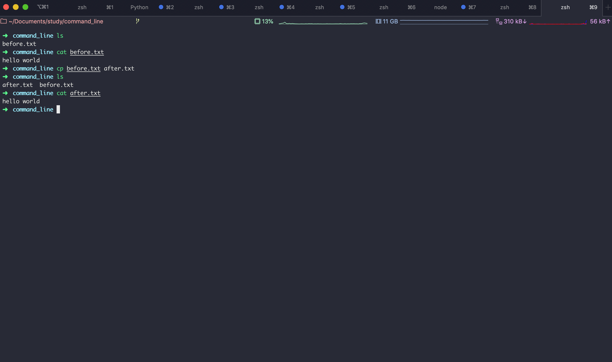

미리 `before.txt` 파일을 생성해놨습니다.

`cat` 명령어로 내용을 확인해보니 `hello world` 가 써있네요.

`cp before.txt after.txt` 를 실행해주고 `ls` 명령어로 확인해주니 `after.txt` 파일이 생성되어있습니다.

`cat` 명령어로 내용을 확인해보니 `before.txt` 와 동일한 내용이 써있습니다.


## 파일이나 폴더 이동시키기

------

파일이나 폴더 이동은 `mv` 명령어를 사용합니다.

복사하기`cp`와 똑같은 방법으로 사용하면 됩니다.

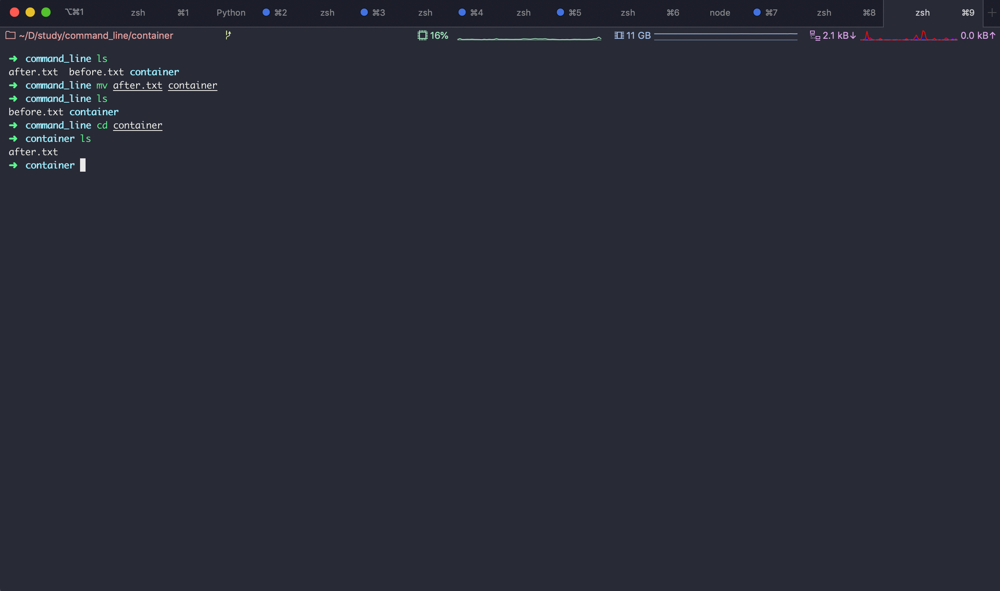

<br>

### 정리

---

| 명령어 | 의미 | 설명       |
| ------ | ---- | ---------- |
| cp     | Copy | 복사하기   |
| mv     | Move | 이동시키기 |

<br>


## 그 외 유용한 명령어들

---

여러 커맨드들을 동시에 입력할 수 있습니다.

`&&` 를 사용하면되는데요. (자바스크립트랑 비슷하네요!)

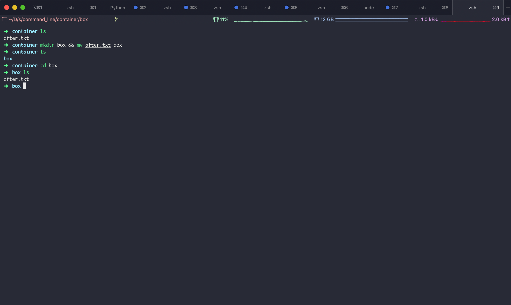

`mkdir box && mv after.txt box` 라고 명령어를 입력하였습니다.

`box` 폴더를 생성하고, `after.txt`파일을 `box` 폴더로 옮기고 싶어서 저렇게 썼습니다.

확인해보니 잘 동작했습니다.

<br>

다음으로는, `sudo` 명령어 입니다.

`sudo` 는 **super user do** 의 약어입니다. 추가적인 보안권한을 얻는 명령어입니다.

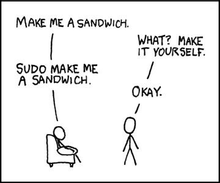

<center>
  <small>
  	하하하 개발자조크
  </small>
</center>

`sudo` 는 어떤 작업을 할때, 권한이 없어 막혔을 때 사용하게 됩니다.

`sudo` 명령어는 워낙 다양한 상황에 사용됩니다.

트러블슈팅을위해 stackoverflow등에서 검색을 했을때 분명히 한번쯤은 보게 될 것입니다.


마지막으로 또 유용한 명령어가 있는데요.

`nano` 입니다. `nano` 는 터미널 기반의 텍스트 에디터입니다.

아까는 `echo` 명령어로 내용이 담긴 파일을 생성했는데요. 뭔가 굉장히 약했죠..

`nano` 는 훨씬 강력합니다.

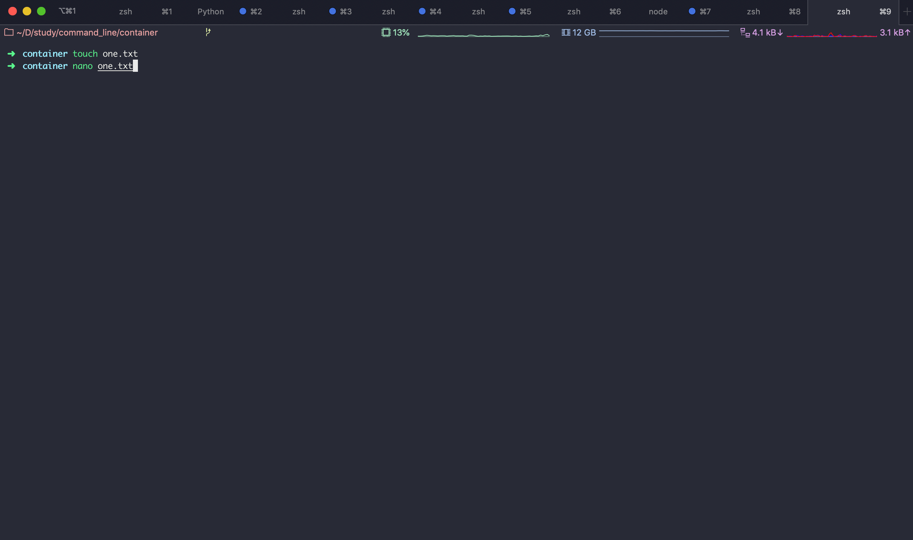

`touch` 명령어로 `one.txt` 파일을 생성해줍니다.

그리고 `nano one.txt` 명령어를 실행시켜주면, 다음과같이 텍스트 에디터가 터미널안에서 실행됩니다.

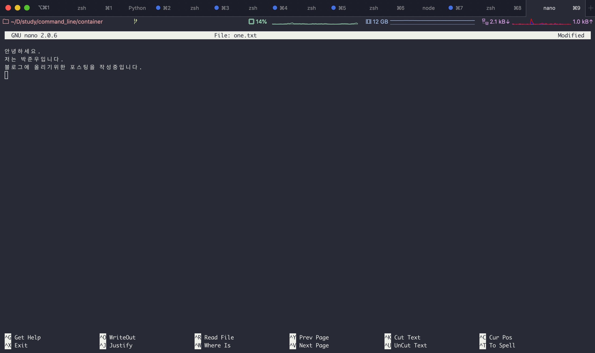

이제 자유롭게 입력해주면됩니다!

`echo` 에 비하면 훨씬 보기좋습니다.

입력이 끝났으면 `control` + X 버튼을 눌러주고 Y를 눌러준다음에 `Enter` 를 쳐주면 완료됩니다.

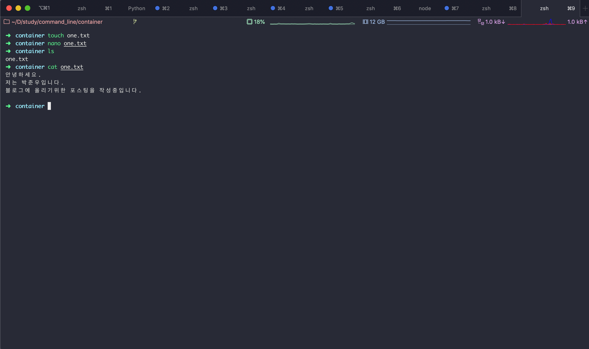

`cat` 명령어로 `one.txt` 파일을 확인해보니 내용이 잘 저장되었네요!

| 명령어 | 의미          | 설명                        |
| ------ | ------------- | --------------------------- |
| &&     | &&            | 여러 명령어를 동시에 실행   |
| sudo   | super user do | 추가적인 보안권한 get       |
| nano   | nano          | 터미널 기반의 텍스트 에디터 |


------

터미널 명령어도 자주 안쓰면 항상 까먹는 것 같습니다.

~~마치 sql 이라던가, sql이나, sql처럼...~~

저는 MacOS에서 기본으로 제공하는 터미널말고, zsh라는 터미널을 설치했는데요.


여기 [subicura님의 블로그](https://subicura.com/2017/11/22/mac-os-development-environment-setup.html){:target="_blank"}에 가시면 굉장히 잘 정리되어있습니다.

긴 글을 끝까지 읽어주셔서 감사합니다!
