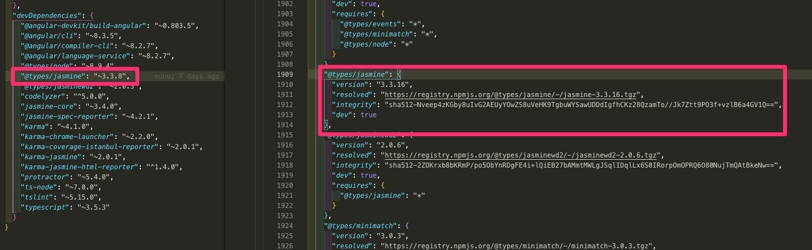
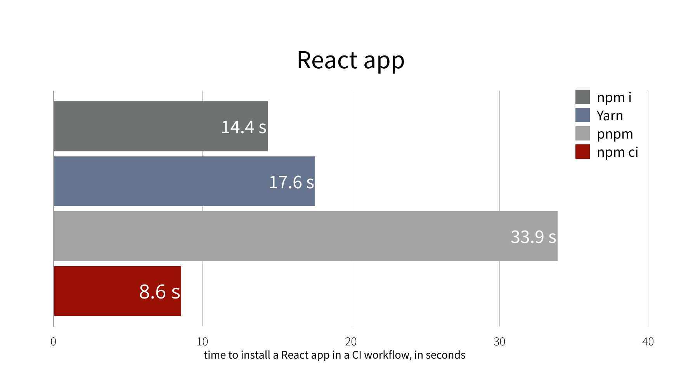
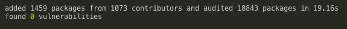
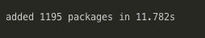

package-lock.json을 자주 봤지만 어떤 역할을 하는지 모르고 있었습니다.

오늘은 package-lock.json에 대해서 정리해보려고 합니다.

 

## package-lock.json은 왜 생성될까?

---

우리가 기존에 사용하는 `package.json` 만으로는 정보가 부족하기 때문입니다.

`package.json` 에서는 버전정보를 저장할 때 `version range` 를 사용합니다.

"내가 사용할 패키지의 버전은 1.2.7버전이다." 라고 말하는 대신 "나는 1.2.7버전 이상의 패키지를 사용할거다."처럼 말하는 방식인데요. (전자처럼 버전정보를 명시하는 것도 가능합니다.)

협업을 하기위해 같은 `package.json` 을 사용해 각자의 컴퓨터에 같은 패키지들을 설치해서 같은 개발환경을 구성하게됩니다.

하지만 몇가지 조건이 들어맞아버리는 불행한(..) 상황이 오게되면, 
같은 `package.json` 을 사용해서 `npm install` 을 진행하더라도 서로 다른 `node_modules`를 생성하는 경우가 발생합니다.

- npm의 버전이 다른 경우, npm의 알고리즘이 조금씩 다르기 때문에 서로 다른 `node_modules` 트리가 생성될 수 있습니다.
- 콕찝어서 버전명을 명시하지않고 `version range` 를 사용하기 때문에, 새로운 버전의 패키지가 배포된 이후 설치를 진행할 경우 최신 버전으로 설치될 수 있습니다.
- 내가 사용하고 있는 패키지가 의존하고 있는 패키지가 새로운 버전으로 배포되었을 경우, 다른 `node_modules` 트리가 생성될 수 있습니다.

 

첫번째 상황 같은 경우에는 협업하는 멤버들이 `npm --version` 으로 버전을 확인한 뒤, npm 버전을 일치시킨 후 작업하면 예방할 수 있는 상황입니다.

하지만 다른 상황들에서는 다음과같은 일들이 발생할 수 있습니다.

> 개발자1: 테스트가 계속 실패해.
>
> 개발자2: 어제 내가 테스트할 땐 잘 됐는데??
>
> 개발자1: 왜이러지..
>
> .. 몇 시간 후
>
> 개발자1: 아직도 안돼..
>
> 개발자2: 뭐가 문제인 것 같아?
>
> 개발자1: range-parser문제인 것 같아.
>
> 개발자2: range-parser 버전 몇이야?
>
> 개발자1: 2.0.1
>
> 개발자2: 나랑 버전이 다르네; 오늘 아침에 새로운 버전으로 릴리즈되었나본데?

난감하죠.

이런 불행한 상황을 피해가기위해 태어난 것이 `package-lock.json` 입니다.

  <small>
  	package.json 에는 "~3.3.8" 으로 적혀있지만, package-lock.json 에는 "3.3.16"으로 정확한 버전명이 적혀있습니다.
  </small>

 

`package-lock.json` 은 `node_modules` 구조나 `package.json` 이 수정되고 생성될 때 당시 의존성에 대한 정확하고 구체적인 정보를 품고 자동으로 생성됩니다.

 `npm install` 명령어를 입력하면 태어난다고 생각하면 되겠네요.

또한 `package-lock.json` 이 존재할 때에는 `npm install` 의 동작방식이 조금 변하는데요.

 `package.json` 을 사용하여 `node_modules` 를 생성하지않고 `package-lock.json` 을 사용하여 `node-modules` 를 생성합니다.

정리를 해보자면, `package-lock.json` 은 개발자들이 동일한 `node_module` 트리를 생성해서 같은 의존성을 설치할 수 있도록 보장해주는 고마운 녀석이라고 할 수 있겠습니다.

결론은.

" `package-lock.json` 을 레포지토리에 같이 커밋하자. "

 

### 포스팅 끝!

.

.

.

..을 내려고했지만 궁금했던 점.

## 왜 `package.json` 과 `package-lock.json` 으로 나눠둔 걸까요?

---

애초에 `package.json` 에 정확한 버전명을 적어놓으면 해결되는 문제 아닐까? 라는 의문점이 들어서 찾아봤습니다.

앞서 `package.json` 에서는 `version range` 를 사용한다고 했습니다.

`version range` 는 다음과 같이 사용하는데요.

- `1.4.0 `: 정확하게 1.4.0버전
- `>1.4.0` : 넘버링이 1.4.0보다 큰 버전
- `<1.4.0 `: 넘버링이 1.4.0보다 작은 버전
- `>=1.4.0` : 넘버링이 1.4.0보다 크거나 같은 버전
- `<=1.4.0` : 넘버링이 1.4.0보다 작거나 같은 버전
- `1.4.0 || >= 2.4.0` : 정확하게 1.4.0버전이거나, 넘버링이 2.4.0보다 같거나 큰 모든 버전

 

만약 `package.json` 에 패키지 버전을 **콕 찝어** 정해놓는다면,

프로젝트에서 사용하고 있는 패키지의 중요한 버그 수정이 이루어질 때 마다 프로젝트의 `package.json` 에 적혀있는 버전도 수정해주어야하기 때문입니다.

모든 크고 작은 패키지들의 릴리즈에대해 항상 추적하고 수정해야하는 엄청난 귀찮음과 수고스러움을 `version range` 가 해결해주고 있었습니다.

역시 괜히 이렇게 나눠둔 것이 아니었네요!

 

### 포스팅 끝!

.

.

.

을 내려고했지만 하나만 더.

## `npm ci` 명령어

---

`npm ci` 는 npm@5.7.1 부터 지원되는 명령어입니다.

`package-lock.json` 이 존재하면 `package.json` 대신,  `package-lock.json` 을 이용해서 패키지들을 설치하는 명령어입니다.

"아니 걍 npm install로 설치해도 package-lock.json있으면 lock으로 설치하는거 아닌가"

[npm blog](https://blog.npmjs.org/post/171556855892/introducing-npm-ci-for-faster-more-reliable){:target="_blank"} 에 따르면 `node_modules` 가 없으면, `npm install` 보다 `npm ci` 가 **2배 이상** 더 빠르다고 합니다.

  <small>
  	오오..
  </small>

 

그래서 저도 사용해봤는데요.

  <small>
  	npm install 명령어로 설치
  </small>

  <small>
  	npm ci 명령어로 실행
  </small>

작은 프로젝트임에도 설치 시간이 차이가 나네요.

production으로 빌드할때 node_modules가 항상 비워져있는 환경이라면, `npm ci` 명령어를 사용하는 것도 좋을 듯 합니다!

 

### 포스팅 끝!

.

.

.

.

.

정말 끝.

 

### Reference

---

- [https://medium.com/coinmonks/everything-you-wanted-to-know-about-package-lock-json-b81911aa8ab8](https://medium.com/coinmonks/everything-you-wanted-to-know-about-package-lock-json-b81911aa8ab8){:target="_blank"}
- [https://docs.npmjs.com/misc/semver](https://docs.npmjs.com/misc/semver){:target="_blank"}
- [https://docs.npmjs.com/about-semantic-versioning](https://docs.npmjs.com/about-semantic-versioning){:target="_blank"}
- [https://www.lucidchart.com/techblog/2017/03/15/package-management-stop-using-version-ranges/](https://www.lucidchart.com/techblog/2017/03/15/package-management-stop-using-version-ranges/){:target="_blank"}
- [https://stackoverflow.com/questions/45052520/do-i-need-both-package-lock-json-and-package-json](https://stackoverflow.com/questions/45052520/do-i-need-both-package-lock-json-and-package-json){:target="_blank"}
- [https://hyunjun19.github.io/2018/03/23/package-lock-why-need/](https://hyunjun19.github.io/2018/03/23/package-lock-why-need/){:target="_blank"}
- [https://trustyoo86.github.io/npm/2018/01/10/package-lock-introduction.html](https://trustyoo86.github.io/npm/2018/01/10/package-lock-introduction.html){:target="_blank"}
- [https://pewww.tistory.com/11?category=763280](https://pewww.tistory.com/11?category=763280){:target="_blank"}
- [https://dschci.tistory.com/108](https://dschci.tistory.com/108){:target="_blank"}
- [https://blog.kangho.me/about-package.json/](https://blog.kangho.me/about-package.json/){:target="_blank"}
- [https://blog.greenkeeper.io/introduction-to-version-ranges-e0e8c6c85f0f](https://blog.greenkeeper.io/introduction-to-version-ranges-e0e8c6c85f0f){:target="_blank"}
- [https://devnote.niceilm.net/npm-ci/](https://devnote.niceilm.net/npm-ci/){:target="_blank"}
- [https://medium.com/@trustyoo86/ci-%ED%99%98%EA%B2%BD%EC%9D%84-%EC%9C%84%ED%95%9C-npm-ci-npm-ci-for-continous-integration-850fc48dd4cc](https://medium.com/@trustyoo86/ci-환경을-위한-npm-ci-npm-ci-for-continous-integration-850fc48dd4cc){:target="_blank"}
- [https://blog.npmjs.org/post/171556855892/introducing-npm-ci-for-faster-more-reliable](https://blog.npmjs.org/post/171556855892/introducing-npm-ci-for-faster-more-reliable){:target="_blank"}