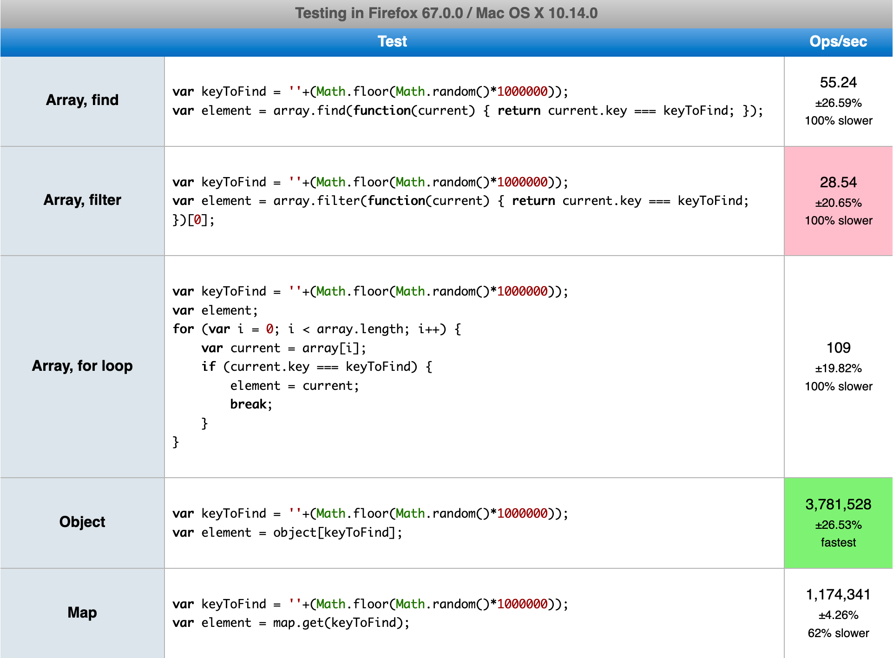
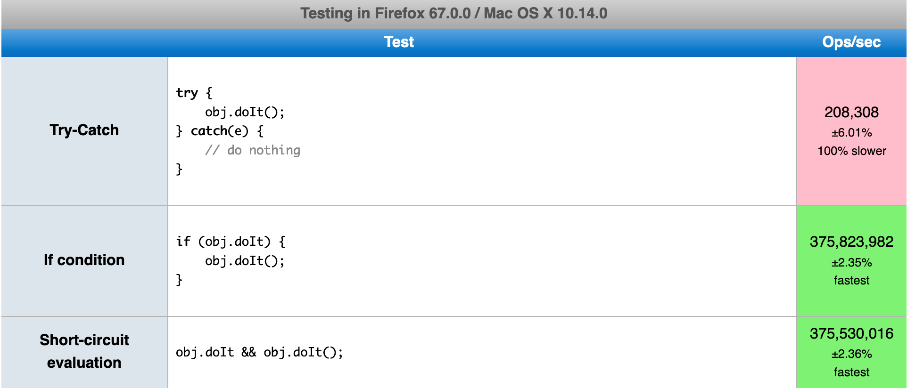
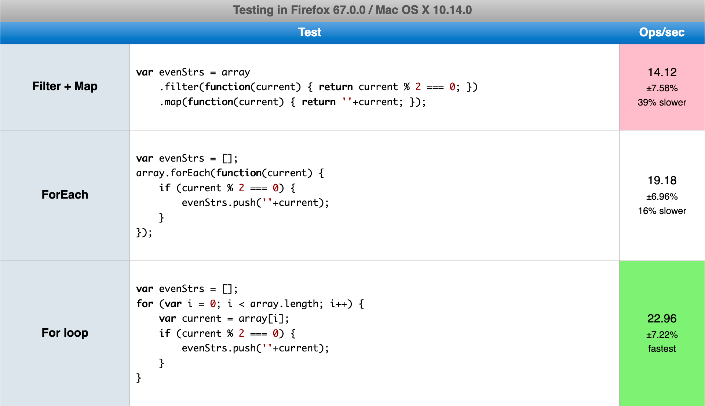
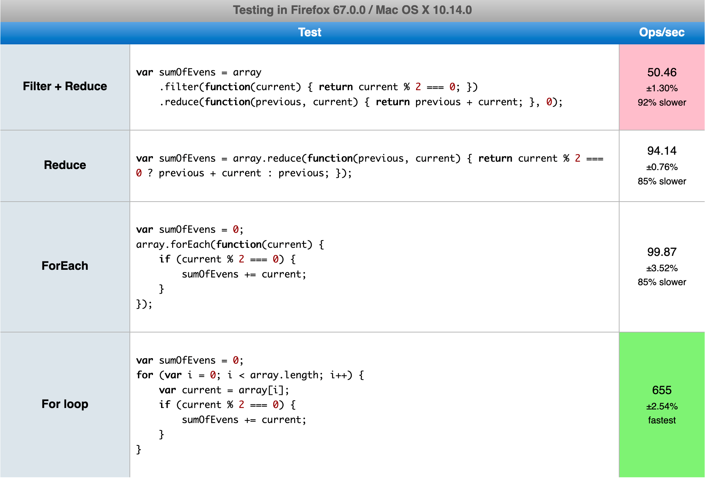
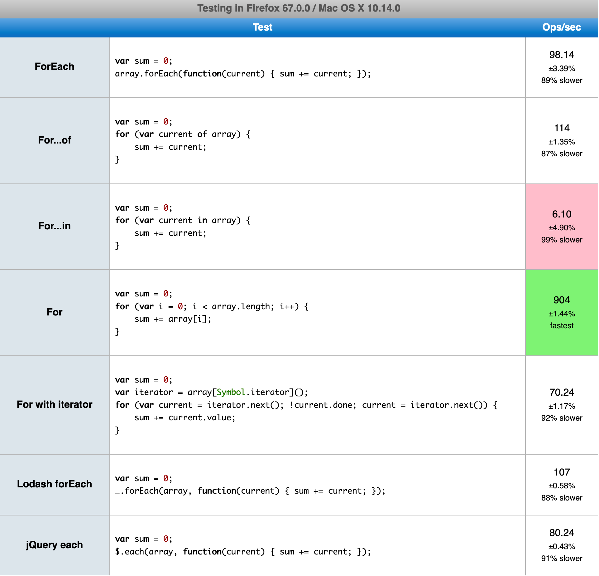
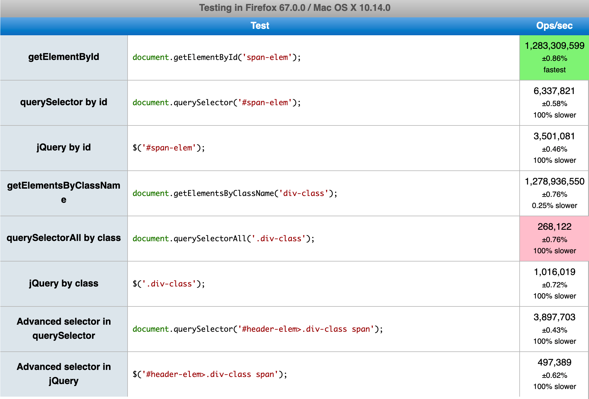

# 앱의 프론트엔드 성능을 향상시키는 방법 - 5가지 코딩 팁

------

> 이 글은 Tomasz Świstak의 How to increase your frontend app's performance - 5 coding tips를 번역한 글입니다.
>
> 원문 주소는 [https://www.synergycodes.com/blog/how-to-increase-your-frontend-apps-performance](https://www.synergycodes.com/blog/how-to-increase-your-frontend-apps-performance){:target="_blank"} 입니다.

------

많은 프론트엔드 프로젝트들이, 어느 시점에서부터는 성능 저하 문제가 발생하기 시작합니다.

솔루션의 복잡성이 증가하는 것은 정상적인 일입니다.

하지만 개발자들은 이러한 문제를 해결해야하죠.

이 포스팅에서 앱을 최적화하는데 도움이되는 5가지 팁을 정리해보고자 합니다.

일부는 당연해보이고, 또 일부는 프로그래밍의 기초라고 생각될테지만, 그래도 이러한 기초지식들을 되새김질하는 것은 중요합니다.

각각의 팁은 자체적으로 실행하고 성능을 직접 확인한 벤치마크를 근거로 작성되었습니다.

 

## 이 팁을 읽기 전에

------

매우 중요한 점은, 최적화가 필요하지않은 코드를 갈아엎지는 마세요.

여러분이 작성하는 코드는 코드 자체적으로도 빨라야하지만, 더더욱 중요한 점은 다른 개발자들이 읽기 쉬워야한다는 점입니다.

Donald Knuth는 코드 최적화에대해 공부할 때 가장 중요한 책 중 하나로 평가받는 'Computer Programming as an Art' 에 다음과 같이 썼습니다.

> "가장 큰 문제는 개발자들이 잘못된 시점에, 너무 효율적인 코드를 고민하며 시간을 낭비하고 있다는 겁니다."
>
> "**조기 최적화**는 프로그래밍에서 **악의 근원**입니다."

 

## 1. 배열 대신 객체/맵을 사용하여 조회하세요.

------

우리는 데이터를 다룰 때, "객체 검색, 객체 다루기, 또 다른 객체 검색" 같은 상황이 자주 발생합니다.

가장 일반적은 자바스크립트 데이터 구조는 배열이므로, 배열 안에 데이터가 저장되는 것은 지극히 정상적인 현상입니다.

배열에서 무언가를 찾으려면 `find`, `indexOf`, `filter` 같은 메소드를 사용하여 배열의 처음부터 끝을 모두 훑어야합니다.

그래서 우리는 O(n)의 복잡성을 지닌 선형 검색을 사용하게 됩니다.

이는 최악의 경우, 배열의 요소 갯수만큼의 많은 비교를 수행해야함을 의미합니다.

작은 배열에서는 이것이 눈에 띄지 않지만, 배열의 크기가 크다면 성능에 엄청난 영향을 끼치게됩니다.

이러한 시나리오에서는 배열을 객체나 맵으로 변환하고 `key` 로 검색을 하는 것이 좋습니다.

이러한 데이터 구조에서는 O(1)의 복잡성을 가지며 요소에 접근할 수 있으므로, 자료의 크기에 관계없이 항상 메모리를 한 번만 호출하게 됩니다.

객체와 맵은 `해시 테이블` 이라는 자료구조를 사용하기 때문이죠.

벤치마크 주소는 다음과 같습니다 : [https://jsperf.com/finding-element-object-vs-map-vs-array/1](https://jsperf.com/finding-element-object-vs-map-vs-array/1){:target="_blank"}

차이가 매우 큽니다. 

맵과 객체는 초당 수백만 개의 작업을 수행하지만, 배열은 최상의 결과에서조차 고작 100여개의 작업만 수행할 수 있습니다.

물론 지금은 데이터 변환을 고려하지않았지만, 데이터 변환을 고려한다고 해도 여전히 맵과 객체가 빠릅니다.

 

## 2. 예외를 먼저 처리하는 대신, IF문을 사용하세요.

------

때때로 사람들은 무언가가 존재하지않을 때 `null` 을 체크하는 것을 생략하고, 예외를 포착하는 것이 더 쉽다는 것을 느끼게됩니다.

그러나, 이것은 나쁜 습관입니다.

따라서 당신의 코드에 이렇게 사용한 코드가 있다면 수정하세요.

벤치 마크에서는 세가지 방법, `if문`, `try-catch`, `short-circuit 평가` 를 검사했습니다.

벤치마크 주소는 다음과 같습니다 : [https://jsperf.com/try-catch-vs-conditions/1](https://jsperf.com/try-catch-vs-conditions/1){:target="_blank"}

`null` 을 체크하는 것이 항상 더 낫다는 것은 굉장히 중요한 사실입니다.

또한 벤치마크를 보면 알겠지만, `if문`과 `short-circuit 평가` 는 성능 차이가 거의 없기때문에 더 마음에 드는 것을 사용하면 됩니다.

 

## 3. 가능한 한 반복문을 적게 사용하세요.

------

반복문을 적게 사용하는 것 또한 당연하게 여겨지지만, 논쟁의 여지가 있는 주제입니다.

`map`, `filter`, `reduce` 는 너무나 훌륭한 기능을 가지고 있어서 누구나 사용하고 싶어합니다.

이러한 메소드들은 코드를 깔끔하게 만들어주고 동료개발자들이 내 코드를 읽기 쉽게 만들어줍니다.

그러나, 성능을 저하시키는 요소가 될 수 있습니다.

저는 두가지 케이스를 만들어보기로 하였습니다 : `filter` 메소드 사용 후 `map` 메소드를 사용하는 것과 `filter` 메소드 사용 후 `reduce` 메소드를 사용하는 것.

각각의 케이스를 `메소드 체이닝`, `forEach`, `기본 반복문` 을 사용하여 테스트해보았습니다.

벤치마크 주소는 다음과 같습니다 : [https://jsperf.com/array-function-chains-vs-single-loop-filter-map/1](https://jsperf.com/array-function-chains-vs-single-loop-filter-map/1){:target="_blank"}

`기본 반복문` 이 가장 빠르긴 하지만 차이가 커보이지는 않습니다.

차이가 크지않은 이유는, `map` 에서는 `push` 를 하는 과정이 없기때문입니다.

이제, `filter`와 `reduce` 를 검사해보겠습니다 : [https://jsperf.com/array-function-chains-vs-single-loop-filter-reduce/1](https://jsperf.com/array-function-chains-vs-single-loop-filter-reduce/1){:target="_blank"}

이번에는 차이가 더 큽니다.

두 함수를 하나로 합쳤을 때(`Reduce`와 `ForEach`), 거의 100%의 성능향상을 보여줍니다.

하지만, `기본 반복문` 으로 변경했을 때, 속도는 비교할 수 없을 정도로 향상되었습니다.

 

## 4. 기본 반복문을 사용하세요.

------

개발자들의 선호도가 다르기때문에, 이번에도 논란의 여지가 있을 수 있는 부분입니다.

`반복문`에는 `forEach`, `for...of`, `for...in` 등이 있습니다.

이러한 반복문은 굉장히 나이스해보이고 훌륭한 워크플로우를 제공합니다.

그러 이러한 반복문은 전통적으로 사용되던 `기본 반복문` 과 비교하면 성능이 떨어집니다.

이미 반복문의 성능을 알 수 있는 벤치마크들을 살펴보았지만, 새로운 벤치마크를 만들어보겠습니다 : [https://jsperf.com/for-loops-in-few-different-ways/](https://jsperf.com/for-loops-in-few-different-ways/){:target="_blank"}

자바스크립트 내장 함수 이외에, Lodash의 `forEach`와 jQuery의 `each` 도 테스트했습니다.

역시나 `기본 반복문` 이 다른 방법보다 훨씬 빠른 것을 볼 수 있습니다.

하지만 이 결과는 배열에 한정된 결과입니다.

다른 상황에서는 `forEach` 나 `for...of` 를 사용하는 것이 좋을 수 있습니다.

그렇다하더라도 `for...in`  반복문은.. 음.. 글쎄요. 
다른 방법이 정녕 없는 경우를 제외하고는 사용하지 않는 것이 좋겠네요.

게다가 `for...in` 반복문은 모든 객체의 프로퍼티(배열의 경우 인덱스)에 접근하기때문에, 예상치못한 결과가 발생할 수 있습니다.

놀랍게도, Lodash와 jQuery의 메소드는 빌트인 메소드인 `forEach`에 비해 성능이 그리 나쁘지않습니다.심지어 Lodash의 메소드는 벤치마크에서 더 빠른 속도를 보여주기도 했습니다.

 

## 5. 내장 DOM 메소드를 사용하세요.

------

다른 사람의 코드에서, DOM을 조작하기위해 jQuery를 사용하는 것을 본 적이 있습니까?

jQuery는 가장 유명한 자바스크립트 라이브러리 중 하나이기때문에, 여러분이나 혹은 여러분의 동료가 jQuery를 사용하는 것을 봤을 것이라고 확신합니다.

물론 DOM을 다룰 때 라이브러리를 사용하는 것은 나쁜 방법이 아닙니다 - 요즘엔 React나 Angular를 사용하여 동일한 작업을 수행합니다.

그러나, 몇몇 사람들은 DOM에서 엘리먼트를 조작하며 자그마한 수정을 하는 등의 간단한 작업을 할때도 jQuery를 반드시 사용해야한다는 착각을 하곤 합니다.

이번에는 jQuery와 내장 DOM 메소드를 비교해보는 벤치마크를 준비해보았습니다 : [https://jsperf.com/native-dom-functions-vs-jquery/1](https://jsperf.com/native-dom-functions-vs-jquery/1){:target="_blank"}

당연하게도, 가장 기본적인 메소드인 `getElementById`와 `getElementsByClassName` 이 DOM을 순회할 때 가장 뛰어난 성능을 보여주었습니다.

`querySelector by id` 와 `Advanced selector in querySelector` 또한 jQuery보다 빠른 성능을 보여주었습니다.

오직 클래스 명으로 엘리먼트 여러개를 가져올 때 사용하는 `querySelectorAll` 의 경우에만 jQuery보다 느렸습니다.

jQuery를 어떻게 교체해야할 지에 대한 더 많은 정보를 얻고 싶으면, [http://youmightnotneedjquery.com](http://youmightnotneedjquery.com/){:target="_blank"} 를 읽어보세요.

물론, DOM을 다룰 때 라이브러리를 사용하는 것이 나쁜 방법은 아닙니다.

하지만 간단한 DOM조작의 경우에도 라이브러리가 필요하다는 의미는 절대 아니라는 것이 중요합니다.

 

## 이 외의 방법

------

앞에서 살펴본 다섯가지 팁들은 자바스크립트로 더 빠른 코드를 작성하는데 도움이 되는 방법들이었습니다.

이 다섯가지 이외의 다른 방법들로도 성능을 향상시키고 싶은 사람들을 위해, 몇가지 케이스들을 준비해보았습니다.

1. Webpack으로 진행하는 자바스크립트 번들링을 최적화하는 방법에대해 알아보세요.
   이는 매우 광범위한 주제이지만, 제대로 수행한다면 당신의 어플리케이션의 로딩 시간이 매우 크게 향상될 수 있습니다.
2. 자료구조, 기본적인 알고리즘과 그 알고리즘의 복잡성에대해 공부해보세요.
   사람들은 이것들이 단지 이론적인 지식에 불과하다고 생각하지만, 우리는 이미 첫번째 팁에서 이 지식들이 실제로 어떤 영향을 끼치는지 확인해봤습니다.
3. [jsPerf](https://jsperf.com/popular){:target="_blank"} 에서 테스트 케이스들을 찾아보세요.
   자바스크립트에서 동일한 결과를 달성하는 여러가지 다른 방법들을 비교할 수 있습니다.

 

------

## 번역 후기

약간의 성능 향상을 포기하는대신, 다른 개발자들이 읽기 쉬운 코드를 작성하는게 더 중요하다고 생각하는 개발자분들 또한 많으실 거라 생각됩니다.

사실 저도 그렇게 생각하는 편입니다.

그러한 부분을 의식했는지 원문에도 논란이 있을 수 있다는 언급이 많이 있네요.ㅎㅎ

뭐, 정답이 있는 문제는 아니라고 생각합니다!

여담으로, 기술포스팅을 번역해서 포스팅을 해보는 것은 처음인데요.

한줄한줄 읽고 넘어가는 것과 한줄한줄 번역을 해보는 것은 시간은 물론 노력에서도 정말 어마어마한 차이가 있네요..;

기술포스팅들을 번역해주시는 많은 능력자분들에게 존경을 표합니다.

앞으로는 단어 하나하나 허투루 읽지않고 더 감사한 마음으로 읽겠습니다...

글이 술술, 원활하게 읽히길바라는 마음에 의역을 많이 했습니다.

오타와 오역에 대한 지적. 
댓글이나 메일로 감사하게 받겠습니다!

읽어주셔서 감사합니다.

