저는 프로젝트를 완성시킨 다음, 배포를 진행해야 한다는 생각을 가지고 있었습니다.

~~그래서 배포한 프로젝트가 없..~~

localhost에서 늘 혼자만 보다가 어느샌가 사라져버리는건 이젠 더이상은 naver..

누군가가 호스팅 URL을 통해 보고있으면 더 재미있으니깐, 정말 아무것도 없이 네비게이션 바 라우팅만 되어있는 프로젝트라고해도 앞으로는 배포를 먼저 해버리고 프로젝트를 시작하려고 Firebase Cloud Hosting을 시도해보고 기록으로 남깁니다.

<br>

## Step 1. Firebase CLI 설치

```
npm install -g firebase-tools
```


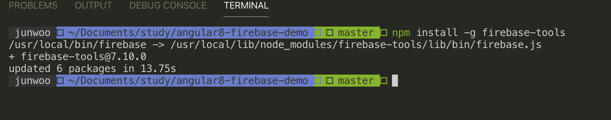

<br>

---

## Step 2. Firebase CLI를 사용하여 로그인

```
firebase login
```

`firebase login` 명령어로 로컬머신을 Firebase에 연결하고, Firebase 프로젝트에대한 액세스 권한을 부여받을 수 있습니다.

<br>

---

## Step 3. 액세스 확인

```
firebase list //해당 명령어는 deprecated되었네요. 아래 명령어를 입력해주세요.
firebase projects:list

```

[Firebase Console](https://console.firebase.google.com/u/0/) 에 추가해둔 프로젝트들이 터미널창에 나열되면 제대로 액세스 된 것입니다.

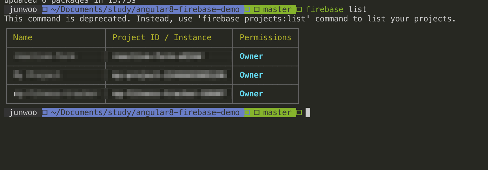


한 번 [Firebase Console 링크](https://console.firebase.google.com/u/0/)로 들어가서 테스트해보겠습니다.

링크에 접속하면 그동안 생성했던 프로젝트들과 `프로젝트 추가` 버튼이 있습니다.


버튼을 눌러주면 이제 프로젝트 만들기 단계가 시작되는데요.

프로젝트 이름을 채워줍니다.

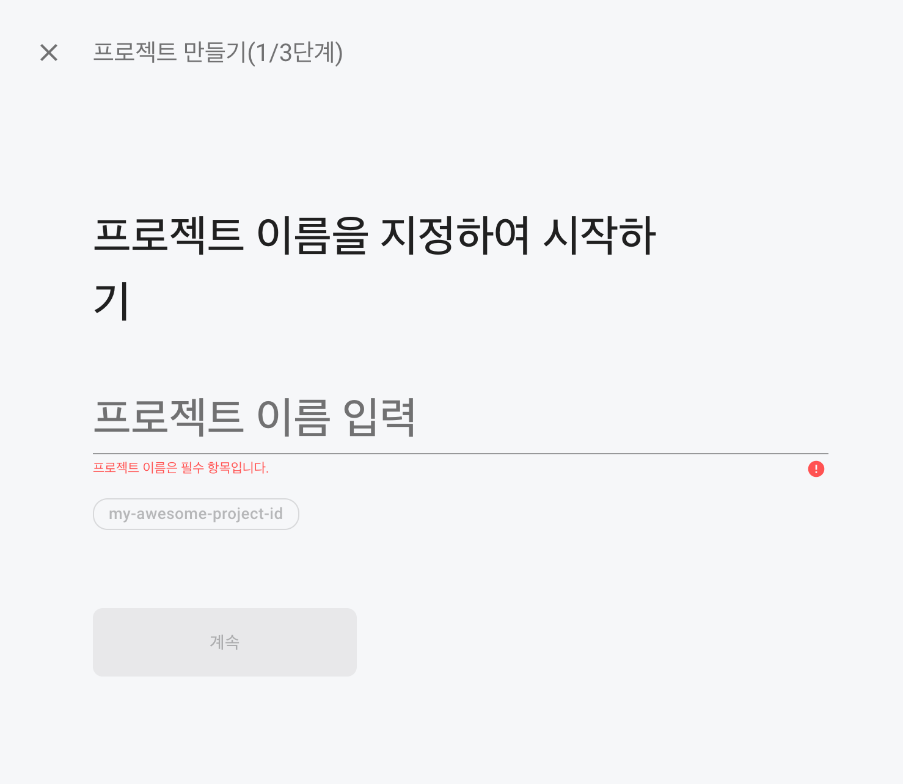


이 다음은 GA 설정인데요.

저는 필요가 없어서 꺼버렸습니다.

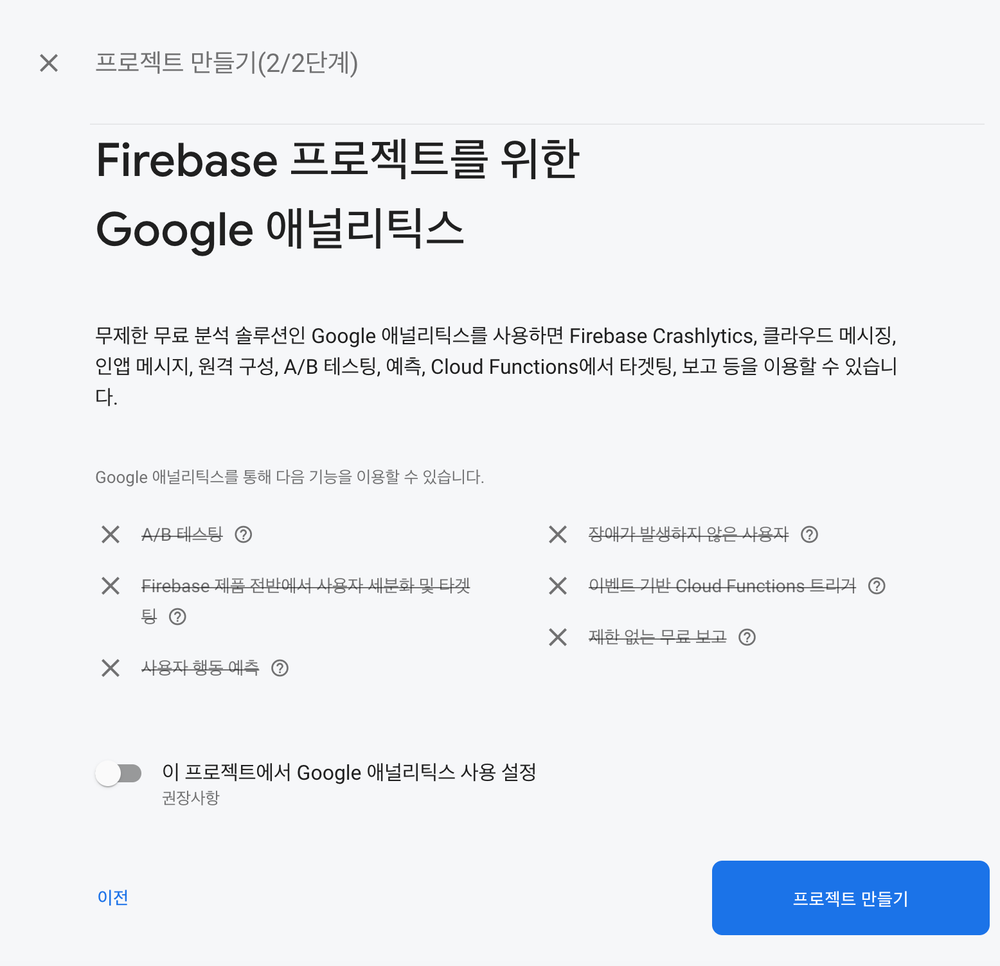


프로젝트 만들기버튼을 누르면, 이제 프로젝트가 생성됩니다.


생성이 완료되었으면, 다시 터미널로 돌아가서 `firebase list` 명령어를 입력해서 확인해봅니다.

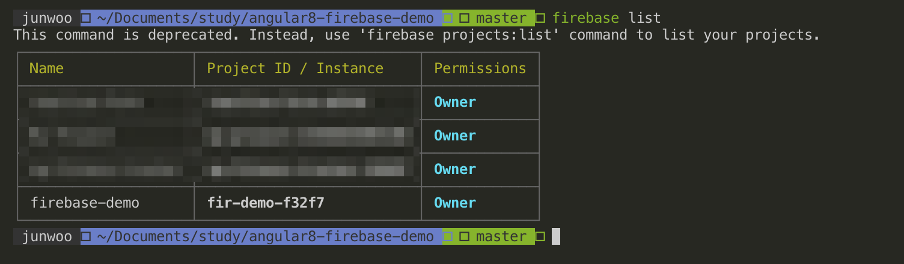


생성한 프로젝트가 잘 보이네요!

<br>

---

## Step 4. 프로젝트 초기화

```
firebase init
```


배포작업에는 프로젝트 디렉터리 설정이 필요한데, `firebase init` 명령어가 바로 그 설정 단계입니다.

명령어를 입력하면 터미널에 몇가지 질문들이 표시됩니다.

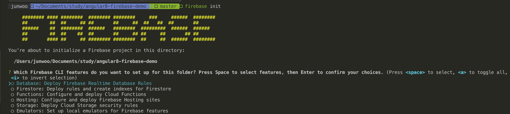

스페이스바를 눌러서 선택이 가능하고, 엔터키를 눌러서 다음 단계로 넘어갈 수 있습니다.


저는, 호스팅만 필요하기때문에 호스팅만 선택한 뒤 넘어갑니다.

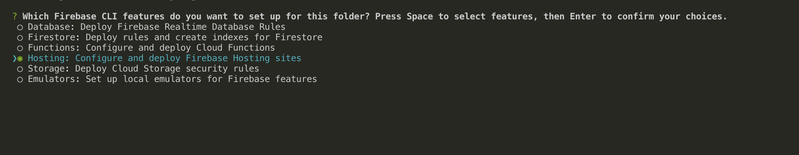


저는 제가 아까 등록한 프로젝트를 사용할 겁니다.

`Use an existing project` 를 선택해줍니다. 

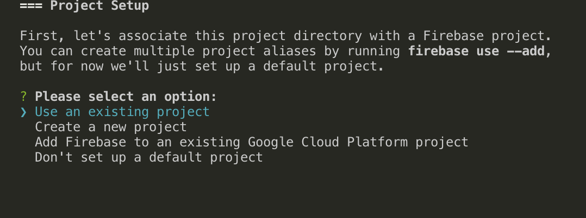


그리고 아까 만들었던 프로젝트를 선택해줍니다.

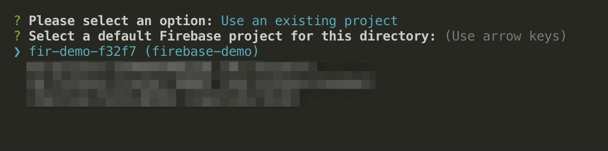

<br>

---

이제 Hosting 설정 단계입니다.

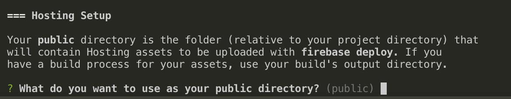


build 결과물의 디렉토리를 적어주면 됩니다.

보통 Angular에서  `ng build` 명령어를 사용하면 따로 설정을 하지 않은 경우에는 dist/PROJECT_NAME 구조로 생성됩니다.

저같은 경우에는 이렇게 dist 폴더 아래의 angular8-firebase-demo 폴더 아래에 index.html이 자리잡고 있습니다.

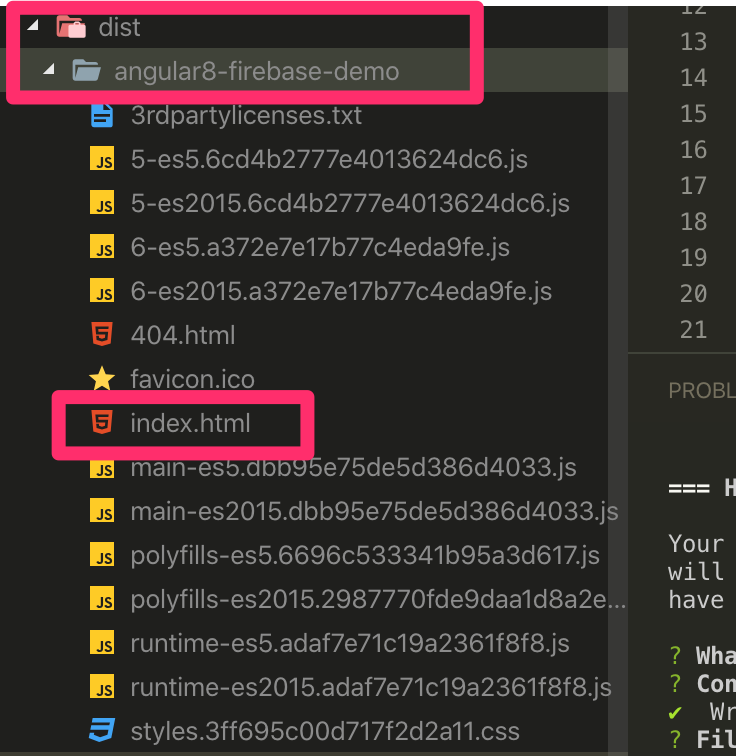

첫번째 질문에는 `dist/angular8-firebase-demo` 를 적어주고 나머지 질문에는 모두 `No` 를 선택해줍니다.


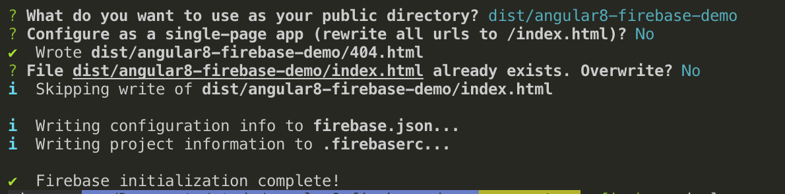

Firebase initialization complete!

<br>

---


## Step5. 배포하기

<br>

혹시 아직  `ng build --prod` 명령어로 빌드하지않았다면, 빌드를 먼저 진행해주세요.

```
ng build --prod
```

<br>

빌드가 완료되었으면 `firebase deploy ` 명령어를 실행하여 배포를 시작합니다.

```
firebase deploy
```


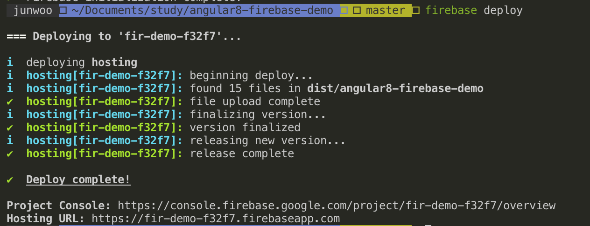

<br>

배포가 성공적으로 완료되면, Hosting URL에 들어가서 잘 동작하는지 확인해보면 됩니다!