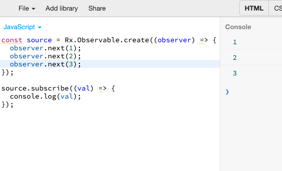
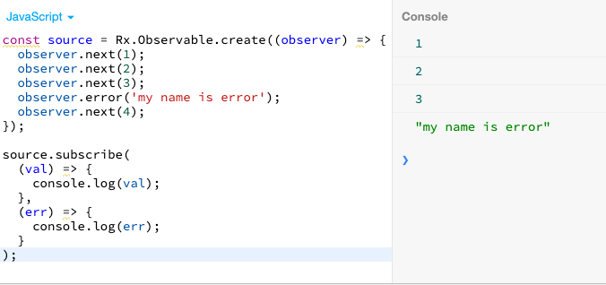
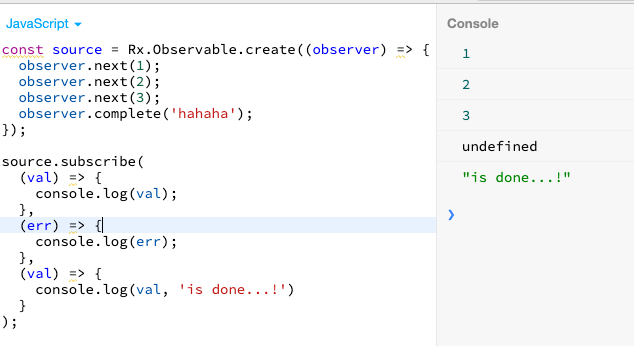
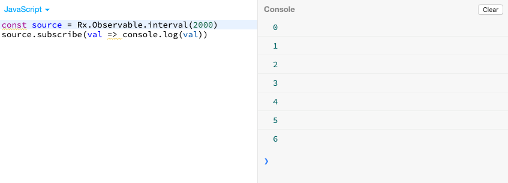
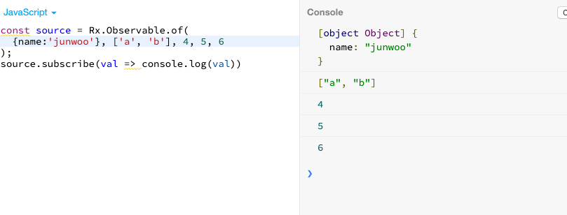
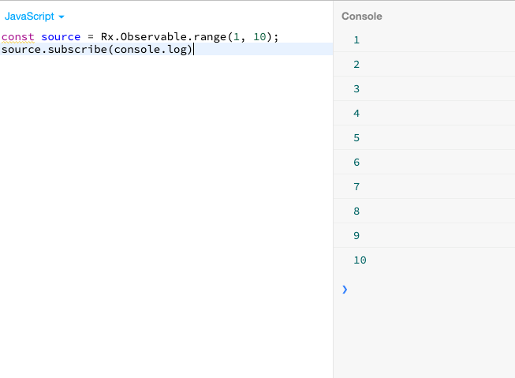
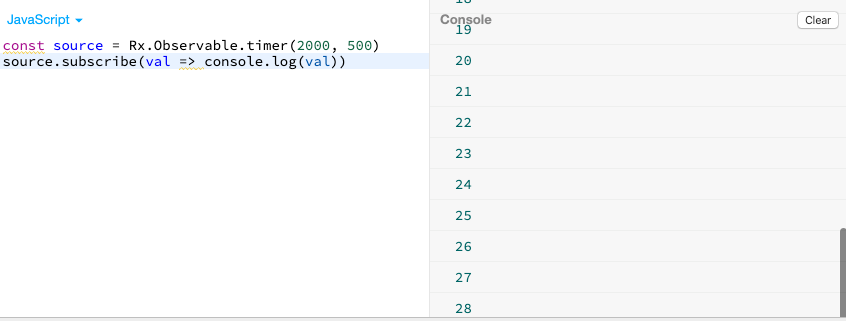

RxJS를 조금씩 공부하고 있습니다.

옵저버블의 개념에 대해서는 [옵저버블](https://junwoo45til.netlify.com/#/RxJS/observable){:target="_blank"} 에 아주 거칠고 투박하고 나만 알아먹게 첫느낌 정도로만 정리해두었습니다.

더 정제된 글로 다듬어야겠네요..

이 글에서는 RxJS의 수많은 오퍼레이터 중에서도 생성에 관련된 오퍼레이터들을 몇 개 정리해보았습니다.

 

## create

: 주어진 subscription 함수를 옵저버블로 만듭니다.

이렇게 error를 만나면, 다음 next는 옵저버에게 전달되지않고 종료된다.

complete에게는 value값을 넘길 수 없구나..

 

## from

: 배열이나 프로미스, 또는 이터러블을 옵저버블로 바꿔준다.

#### 1. Observable from array

배열의 요소 하나하나가 next메소드를 통해 옵저버에게 전달된다.

완료가 되면 옵저버에게는 complete notification이 전달 되고, 실행된다.

#### 2. Observable from promise

#### 3. Observable from collection

 

## fromEvent

:DOM 이벤트를 옵저버블로 바꿔줍니다.

 

## interval

:정해진 시간 간격으로 숫자를 생성해낸다.

 

## of

:전달된 값들을 생성해낸다.

 

## range

:전달된 범위의 숫자를 생성해낸다.

jsbin에서 실행해보았다.

 

## timer

: 주어진 지속시간 후에, 지정된 시간마다 순서대로 숫자를 생성해낸다.

아래는 2초뒤부터, 500ms 시간마다 숫자를 생성해낸 모습.

 

#### Reference

- [https://rxjs-dev.firebaseapp.com/guide/operators](https://rxjs-dev.firebaseapp.com/guide/operators){:target="_blank"}
- [https://www.learnrxjs.io/operators/](https://www.learnrxjs.io/operators/){:target="_blank"}

