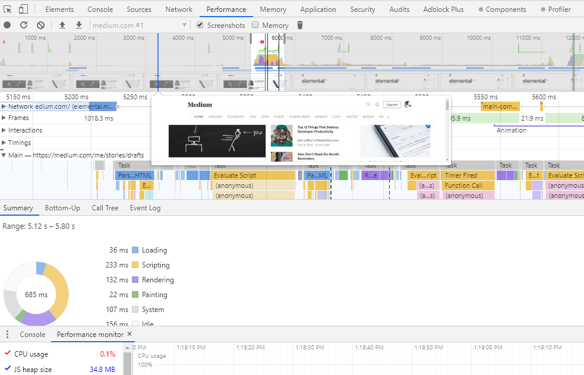
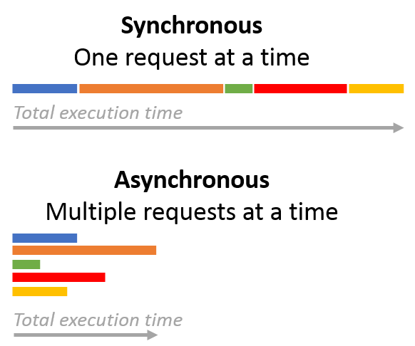
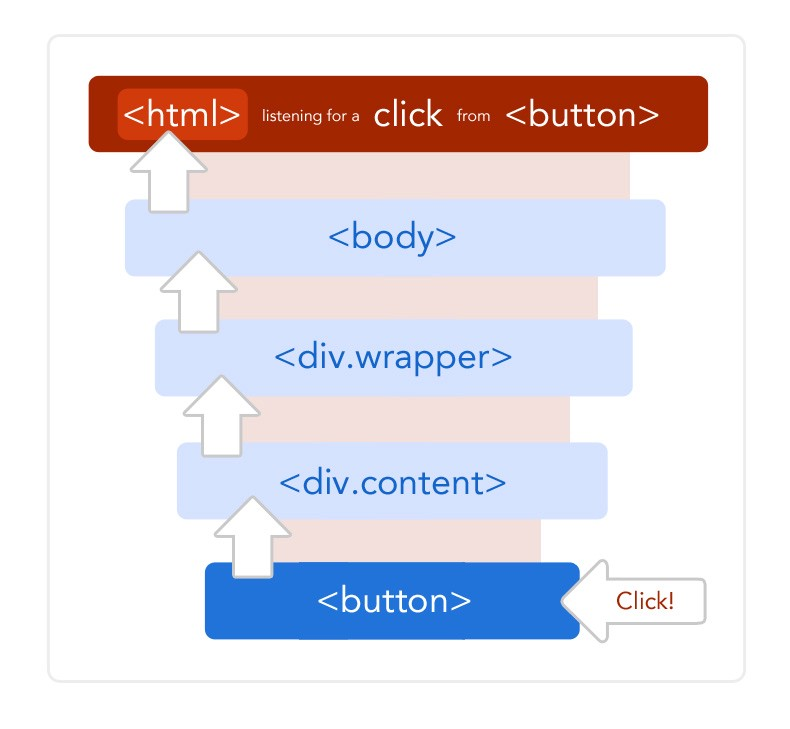
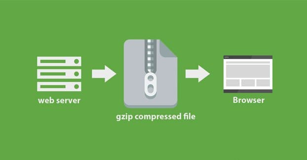
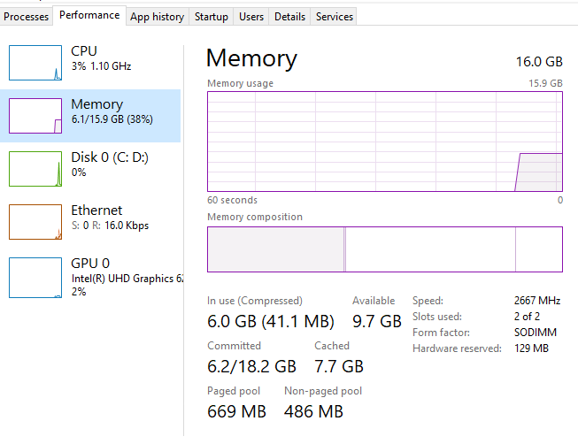

------

> 이 글은 Isha Jauhari의 How to improve JavaScript Performance를 번역한 글입니다.
>
> 원문 주소는 [https://medium.com/javascript-in-plain-english/how-to-improve-javascript-performance-f75f09835eb6](https://medium.com/javascript-in-plain-english/how-to-improve-javascript-performance-f75f09835eb6){:target="_blank"} 입니다.

------

 

지난 몇 년 동안, JavaScript는 대부분의 개발자들의 사용하는 스크립트 언어 중 하나가 되었습니다. JavaScript는 클라이언트 측에서는 물론, 서버 측에서도 사용됩니다. 또한 GitHub에서 가장 많이 사용되는 언어 중 하나입니다.

 

#   우선 문제를 감지합시다.

Lighthouse는 웹 페이지에 널리 사용되는 도구입니다. Lighthouse는 접근성, 퍼포먼스, SEO와 같은 성능들을 측정해줍니다. 마찬가지로 [Google PageSpeed](https://developers.google.com/speed/pagespeed/insights/){:target="_blank"}도 JavaScript 개발자가 웹 사이트의 개선 및 성능 최적화에대해 이해하도록 돕기위해 만들어졌습니다.

크롬의 메인 메뉴에는 각 탭의 메모리 및 CPU 사용량을 보여주는 '도구 더보기' 옵션이 있습니다. 또한, 크롬이나 파이어폭스의 퍼포먼스 탭에서는 더욱 자세한 분석을 확인할 수 있습니다. 이러한 도구들을 통해 다양한 분석을 할 수 있습니다.

더 심도있게 공부하려면 [Navigation Timing API](https://levelup.gitconnected.com/navigation-timing-browser-api-track-and-improve-website-performance-in-javascript-f1dbfb45612){:target="_blank"}를 사용해보세요. 이 API는 웹 사이트의 성능을 측정하기위해 사용하는 데이터를 제공해줍니다.

 

# 변수 스코프

특정 함수를 호출할 때 마다, 해당 함수를 정의하는 데 사용되는 변수가 내부에 저장됩니다. 변수는 두가지 유형으로 분류할 수 있습니다.

- 로컬 변수: - 자신 안에서만 정의된 변수
- 전역 변수: - 스크립트 전체에서 사용되는 변수

함수 호출 중에, JavaScript 컴파일러는 사용중인 변수의 스코프를 탐색합니다. 스코프 체인의 스코프 수가 증가함에 따라, 현재 스코프 외부에 있는 변수에 접근하는데 걸리는 시간도 증가합니다.

따라서 엔진은 로컬 변수에 비해 글로벌 변수에 접근하는데 시간이 더 걸립니다. 즉, 대부분의 변수를 로컬 변수로 정의하면 변수 검색에 필요한 시간이 매우 줄어들게 됩니다. 결과적으로, 애플리케이션의 전반적인 성능이 향상됩니다.

 

# 가볍고 적은 코드

모바일 애플리케이션의 고성능을 유지하려면, 코드를 최대한 가볍고 컴팩트하게 유지해야합니다. 이러한 방법은 페이지 레이턴시를 줄여주고 속도를 향상시켜줍니다.

모듈을 개발할 때, 스스로에게 아래와 같은 질문을 해봐야합니다.

이 모듈이 정말로 필요한가?

이 프레임워크를 사용하는 이유가 뭘까?

오버헤드할 가치가 있나?

만약 그렇다면, 더 간단한 방법은 없을까?

애플리케이션의 성능을 최적화하는 또 다른 방법은, 다양한 JS파일을 하나로 축소하고 줄이는 것입니다. 예를 들어, 앱에 7개의 JavaScript 파일이 있는 경우엔 브라우저가 7개의 서로 다른 HTTP 리퀘스트를 주고받아야합니다. 이러한 상황을 피하기위해서는 7개의 파일을 하나의 파일로 바꾸기만하면 됩니다.

 

# 쓸데없는 반복문 쓰지 않기

JavaScript의 반복문은 브라우저에 추가적인 부담을 줍니다. 반복문 내부의 코드 양은 가능한 한 작아야합니다. 반복문에서 수행하는 작업이 적을수록 반복문을 빨라집니다. 또한, 각 반복마다 배열의 길이를 읽는 대신, 배열의 길이를 다른 변수에 저장해놓는 등의 간단한 요령을 적용할 수도 있습니다. 이를 통해 코드를 최적화하고, 보다 효율적인 방식으로 작업을 수행할 수 있습니다.

 

# DOM 접근 최소화

자바스크립트의 네이티브 환경 외부에서 발생하는 모든 상호작용으로 인해 성능이 크게 저하되고 예측할 수 없게될 수 있습니다. 예를 들어, 브라우저가 환경 외부에서 DOM 객체와 여러번 상호작용해야하는 경우, 브라우저는 매 번 새로고침을 해야하므로 성능이 저하됩니다. 이를 피하려면 DOM 접근을 최소화해야 합니다. 이를 만족시킬 수 있는 몇가지 방법이 있습니다. 예를 들어, 브라우저 객체에 대한 참조를 저장하거나, 전체 DOM 순회를 줄이는 방법이 있습니다.

 

# 비동기 프로그래밍

대부분의 애플리케이션에서, 데이터를 가져오기위해 여러 API를 여러 번 호출하게됩니다. 그 중 하나는 각 기능마다 별도의 미들웨어를 두는 방법입니다. 그러나, 자바스크립트는 싱글 스레드이며 수많은 동기적인 구성요소를 가지고 있습니다. 이러한 구성 요소들은 애플리케이션을 멈춘 것처럼 보이게 할 수 있습니다.

이러한 상황을 피하기위해, 자바스크립트의 비동기적인 기능이 필요합니다. 비동기 코드는 다른 모든 코드를 실행한 후에 이벤트 큐로 보내집니다. 그러나, 자바스크립트의 비동기 기능을 사용하더라도 우연히 동기식 호출을 유발할 수 있는 외부 라이브러리를 사용할 가능성도 있습니다. 이러한 동기식 호출을 애플리케이션의 전체 성능에 부정적인 영향을 줄 수 있습니다.

최선의 방법은, 항상 코드에서 비동기 API를 사용해야한다는 것입니다. 비동기적인 코드를 작성할 땐, 초심자에게는 조금 어려울 수 있는 복잡성이 존재한다는 사실을 염두해두어야합니다.

 

# 이벤트 위임

이벤트 위임을 사용해야 하나의 이벤트 핸들러를 사용하여 여러 이벤트를 효율적으로 처리할 수 있고, 이러한 방법은 결국 전체 페이지의 이벤트 유형을 효율적으로 관리하는 데 도움이 됩니다. 대규모 웹 애플리케이션의 경우에는 이벤트 위임을 사용하지 않는다면, 여러 이벤트 핸들러가 존재하게되어 성능을 저하시킬 수 있고, 최악의 경우에는 애플리케이션이 멈출 수 있습니다.

 

이벤트 위임은 여러 장점을 가지고 있습니다.

- 관리할 기능이 적어진다
- 처리하는 데 필요한 메모리가 적어진다
- DOM을 다루는 코드가 적어지는 등등..

 

# Gzip 압축

Gzip은 대부분의 클라이언트와 서버에서 압축 및 압축 해제를위해 사용하는 소프트웨어 애플리케이션입니다. gzip과 호환되는 브라우저가 자원을 요청하면 서버는 브라우저로 읍답을 보내기 전에 압축을 합니다. Gzip은 큰 자바스크립트 파일을 압축하고 대역폭을 절약하여 결과적으로는 레이턴시와 시간 지연을 줄여주고 애플리케이션의 전체적인 성능을 향상시켜줍니다.

 

# 객체를 캐싱하여 성능 향상

캐싱은 자주 접근하는 데이터를 캐시에 임시 저장하여 추가적인 요청에 재사용할 수 있도록 해주는 프로세스입니다.

여기서 캐싱은 서버의 부담을 줄여주는 데 도움이 됩니다. 각 요청의 사본을 저장한 후, 다음에 동일한 요청일 있을 때 캐시를 확인하여 제공합니다. 사본이 없으면, 요청은 서버로 전송되어 처리 및 컴파일되며 브라우저로 다시 돌아가는 동안 사본이 캐시에 저장됩니다.

우린 두가지 방법으로 사용할 수 있습니다.

- [HTTP 프로토콜 캐시](https://developer.mozilla.org/en-US/docs/Web/HTTP/Caching){:target="_blank"}
- 또는 서비스 워커 설치로 사용할 수 있는 자바스크립트 Cache API

해당 객체에 대한 참조에 변수를 사용하거나, 반복된 접근 객체를 사용자 정의 변수에 저장함으로써 성능을 크게 향상시킬 수 있습니다.

 

# 메모리 사용량 제한

메모리 사용량 제한은 자바스크립트 개발자가 가지고 있어야하는 주요 기술 중 하나입니다. 애플리케이션이 동작할 때에는, 디바이스에 필요한 정확한 메모리량을 결정하기 어렵기 때문입니다.

애플리케이션이 브라우저를위한 새로운 메모리 예약을 요청하면, 브라우저의 가비지 콜렉터가 시작되고 일부 메모리를 확보하려고 시도합니다. 자바스크립트 코드는 메모리가 있을때까지 기다려야합니다. 이러한 문제가 계속되면, 페이지 속도가 느려지게됩니다.

 

# 자바스크립트 로딩 지연

사용자들은 당연하게도 페이지가 빠르게 열리는걸 기대합니다. 페이지를 처음 로드할때 모든 기능을 사용하진 않습니다. 예를 들어, 사용자가 클릭하거나 탭을 바꾸는 등의 기능을 수행하는 경우, 초기 페이지의 로딩이 완료될 때까지 해당 기능에대한 로딩을 연기할 수 있습니다.

이 방법을 사용하면 페이지의 초기 표시를 유지하는 자바스크립트 코드의 로딩과 컴파일을 방지할 수 있습니다. 페이지가 로드되면, 사용자가 나중에 필요할 때 애플리케이션과의 상호작용에 필요한 모든 기능을 로드할 수 있습니다. 구글의 RAIL 모델에 따라서, 50ms 블록 단위로 로드를 연기해야합니다. 이렇게 하면 사용자와 페이지 간의 상호작용에 영향을 주지 않습니다.

 

# 메모리 누수 방지

메모리 누수가 발생하면, 페이지는 점점 더 많은 메모리를 사용하게 되고 결국 디바이스의 모든 메모리를 차지해버리게 됩니다. 이는 전체적인 성능에 부정적인 영향을 끼칩니다.

메모리 누수 문제를 분석하는데 사용되는 도구들이 있습니다. 크롬 개발자 도구의 성능(performance) 탭에서는 타임라인을 기록할 수 있습니다. 일반적으로, 페이지에서 삭제된 DOM조각이 메모리 누수와 연관이 있는데, 이러한 DOM조각들은 가비지 컬렉터가 동작하는 것을 방해하는 참조 변수를 가지고 있습니다.

 

# 다양한 최적화 방법 사용

최적의 데이터 구조로 모든 작업을 해결하기위해서는, 늘 계산 복잡성이 가장 적은 알고리즘을 사용해야합니다.

- 배열에서 case문이나 switch문이 아닌 다른 방법을 기반으로하여 값을 가져오기.
- 적은 계산으로 동일한 결과를 얻기위해 알고리즘을 수정하기
- 재귀를 사용하지않기
- 반복되는 모든 함수에 대해서 계산, 호출, 그리고 변수를 넣기
- 예측 실행을 사용하여 참일 수 있는 조건을 만들기