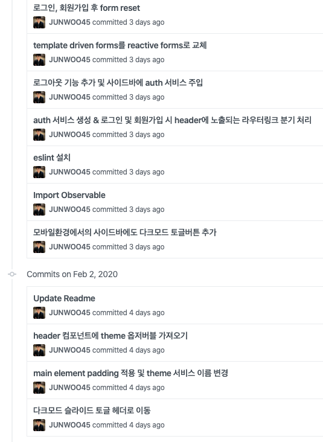
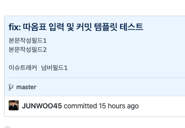
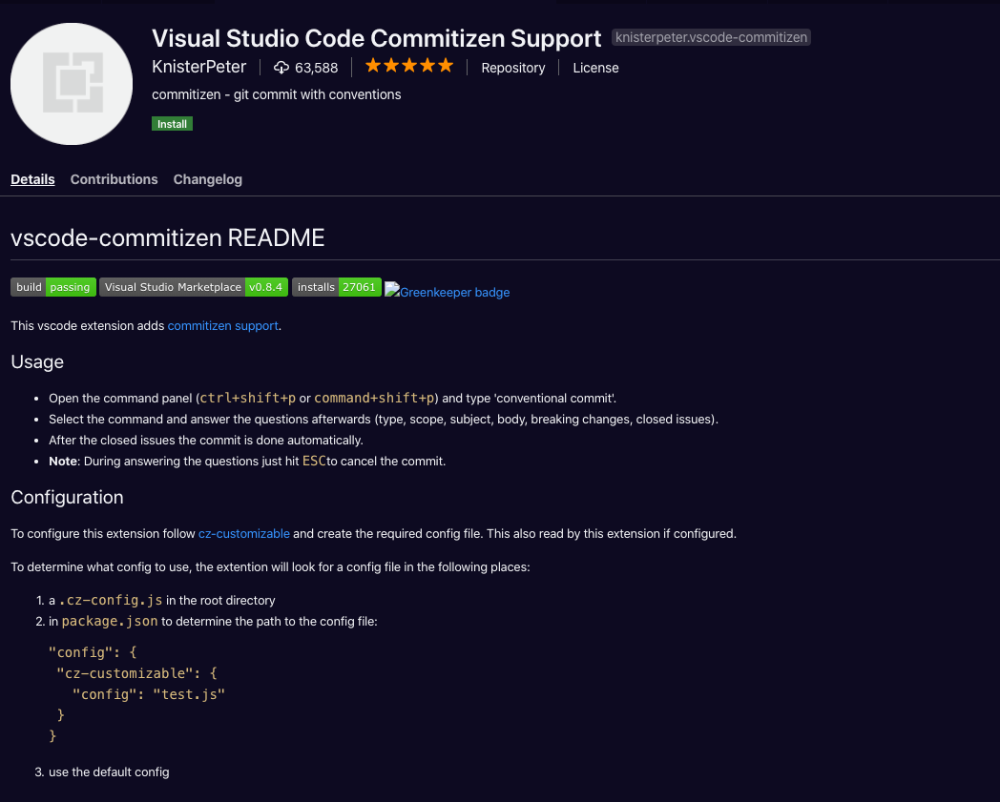

저는 다른 개발자분들이 작성한 코드를 읽을 때, 커밋 메시지의 도움을 많이 받고있습니다.

코드만 볼 땐 이해를 못했는데, 커밋 메세지를 확인하면 바로 이해가 갈 때가 많았거든요. ~~GitLens 찬양해..~~

그런데 며칠 전... 제가 작성한 커밋 내역을 훑어봤는데, 엉망진창인 커밋 메세지를 보며 부끄러움을 느꼈습니다.

다른 분들은 제 커밋 메시지를 보며 도움을 받기가 힘들 것 같았습니다.



<br>심지어 커밋한 작업 분의 '대표적인 변경점' 만 기록했습니다;

저장소를 돌아다닐 때, 잘 정돈되고 규칙적인 커밋 로그를 보면 기분이 좋아지므로,

그리고 일정한 스타일을 유지하는 좋은 커밋 습관을 가진 개발자가 되기위한 연습의 일환으로.

커밋 템플릿을 만들어보았습니다.

---

<br>

[https://git-scm.com/book/ko/v2/Git%EB%A7%9E%EC%B6%A4-Git-%EC%84%A4%EC%A0%95%ED%95%98%EA%B8%B0](https://git-scm.com/book/ko/v2/Git맞춤-Git-설정하기){:target="_blank"} 를 읽고 따라가며 진행했습니다.

<br>

우선, 가이드대로 `~/.gitmessage.txt` 파일을 만들어줍니다.

```
touch ~/.gitmessage.txt
```

<br>

텍스트 에디터로 진입한 뒤,

```
vim ~/.gitmessage.txt
```

<br>

아래 커스텀 템플릿을 넣고 저장해줍니다.

```
# <타입>: <제목>

##### 제목은 최대 50 글자까지만 입력 ############## -> |


# 본문은 위에 작성
######## 본문은 한 줄에 최대 72 글자까지만 입력 ########################### -> |

# 꼬릿말은 아래에 작성: ex) #이슈 번호

# --- COMMIT END ---
# <타입> 리스트
#   feat    : 기능 (새로운 기능)
#   fix     : 버그 (버그 수정)
#   refactor: 리팩토링
#   style   : 스타일 (코드 형식, 세미콜론 추가: 비즈니스 로직에 변경 없음)
#   docs    : 문서 (문서 추가, 수정, 삭제)
#   test    : 테스트 (테스트 코드 추가, 수정, 삭제: 비즈니스 로직에 변경 없음)
#   chore   : 기타 변경사항 (빌드 스크립트 수정 등)
# ------------------
#     제목 첫 글자를 대문자로
#     제목은 명령문으로
#     제목 끝에 마침표(.) 금지
#     제목과 본문을 한 줄 띄워 분리하기
#     본문은 "어떻게" 보다 "무엇을", "왜"를 설명한다.
#     본문에 여러줄의 메시지를 작성할 땐 "-"로 구분
# ------------------
```

<br>

그리고 `commit.template` 에 이 파일을 설정해줍니다.

```
git config --global commit.template ~/.gitmessage.txt
```

<br>

앞으로, `git commit` 명령어를 작성하면 터미널 에디터에 커스텀 템플릿이 기본으로 보이게 됩니다.


---

커스텀 템플릿에는 제목, 본문, 꼬릿말을 적을 수 있습니다.

테스트를 해봤는데요.




이런 식으로 예쁜 커밋을 작성할 수 있습니다.

커밋 템플릿을 만들어본 만큼.. 이젠 `git commit -m` 명령어를 사용해서 대충 커밋 메세지를 작성하지 않도록, 항상 의식하며 커밋을 작성해야할 것입니다.

커밋하는 것을 잊고, 작업량이 많아진 후에야 부랴부랴 커밋하는 경우도 종종 있었는데요.
작업을 잘게 쪼개서 커밋을 자주하는 연습도 해야겠습니다.

<br>

---

역시나, VS Code Extension에는 [Visual Studio Code Commitizen Support](https://marketplace.visualstudio.com/items?itemName=KnisterPeter.vscode-commitizen){:target="_blank"} 가 있는데요. (알려준 [바다](https://github.com/0261){:target="_blank"} 감사..!)



<br>

요 녀석은 커밋 템플릿을 좀 더 써보고, 설치해 볼 생각입니다.

<br>

---

### Reference

- [https://git-scm.com/book/ko/v2/Git%EB%A7%9E%EC%B6%A4-Git-%EC%84%A4%EC%A0%95%ED%95%98%EA%B8%B0](https://git-scm.com/book/ko/v2/Git맞춤-Git-설정하기){:target="_blank"}

