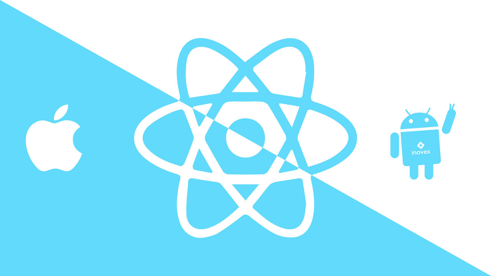

# 초보자용 리액트 네이티브 개발 환경 구축

---

> 개요
 
> React- Native로 앱을 개발 하기 위해 MAC에서 개발 환경을 설정하는 방법을 알아볼 것입니다.

---

리액트 네이티브 개발 방법은 아래와 같이 두 가지 개발 방법이 있습니다.

 - 1. Expo CLI
 - 2. React Navite CLI

React-Native로 앱을 개발하기 위해서는 NodeJS, Watchman, Xcode등을 설치 해야 합니다. 

---

### HomeBrew 설치

Homebrew는 맥(Mac)에서 필요한 패키지를 설치하고 관리하는 맥(Mac)용 패키지 관리자입니다. Homebrew를 사용하려면 맥에서 간단하게 필요한 패키지를 설치 할 수 있습니다.

 - HomeBrew : https://brew.sh/

 
 ---
 
 ### Nodejs 설치

 react-native는 Javascrit이므로 javascrit의 런타임인 NodeJS가 필요합니다.
  - Nodejs : https://nodejs.org/

아래의 homebrew 명령어를 통해 nodejs를 설치 합니다.

> brew install node
 - 설치가 완료되면, 아래의 명령어를 통해 Nodejs가 제대로 설치 되었는지 확인합니다.

> node -v

Nodejs를 설치하면, 기본적으로 Nodejs 패키지 매너지인 npm(Node Package Manager)도 같이 설치 됩니다.
NPM도 잘 설치가 되었는지 버전 확인 합니다.

> npm -v

---

### Watchman 설치

watchman은 특정 폴더나 파일을 감시 하다가 변화가 생기면, 특정 동작을 실행 하도록 설정 하는 역할을 합니다.
React-Native에서는 소스코드의 추가, 변경이 발생하면 다시 빌드 하기 위해 Watchman을 사용하고 있습니다.
 - Watchman : https://facebook.github.io/watchman/

watchman을 설치 하기 위해 아래의 Homebrew 명령어를 실행합니다.

> brew install watchman

설치가 완료되었다면, 아래의 명령어를 실행하여 확인 해줍니다.

> watchman -v

 

> ## Expo란 ?
> 쉽게 말해, 리액트 네이티브로 하는 개발을 쉽게 할 수 있게 해주는 것이다. 리액트 네이티브를 위한 set-up이 미리 구성되어 있고,
>native 파일들을 사용자에게서 숨겨놓고, 알아서 관리 해주는 일종의 캡슐화 같은 느낌이다.

Expo의 장점

 - Expo는 개발 시작하기가 간편하다. 리액트 네이티브를 위한 set up이 미리 구성 되어 있기 때문이다
 - Expo는 배포 하기가 매우 편하다. 처음 배포 후, 업데이트 버전은 Expo에 pulish만 해주면 Expo가 알아서 업데이트 해준다.

Expo의 단점

 - Expo에서 제공하는 API만 사용 가능하다. 필요한 기능이 없을 경우, 모듈을 만들어서 사용 불가능
 - Native 파일들을 크게 제어할 수 없다.

Expo로 프로젝트 시작하기

Expo로 프로젝트를 시작하기 위해서는 node.js  12 LTS 이상의 버전과 NPM 6이상으 ㅣ버전이 설치 되어 있어야 한다. 또한,  expo 계정생성을 해야한다.
http://expo.io/

Expo CLI 설치
 - npm install -g expo-cli

Expo 프로젝트 생성

 - expo init [프로젝트명]

Expo 프로젝트 실행 방법
 - cd 프로젝트명 # 위에서 생성해준 프로젝트 디렉토리로 접속 npm start # 프로젝트 실행 (npm start대신 expo start도 가능)

 - study_expo 라는 프로젝트 만들어 실행

 - 명령어를 입력하면, template를 선택해 줄 수 있다. 기본으로 Black를 선택

- Black 선택후, app의 일므을 원하는대로 적어주고 엔터를 눌러주면 프로젝트 생성.

 - 만들어진 프로젝트 디렉토리 이동 후, npm start를 입력하면 프로젝트 실행
 - 프로젝트가 실행 되면서 자동으로 expo dev tool 웹페이작 열림.

휴대폰에 'Expo'(ios) or 'Expo client'(Android) 스토어에서 다운 받으면 바로 확인이 가능하다.

- 주의사항 : expo 실행 되고 있는 컴퓨터와 휴대폰이 같은 인터넷으로 연결 되어야 한다.

휴대폰 start로 프로젝트 실행시킨 후 expo 어플리케이션(휴대폰)으로 접속 해보면, 'RECENTLY IN DEVELOPMENT' 부분에 실행중인 프로젝트와 연결

> ## React Native CLI란?

> 직접 네이티브로 어플리케이션을 개발 할 수 있다.
> native file들을 직접 다를 수 있다.

React Native의 장점

 - 필요한 기능이 있는 경우, 모듈을 직접 만들어서 사용할 수 있다.
 - 개발자가 원하는 언어로 추가적으로 작성 할 수 있다(kotlin, java, swift, object-c)

React Native의 단점

 - 초기 개발 환경 세팅 및 관리 운영에 비교적 많은 공수가 들어간다.
 - MacOS 없이 ios를 개발할 수 없다.
 - 배포, 업데이트 하는데 많은 시간이 소요 한다.

React Native CLI로 프로젝트 시작하기

React native CLI로 프로젝트 시작 하기 위해서는 OS에 따라 설치법이 다르다. (Mac)

 Homebrew를 이용하여 설치 해준다.
 - 개발 OS가 MAC OS일 경우, ios / Android를 둘 다 지원 가능 
  - brew install Node
  - brew install Watchman (파일 시스템의 변화를 확인하는 Facebook 도구)

 - 개발 OS가 Window일 경우, Android만 가능하다.
  - 설치 : Node, Python3 Jdk8

 Xcode는 AppStore에서 다운 받을 수 있다. 
 XCode를 실행하고, 커멘드라인 툴을 설정 해주기 위해 메뉴 Preferences..를 선택 후 그 다음 메뉴에서 Locations를 선택하고,
 하단의 Command Line Tools를 최 신 버 전선택한다.

여기까지 React Navtie를 시작하기 위한 준비 과정이었고, 본격적으로 React native를 설치 방법입니다.

1. 대부분 cd DEV 디렉토리 안에 따른 폴더 생성 후 사용 하시는걸 추천합니다! 

- $ npm install -g react-native-cli

- $ react-native init [프로젝트명]

- // ios  $ react-native run-ios

- // Android $ react-native run-android

 react-native run-ios 실행 화면입니다.

---

> React Native CLI를 통해 생성한 프로젝트의 휴대폰을 실행
> 다음 과 같은 화면이 뜨면 정상작동이 되는걸 확인할 수 있습니다. 

