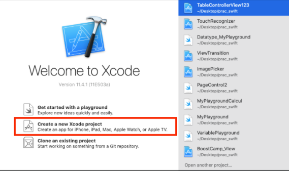
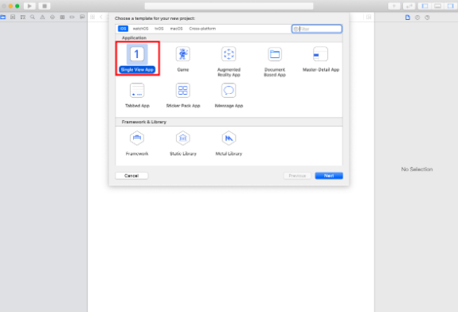
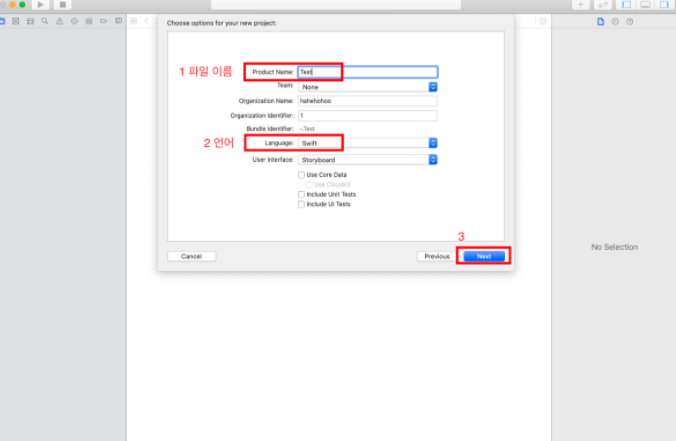
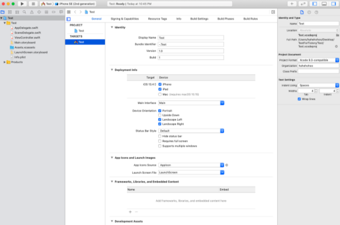

# Swift 프로젝트 준비 과정

---

> 개요
 
> Swift[MAC]의 프로젝트 준비 과정을 자세히 알아보자.

---

## STEP 1 #### Xcode 실행하고 Create a New Xcode Project를 클릭하여 새 프로젝트 만들기

---

## STEP 2 템플릿 선택하기

- [Sing View App를 선택하고 New를 눌러주세요]

## STEP 3 파일 이름 및 저장할 폴더 지정하기

- 프로젝트의 기본 정보를 입력 하는 창이 나오면 프로젝트 이름, 사용 하는 언어 지정 등 프로젝트의 기본 정보를 입력한 후  Next버튼을 클릭합니다. 저장할 폴더를 지정합니다.

## STEP 4 새 프로젝트 생성!

> 간단한 Xcode 프로젝트를 만드는 방법을 알아보았습니다. 
---

