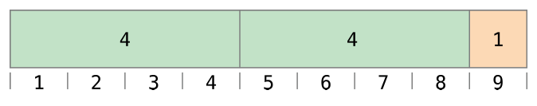

# Swift를 배우고자 하는 초심자를 위한 가이드북입니다.

---

### 개요
<br>
> 스위프트(Swift)란?

스위프트는 애플의 IOS와 macOS 개발을 위한 프로그래밍 언어로 2014년 6월 2일 WWDC(애플 세계 개발자 회의)에서 처음으로 소개 되었습니다. 기존에 애플 운영체제 개발을 위한 Objective-c 언어가 있었지만, Swift의 약어와 철학의 운은 다음과 같습니다. 
 "신속", "빠른", "즉석" "He is Swift of foot like a horse. 또 한 다른 한편으로 개발이나 학습의 측면에서도 '빠름'을 의미 하는게 아닌가 싶습니다. 
 애플은 스위프트를 소개 할 때 가장 먼저 배우기 쉬운 강력한 프로그래밍 언어라고 설명했습니다.
 이러한 설명을 뒷받침 하듯이 애플 홈페이지(https://www.apple.com/kr/swift/)에서 대학 교육과정을 도입도 하게 되었습니다. 

스위프트는 애플의 차세데 그리고 현재의 개발자 생태계 확보를 위해 만들어진 언어라고 보여집니다.
 성능 상으로도 Objective-c를 개발하면서 흔히 발생하는 에러를 줄일 수 있도록 보완해서 스위프트를 만들었다고 하고, 스위프트로 만들어진 앱이 Objective-c로 만들어진 앱 보다 성능이 더 좋다고 애플에서 직접 발표 했다고 하니 애플에서도 개발 생태계의 흐름을 고려해 Objective-C와 스위프트은 병행 하지만 사실상 스위프트로 대체해 나가는 것 같습니다.

---


### 1. 자료형

- 변수 선언 및 할당, 할당 시 저장 및 타입 자동 설정, " 대신 '는 사용 불가

```swift
var 변수명 = "Hello World"

//출력
print(변수명) == Hello World
```

- 상수 선언 및 할당, 할당 시 이 후 변경 불가

```swift
let name="valueName"
//name = "value"로 변경불가

print(name) // reulst = valueName
```

- : 뒤에 오는 것은 타입, 따로 지정 하지 않으면 컴파일러가 알아서 설정 해주게 됨.

```swift
let name2: String = "valuename" // 문자열
let lastName: Character = "value" //문자
let name3: "name"

```
만약 타입을 따로 지정 하지 않으면 컴파일러는 문자열로 인식, 즉 문자로 인식하고 싶다면 // Character로 직접 할당해야 함.

- 정수형, 최대 최소 값은 컴퓨터의 cpu bit수에 따라 다르기에, 32bit 사용 시 64bit의 값보다 작게 나옴 Int 대신 Int32 In64로 사용 하는 것이 좋음, Int64로 선언 시 32bit cpu에서도 64bit수로 인식 하게 됨.

```swift
let age: Int = 28
let age2 = 28
let age3: Int64 = 28

print(Int.min) //reuslt = -9223372036854775808
print(Int.max) // reuslt = 9223372036854775807
```

- 실수형, 정확도를 위해 Float보다는 Double 권장

```swift
let pi = 3.141592 
let pi2: Float = 3.141592 
```
Double, 타입을 따로 지정 하지 않으면 컴파일러는 Double로 인식, 15자리

```swift
//Bolean
let isMan:Bool = true
```
---

### 기본연산자 및 사칙연산 & 논리 연산자

- Swift에서는 통상적으로 이용하는 +, -, /, % 같은 산술연산자와 &&, || 같은 논리 연산자, 그리고 C에서 지원 하지 않는 a..<b 나 a..b> 같이 값의 범위를 지정할 수 있는 범위 연산자를 지원


#### 용어
연산자에는 단항(unary), 이항(binary) 그리고 삼항(ternary) 연산자가 있습니다.

 - 단항 연산자는 - -a, !b, c! 와 같이 하나의 대상에 앞 뒤에 바로 붙여 사용하는 연산자압니다.
 - 이항 연산자는 2 + 3 같이 두 대상 사이에 위치하는 연산자입니다.
 - 삼항 연산자는 a ? b : c 형태로 Swift에 삼항 연산자는 이 연산자 단 하나만 존재합니다.


 #### 할당 연산자(Assignment Operator)

 할당 연산자는 값을 초기화 시키거나 변경합니다. 아래와 같이 상수, 변수 모두에 사용 가능합니다.

 ```swift
let b= 10
var a= 5
a = b
// a 값은 10
 ```

 아래와 같이 튜플을 이용해 여러 값을 한번에 할당할 수 있습니다.

 ```swfit
let (x, y) = (1, 2)
// x는 1, y 값은 2가 됩니다.
 ```

 C나 Objective-C와 다르게 Swift에서는 할당 연산자는 값을 반환하지 않습니다.


```swift
if x = y{
    // x= y 는 값을 반환 하지 않기 때문에 이 문법은 올바르지 않습니다.
}
```
할당 연산자는 값을 반환하지 않는 이유는 동등비교연산자(==)를 사용해야 하는 곳에 할당연산자(=)가 실수로 사용 되는 것을 막기 위해서 입니다.


#### 사칙 연산자(Arithmetic Operators)

Swift는 모든 숫자 형에서 사용 가능한 4가지 표준 사칙 연산자를 지원합니다

 - 덧셈(+)
 - 뺄셈(-)
 - 곱셈(*)
 - 나눗셈(/)

```swift
let num1 = 10 + 20 //reulst 
print(num1)
let num2 = 20 - 10
print(num2)
let num3 = 10 * 2
print(num3)
let num4 = 10 / 2
print(num4)
```
C나 Objective-C와 달리 Swift는 사칙 연산의 값이 오버플로우 되는 것을 허용 하지 않습니다. 만약 이 것을 허용하고 싶으면 Swift의 오버플로우 연산자를 이용해 지원할 수 있습니다. 덧셈 연산자는 아래와 같이 문자열을 합치기 위해 사용할 수 있습니다.

```swift
"hello," + "world" // equals "hello, world" 
```

#### 나머지 연산자(Remainder Operator)

a % b 와 같이 나머지 연산을 지원합니다

```swift
9 % 4 // 1
-9 % 4 // -1
```



#### 단항 음수 연산자(Unary Minus Operator)
숫자 값은 - 로 표현되는 단항 음수 연산자에 의해 부호가 변합니다

```swift
let three = 3

let minusThree = -three // minusThree는 -3

let plusThree = -minusThree // plusThree는 3, 혹은 "minus muns 3"

```

#### 단항 양수 연산자(Unary Plus Operator)

+로 표현되는 단항 양수 연산자는 부호에 아무런 영향을 끼치지 않습니다

```swift
let minusSix = -6

let alsoMinusSix = +minusSic // alosoMinusSix는 -6
```


