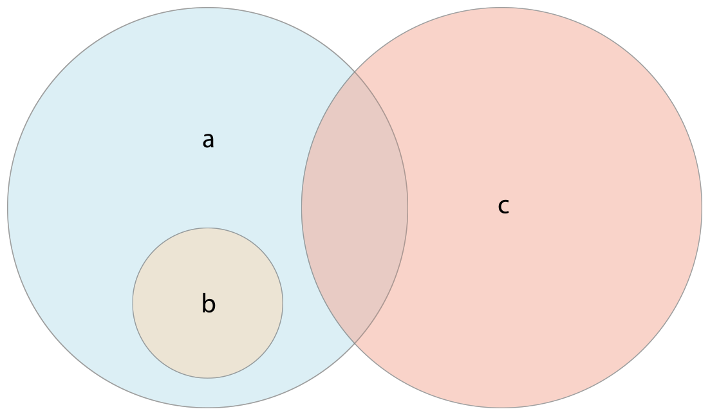

# Swift를 배우고자 하는 초심자를 위한 가이드북입니다.

---

### 개요
<br>
> Swift에서는 콜렉션 타입으로 배열, 셋, 사전 세 가지를 지원합니다.


---


# 컬렉션의 변경

배열, 셋, 사전을 (var)에 할당하면 이 콜렉션은 변경가능하고 상수(let)에 할당하면 변경 불가능합니다.


---

<br>

# 배열(Array)

## 배열의 축약법 문법

배열 타입은 Array로 적을 수 있는데 축약형으로[Element] 형태로 사용할 수도 있습니다.

<br>

## 빈 배열의 생성

아래와 같이 Int형 빈 배열을 생성할 수 있습니다.

```swift
var someInts = [Int]()
print("someInts is of type [Int] with \(someInts.count) items")
```
<br>

```swift
someInts.append(3)
//배열에 3을 추가 했습니다.
someInts = []
//배열을 비웠습니다. 배열의 아이템 타입은 그대로 Int로 유지됩니다.
```
<br>

## 기본 값으로 빈 배열 생성

repating 메소드와 count 메소드를 이용해 기본 값으로 빈 배열을 생성할 수 있습니다.

```swift
var threeDoubles = Array(repeating: 0.0, count: 0)
// threeDoubles : DOuble 타입의 [0.0 , 0.0, 0.0]
```
<br>

## 다른 배열을 추가한 배열의 생성

`+` 연산자를 이용해 배열을 합칠 수 있습니다.

```swift
var threeDoubles = Array(repeating: 0.0, count: 3)
print(threeDoubles)
//result : [0.0, 0.0, 0.0]
var anotherThreeDoubles = Array(repeating: 2.5, count: 3)

var a = (anotherThreeDoubles + threeDoubles)

print(a)
//result :[2.5, 2.5, 2.5, 0.0, 0.0, 0.0]
```

<br>

## 리터럴을 이용한 배열의 생성
`[value 1, value 2, value 3]` 형태를 이용해 배열을 생성할 수 있습니다.

```swift
var shoppingList: [String] = ["eggs", "Milk"]

```
<br>

더 간단하게 선언할 수도 있습니다.
```swift
var shoppingList = ["eggs", "Milk"]
```

<br>

## 배열의 접근 및 변환

배열의 원소 개수 확인

```swift
print("The shopping list contains \(shoppingList.count) items.")
// The shopping list contains 2 items.
```

<br>

배열이 비었는지 확인
```swift
if shoppingList.isEmpty{
    print("the Shopping list is empty.")
}else{
    print("the shopping list is not empty.")
}
```

<br>

배열에 원소 추가
```swift
shoopingList.append("Four")

```swift
shoppingList += ["Baking Powder"]
// shoppingList.count = 4
shoppingList += [Chocolate Spread", "Cheese", "Butter"]
// shoppingList.count = 7
```
<br>

배열의 특정 위치의 원소 접근
```swift
var firstItem = shoppingList[0]
```

```swift
shoppingList[4..6] = ["Bananas", "Apples"]
```

<br>

특정 위치의 원소 추가/삭제/접근
```swift
shoppingList.insert("Maple Syrup", at:0)

let mapleSyrup = shoppingList.remove(at: 0)

firstItem = shoppingList[0]
//firstItem : "Six eggs"
```
```swift
let apples = shoppingList.removeLast()
```
<br>

## 배열의 순회

`for-in` loop을 이용해 배열을 순회할 수 있습니다.

```swift
for item in shoppingList{
    print(item)

    //result :  // Six eggs
// Milk
// Flour
// Baking Powder
// Bananas
}
```
<br>

배열의 값과 인덱스가 필요할 때는 `enumerated()` 메소드를 사용합니다.

```swift
for (index, value) in shoppingList.enumerated(){

    print("Item \(index + 1): (value)")
}
// Item 1: Six eggs
// Item 2: Milk
// Item 3: Flour
// Item 4: Baking Powder
// Item 5: Bananas
```


# 셋(Set)
---

<br>
`Set` 형태로 저장되기 위해서는 반드시 타입이 `hashable`이어야만 합니다. Swift에서 `String`, `Int`, `Double`, `Bool` 같은 기본 타입은 기본적으로 `hashable`입니다. Swift에서 `Set` 타입은 `Set`으로 선언합니다.

<br>


## 빈 Set 생성

```swift
var letters = Set<Character>()
print("letters is of type Set<Character> with \(letters.count) items.")
```
<br>

```swift
letters.insert("a")
letters = []
```

<br>
배열 리터럴을 이용한 Set 생성

<br>
```swift
var favoriteGenres: Set<String> ["Rock", "Classical", "Hip hop"]
```
<br>

Swift의 타입추론으로 아래와 같이 선언도 가능합니다.
```swift
var favoriteGenres: Set = ["Rook", "Classical", "Hip hop"]
```
## Set의 접근과 변경
```swift
print("I have \(favoriteGenres.count) favorite music genres.")
```

<br>

비었는지 확인
```swift
if favorite.isEmpty{
    print("As far as music goes, I'm not picky.")
} else{
    print("I have particular music preferences.")
}
```
<br>

추가
```swift
favorite.insert("Jazz")
```
<br>

삭제
```swift
if let removedGenre = favoriteGenres.remove("Rook"){
    print("\(removedGenre)? I'm over it.")
}else{
    print("I never much cared for that.")
}
```
<br>

값 확인
```swift
if favoriteGenres.contains("Fuck"){
    print("I get up on the good food.")
}else{
    print("It's too funky in here.")
}
```
<br>

## Set의 순회
for -in loop을 이용해 set을 순회할 수 있습니다.
```swift
for genre in favoriteGenres{
    print("\(genre)")
}
```

## Set 명령


<br>

```swift
let oddDigits: Set = [1, 3, 5, 7, 9]
let evenDigits: Set = [0, 2, 4, 6, 8]
let singleDigitPrimeNumbers: Set = [2, 3, 5, 7]


oddDigits.union(evenDigits).sorted()
// [0, 1, 2, 3, 4, 5, 6, 7, 8, 9]
oddDigits.intersection(evenDigits).sorted()
// []
oddDigits.subtracting(singleDigitPrimeNumbers).sorted()
// [1, 9]
oddDigits.symmetricDifference(singleDigitPrimeNumbers).sorted()
// [1, 2, 9]
```
- union : 합집합으로 두 Set을 합쳐 새로운 Set을 만듭니다.
- subtract : 겹치는 부분을 제외하여 새로운 Set을 만듭니다.
- intersect : 두 Set의 겹치는 부분으로 새로운 Set을 만듭니다.
- exclusiveOr : 두 Set의 겹치는 부분을 제외한 나머지 부븐으로 새로운 Set을 만듭니다.


<br>

## Set의 맴버십과 동등 비교

Set의 동등비교와 맴버 여부를 확인하기 위해 각각 `==`연산자와 `isSuperset(of:)`, `isStrictSubset(of:)`, isStrictSuperset(of:)`, `isDisjoint(with:)` 메소드를 사용합니다.



<br>

`isDisjoint(with:)`는 둘간의 공통값이 없는 경우에 `true`를 반환합니다.

```swift
let houseAnimals: Set = ["🐶", "🐱"]
let farmAnimals: Set = ["🐮", "🐔", "🐑", "🐶", "🐱"]
let cityAnimals: Set = ["🐦", "🐭"]

houseAnimals.isSubset(of: farmAnimals)
// 참
farmAnimals.isSuperset(of: houseAnimals)
// 참
farmAnimals.isDisjoint(with: cityAnimals)
// 참
```

- isSubsetOf: Set의 모든 값이 특정 Set에 포함되는지를 확인.
- isSupersetOf: Set의 모든 값이 특정 Set에 포함 하는지 확인
- isDisjointWith: 두 Set이 일치하지 않는지 확인

<br>

# 사전(Dictionaries)
---
> 주의
> Swift의 `Dictionary`타입은 `Foundation` 클래스의 `NSDictionary`를 bridge한 타입니다.

## 축약형 Dictionary

[key: value] 형태로 Dictionary를 선언해 사용할 수 있습니다.


## 빈 Dictionary의 생성

```swift

var namesOfIntegers = [Int: string]()

namesOfIntegers[16] = "sixteen"
namesOfIntegers = [:]
```

## 리터럴을 이용한 Dictionary의 생성

`[key 1: value 1, key 2: value2 , key 3: value3]` 형태로 사전을 선언할 수 있습니다.

```swift
var airports: [String: String] = ["YYZ": "Toronto Pearson", "DUB": "Dublin" ]
```

## Dictionary의 접근과 변경

```swift
print("The airports dictionary contains \(airports.count) items.")
```

빈 Dictionary 확인
```swift
if airports.isEmpty{
    print("The airports dictionary is empty.")
}else {
    print("The airports dictionary is not empty.")
}
```

값 할당

```swift
airports["LHR"] = "London"
```