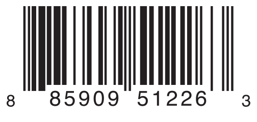
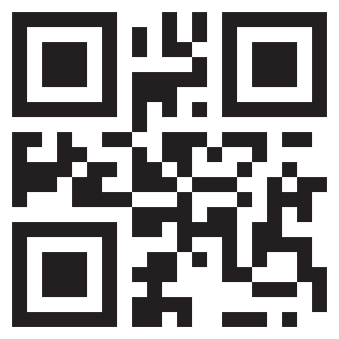

# Swift 프로젝트 준비 과정

---

> 개요
<br>
> 열거형(Enumerations) 란? 관련된 값으로 이루어진 그룹을 공통의 형으로(type) 선언해 형 안전성(type-safety)을 보장하는 방법으로 코드를 다룰 수 있게 해줍니다.
> C나 Objective-C가 Integer값들로 열거형을 구성한 것에 반해 Swift에서는 case값이 string, Character, integer,  floting 값들을 사용할 수 있습니다. 열거형은 1급 클래스(first-class types)이어서 계산된 프로퍼티(computed properties)를 제공하거나 초기화를 지정하거나, 초기 선언을 확장해 사용할 수 있습니다.

---


## 열거형 문법(Enumeration Syntax)

---

`enum` 키워드를 사용해 열거형을 정의합니다.
```swift
enum SomeEnumeration{
    // enumeration definition goes here
}
```

다음은 네 가지 방향을 갖는 `CompassPoint` 열거형 선언의 (예)입니다.

```swift
enum CompassPoint{
    case north
    case south
    case east
    case west
}
```
> C or Objective-C 와는 다르게 Swift에서 열거형은 생성될 때 각 case 별로 기본 integer 값을 할당 하지 않습니다. 위 `CompassPoint`를 예로 들면, noth, south, east,west는 각각 암싲거으로 0,1,2,3값을 갖지 않습니다. 대신 Swift에서 열거형의 각 case는 CompassPoint으로 선언된 온전한 값입니다.


여러 case를 콤마(,)로 구분해서 한줄에 적을 수 없습니다.

```swift
enum Planet {
    case mercury, venus, earth, mars, jupiter, saturn, uranus, neptune
}
```
각 열거형 정의는 완전 새로운 형(type)을 정의합니다. Swift의 다른 형(Types)과 마찬가지로 형의 일므은 대문자로 (CompassPoint나 Planet 같이) 시작 해야 합니다.

```swift
var directionToHead = CompassPoint.west
```

`directionToHead`의 형은 초기화 될 때 타입추론이 돼서 `CompassPoint` 형을 갖게 됩니다. `directionToHead`의 형이 `CompassPoint`로 한번 정의되면 다음에 값을 할당할 때 형을 생략한 점 문법(dot syntax)을 이용해 값을 할당하는 축약형 문법을 사용할 수 있습니다.

```swift
directionToHead= .east
```

## Swift 구문에서 열거형 값 매칭하기(Matching Enumeration Values with a Switch Statemnt)
---
각 열거형 값을 `Swift`문에서 매칭할 수 있습니다.
```swift
directionToHead = .south
switch directionToHead {
case .north:
    print("Lots of planets have a north")
case .south:
    print("Watch out for penguins")
case .east:
    print("Where the sun rises")
case .west:
    print("Where the skies are blue")
}
// Prints "Watch out for penguins"
```

`switch`문은 반드시 열거형의 모든 경우(cases)를 완전히 포함해야 합니다. 만약 뒤에서 `case .west`가 생략 되었다면 코드는 컴파일 되지 않습니다. 만약 열거형의 모든 cases의 처리를 기술하는게 적당 하지 않다면 기본(default) case를 제공함으로써 처리 되지 않는 case를 제공함으로써 처리되지 않는 case를 피할 수 있습니다.

```swift

let somePlanet = Planet.earth

switch somePlanet{
    case .earth:
        print("Mostly harmless")
    default:
        print("not a safe place for humans")
}
```

## 관련 값("Associated Values)

열거형의 각 case에 custom type의 추가적인 정보를 저장할 수 있습니다.


---


예를 들어 바코드가 위와 같이 4가지 구분으로 이루어진 숫자로 이루어진 종류가 있거나, 2953개의 문자로 구성된 QR코드 형태로 이루어진 두 가지 종류가 있다면 이 바코드를 아래와 같은 열거형으로 정의할 수 있습니다.

```swift
enum Barcode{
  case upc(Int, Int, Int, Int)
  case qrCode(String)
}
```

관련 값을 이용하면 위와 같이 같은 형이지만, 다른 형태의 값을 갖는 case를 만들 수 있습니다. 바코드는 아래와 같이 선언할 수 있고,
```swift
var productBarcode = Barcode.upc(8, 85900, 51226, 3)
```
이렇게 선언 하는 것도 가능합니다.
```swift
productBarcode = .qrCode("ABCDEFGHIJKLMNOP")
```

관련 값은 `switch case`문에서 사용할 때 상수 혹은 변수로 선언할 수 있습니다.


