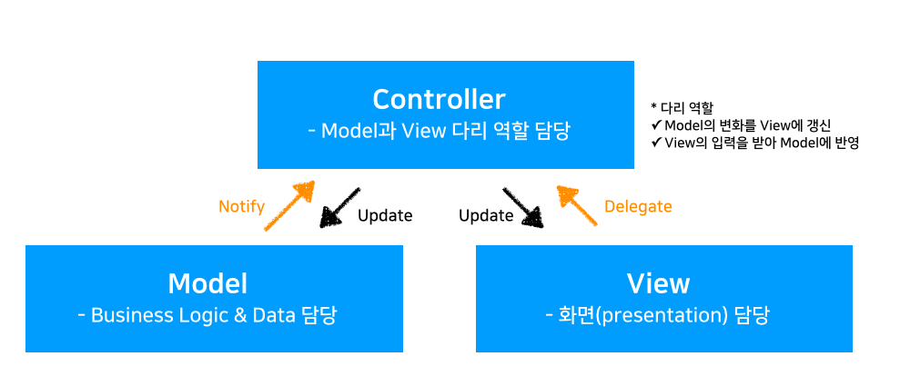
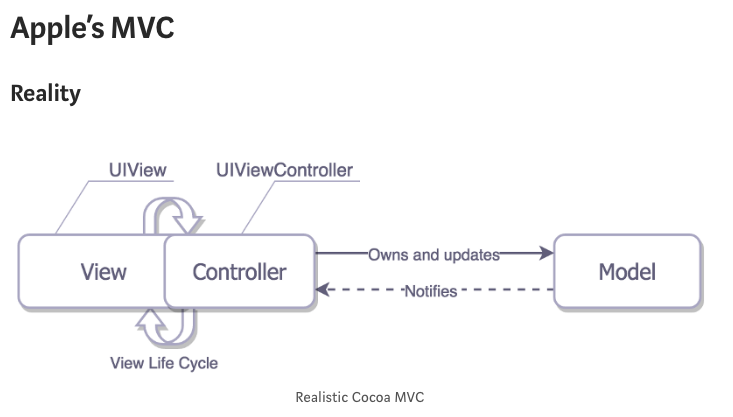
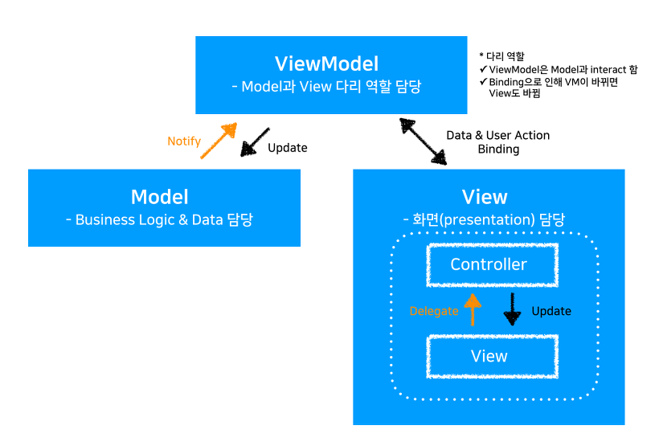
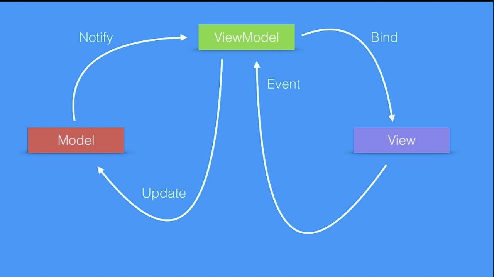
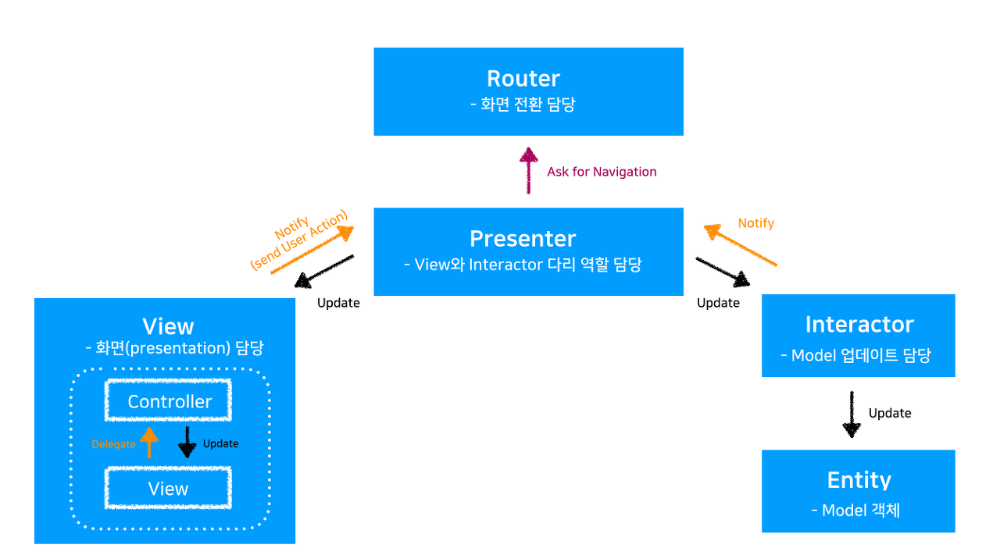

# 디자인 패턴의 종류

---

## MVC(Model-View-Controller)




> 장점

- 역할분담을 고려한 구조를 빠르게 구현 할 수 있음.

---

> 단점

- MVC는 MVC(Massive View Controller) ?!!?

 Model에 넣기도 애매하고 View에도 넣기 애매한 코드를 모두 Controller 들어가게 되어서 Controller가 비대해진다 그래서 MVC Massive View Controller라고 풍자 하기도 한다...


 ex) 날짜 데이터를 각 국가별 양식으로 포맷하는 코드.
 비즈니스 로직이나 데이터라고 보기도 어렵고 UI라고 보기도 어렵다. 결국 이와 같은 Formatting 담당코드들은 Controller에 들어가게 된다.


- 애플의 MVC 패턴에서는 View와 Controller가 너무 친함


애플의 MVC 패턴은 기준 MVC 패턴과는 다르다. View와 Controller가 강하게 연결되어 있어 View Controller가 거의 모든 일을 한다. ViewController에서는 Controller가 View의 lifeCycle(라이프 사이클)에 관여 하기 때문에 View와 Controller를 분리 하기 어렵다. 그래서 앱을 테스트할 때, Model은 따로 분리되어 테스트를 할 수 있어도. View와 Controller는 강하게 연결되어 있기 때문에 각각 테스트하기 어렵다는 단점이 있다.



---


## MVVM(Model - View - ViewModel)






- Model의 변화를 ViewModel에게 알려주면 ViewModel과 바인딩되어 있는 View가 업데이트된다.  
- View에 들어온 Event를 ViewModel에게 알려주면 ViewModel은 Model을 업데이트 시킨다.


#### ViewModel


- ViewModel은 Presentation Logic을 다루게 된다 하지만 UI는 다루지 않는다.
- ViewModel과 View를 바인딩할 때 주로 Rx를 이용한다.


- ER
> 뷰 모델은 뷰와 모델 사이의 중개자 역할을하며 뷰 로직을 처리합니다. 일반적으로 뷰 모델은 모델 클래스의 메서드를 호출하여 모델과 상호 작용합니다. 그런 다음 뷰 모델은 뷰에서 쉽게 사용할 수있는 형식으로 모델의 데이터를 제공합니다. 뷰 모델은 모델에서 데이터를 검색 한 다음 뷰에서 데이터를 사용할 수 있도록하고 뷰에서 더 간단하게 처리 할 수 ​​있도록 데이터 형식을 다시 지정할 수 있습니다. 보기 모델은 애플리케이션 사용자가보기에서 시작하는 명령의 구현도 제공합니다. 예를 들어 사용자가 UI에서 버튼을 클릭하면 해당 작업이 뷰 모델에서 명령을 트리거 할 수 있습니다. 뷰 모델은 또한 일부 작업이 보류 중이라는 표시와 같이 뷰에서 디스플레이의 일부 측면에 영향을 미치는 논리적 상태 변경을 정의 할 책임이 있습니다.

- 장점

유닛 테스팅 하기 좋다.

ViewModel은 View에 대해 아무것도 모른다. 즉 ViewModel에는 UIKit과 관련된 코드가 없다. ( <-> View랑 너무 친한 MVC의 Controller ) ViewController와 의존성도 전혀 없다. 따라서 ViewModel을 이용해서 Model의 비즈니스 로직을 테스트해 볼 수 있다. 

---

# VIPER (View - interactor - Presenter - Entity - Router)



- Entity(엔터티) - 모델 객체
- interactor (인터랙터) - 모델객체(entity)를 조작한다. 어떤 행동에 따라서 모델객체를 조작하는 로직이 담겨있다.
- Presenter(프리젠터) - Interactor에서 데이터를 가져오고 View에 보여준다.
- Router(라우터) - Wireframe 화면 전환 담당, 화면 전환을 어떻게 하는지 알고 있다. '언제', 화면을 전환할지 알고 있는 Presenter가 '어떻게' 화면을 전환할지 알고 있는  Router에게 화면 전환을 요청한다.


 - Presenter는 View , Interactor, Router와 상호작용한다 ( Interactor 로부터 조작된 데이터 가져오고, View/ViewController에 준비한 데이터를 보내주고, Router에 화면전환을 부탁한다 ) 


간략하게 Presenter 코드를 보면 다음과 같다.


```swift
 

class PostListPresenter: PostListPresenterProtocol {

    weak var view: PostListViewProtocol?

    var interactor: PostListInteractorInputProtocol?

    var wireFrame: PostListWireFrameProtocol?

    

    func viewDidLoad() {

        view?.showLoading()

        interactor?.retrievePostList()

    }

    

    func showPostDetail(forPost post: PostModel) {

        wireFrame?.presentPostDetailScreen(from: view!, forPost: post)

    }

}
```


