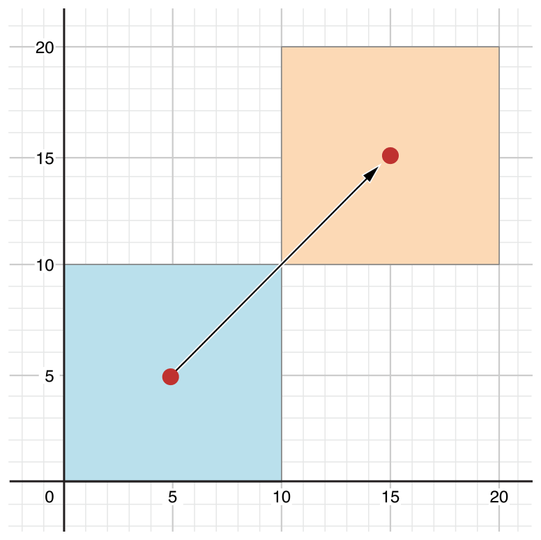

> 프로퍼티
프로퍼티는 클래스, 구조체, 열거형과 관련하 값입니다. 프로퍼티의 종류에는 저장 프로퍼티(Stored Properties)와 계산된 프로퍼티(Computed Properties)가 있습니다. 저장 프로퍼티는 말 그대로 값을 저장하고 있는 프로퍼티이고, 계산된 프로퍼티는 값을 저장하고 있지 않고 특정하게 계산한 값을 반환해 주는 프로퍼티입니다. 계산된 프로퍼티는 클래스, 구조체, 열거형 모두에서 사용가능 하지만, 저장 프로퍼티는 클래스와 구조체에서만 사용 가능합니다. 추가로 프로퍼티 옵저버를 정의해서 값이 변할 때마다 모니터링할 수 있습니다.
---

# 저장 프로퍼티(Stored Properties)
저장 프로퍼티는 위에서 설명한 대로 단순히 값을 저장하고 있는 프로퍼티 입니다. 이 프로퍼티는 `let`키워드를 이용해서 상수 혹은 `var`키워드를 이용해서 변수로 선언해 사용할 수 있습니다.

```swift
struct FixedLengthRange {
    var firstValue: Int
    let length: Int
}
var rangeOfThreeItems = FixedLengthRange(firstValue: 0, length: 3)
// 범위 값은 0, 1, 2 입니다.
rangeOfThreeItems.firstValue = 6
// 범위 값은 6, 7, 8 입니다.
```
위 예제를 보면 `firstValue`와 `length`에 첫 값과 그 길이를 각각의 프로퍼티에 저장해 범위 값을 표현합니다.


## 상수 구조체 인스턴스의 저장 프로퍼티(Stored Properties of Constant Structure Instances)

구조체를 상수로 선언하면 (`let`)그 구조체 인스턴스의 프로퍼티를 변경할 수 없습니다.

```swift
let rangeOfFourItems = FixedLengthRange(firstValue: 0, length: 4)

rangeOfFourItems.firstValue = 6
```

위 예제에서 `rangeOfFourItems`는 상수(`let`)로 선언되었기 때문에 프로퍼티를 변경할 수 없습니다. 반면 구조체가 아니라 클래스는 `let`으로 선언하더라도 프로퍼티가 변경 가능합니다. 이유는 클래스 인스턴스는 참조 타입 이기 때문입니다.


## 지연 저장 프로퍼티(Lazy Stored Properties)

지연 저장 프로퍼티는 값이 처음으로 사용 되기 전에는 계산되지 않는 프로퍼티입니다. 이 프로퍼티를 선언하기 위해서는 프로퍼티의 선언 앞에 `lazy`키워드를 붙이면 됩니다.

>NOTE
>지연 프로퍼티는 반드시 변수(`var`)로 선언해야 합니다. 왜냐하면 상수는 초기화가 되기 전에 항상 값을 같는 프로퍼티인데, 지연 프로퍼티는 처음 사용되기 전에는 값을 갖지 않는 프로퍼티이기 떄문입니다.

프로퍼티 특정 요소에 의존이여서 그 요소가 끝나기 전에 적절한 값을 알지 못한느 경우에 유용합니다. 또 복잡한 계산이나 부하가 많이 걸리는 작업을 지연 프로퍼티로 선언해 사용하면 실제 사용되기 전에는 실행되지 않아서 인스턴스의 초기화 시점에 복잡한 계산을 피할 수 있습니다.


```swift
class DataImporter {
    /*
        DataImporter는 외부 파일에서 데이터를 가져오는 클래스입니다.
         이 클래스는 초기화 하는데 매우 많은 시간이 소요된다고 가정하겠습니다.
     */
    var filename = "data.txt"
    // 데이터를 가져오는 기능의 구현이 이 부분에 구현돼 있다고 가정
}

class DataManager {
    lazy var importer = DataImporter()
    var data = [String]()
    // 데이터를 관리하는 기능이 이 부분에 구현돼 있다고 가정
}

let manager = DataManager()
manager.data.append("Some data")
manager.data.append("Some more data")
// DataImporter 인스턴스는 이 시점에 생성돼 있지 않습니다.
```

`DataManager`라는 클래스를 선언하고 이 클래스는 데이터를 가져오는 `DataImporter` 클래스를 가지고 있으며, 이 클래스는 실제 디스크 파일에서 데이터를 가져오기 떄문에 초기화 시간이 많이 걸립니다. 그래서 이 클래스를 지연 프로퍼티(`lazy var importer = DataImporter())`로 선언합니다. 이 프로퍼티는 코드에서 볼 수 있듯 `DataManager` 인스턴스`manager`를 생성하고 거기에 data를 넣어도 그 시점에서`DataImporter` 인스턴스는 생성되 있지 않습니다. 다시 말하면 지연 프로퍼티로 선언해 놓았기 때문에 실제 그 프로퍼티를 사용하기 전에는 복잡하고 시간일 오래 소요되는 연산을 할 필요가 

```swift
print(manager.importer.filrname)
// data.txt 파일 출력됨.
```
`manager.importer.filename`가 실행되 실제 `importer` 프로퍼티에 처음 접근할 때 비로소 `importer`인스턴스가 생성됨.

>NOTE
> 만약 지연 프로퍼티가 여러 스레드에서 사용되면 지연 프로퍼티가 한번만 실행되는 걸 보장 하지 않습니다. 만약 지연 프로퍼티가 단일 스레드에서 사용되면 초기화는 한번만 하게 됩니다.

## 저장 프로퍼티와 인스턴스 변수(Stored Properties and Instance Variables)

Objective-C에 경험이 있으신 분은 objective-C언에서는 값을 저장하기 위해 점 연산자(`instance.property = value`)나 set 연산(`instance.setProperty(value))`으로 값을 저장한다는 것을 아실 겁니다. 뿐만 아니라 메모리 관리와 관련한 개념도 프로퍼티에 함께 명시합니다. 바로 이런식으로 말이죠 `@Property(nonatomic, retain) NSString *propertyName;` Swift에서는 이런 컨셉을 하나의 프로퍼티에 녹여 프로퍼티의 선언과 사용의 혼란을 피했습니다. 프로퍼티의 이름, 타입, 메모리 관리 등으 모든 정보를 프로퍼티를 선언하는 한 곳에서 정의하게 됩니다.

---
# 계산된 프로퍼티(Computed Properties)

저장 프로퍼티 뿐만 아니라 추가적으로 클래스, 구조체, 열거형은 계산된 프로퍼티를 선언 가능하다.
실제 값을 저장하고 있는 것이 아니라, `getter`와 `optional`한 `setter`를 제공해 값을 탐색하고 간접적으로 다른 프로퍼티 값을 설정할 수 있는 방법을 제공합니다.

```swift
struct Point {
    var x = 0.0, y = 0.0
}
struct Size {
    var width = 0.0, height = 0.0
}
struct Rect {
    var origin = Point()
    var size = Size()
    var center: Point {
        get {
            let centerX = origin.x + (size.width / 2)
            let centerY = origin.y + (size.height / 2)
            return Point(x: centerX, y: centerY)
        }
        set(newCenter) {
            origin.x = newCenter.x - (size.width / 2)
            origin.y = newCenter.y - (size.height / 2)
        }
    }
}
var square = Rect(origin: Point(x: 0.0, y: 0.0),
                  size: Size(width: 10.0, height: 10.0))
let initialSquareCenter = square.center
square.center = Point(x: 15.0, y: 15.0)
print("square.origin is now at (\(square.origin.x), \(square.origin.y))")
// "square.origin is now at (10.0, 10.0)" 출력
```

위 코드는 좌표와 크기를 갖는 사각형을 표현하는 구조체에 관한 코드입니다. 여기서 `Rect` 구조체는 사각형의 중점을 표현하는 `center`라는 계산된 프로퍼티를 제공합니다. 이 프로퍼티는 계산된 프로퍼티의 정의대로 값을 직접 갖고 있는 것이 아니라 다른 좌표와 크기 프로퍼티들을 적절히 연산해서 구할 수 있습니다.(`get`)또는 `set`으로 사각형의 중점을 직접 설정할 수 있는데, 이 값을 설정할 때 `x,y` 좌표가 어떤 값을 가져야 하는지 계산해서 `x,y`에 적절한 좌표값을 넣어 줍니다.




## Setter 선언의 간략한 표현(Shorthand Setter Declaration)

앞의 코드에서는 `Setter`의 인자 이름을 아래 와 같이 `set(newCenter)` 라고 명시 했지만, 만약 이렇게 `(newCenter)`라 인자 이름을 지정 하지 않으면 인자 기본 이름인 `newValue`를 사용할 수 있습니다.

```swift
struct AlternativeRect {
    var origin = Point()
    var size = Size()
    var center: Point {
        get {
            let centerX = origin.x + (size.width / 2)
            let centerY = origin.y + (size.height / 2)
            return Point(x: centerX, y: centerY)
        }
        set {
            origin.x = newValue.x - (size.width / 2)
            origin.y = newValue.y - (size.height / 2)
        }
    }
}
```
위 코드에서는 `set` 메소드 안에서 인자 이름을 지정하지 않았느네도 `newValue.x, newValue.y`를 사용할 수 있는 것을 볼 수 있다.

## 읽기전용 계산된 프로퍼티(Read_Only Computed Properties)

`getter`만 있고 `setter`를 제공 하지 않는 계산된 프로퍼티를 읽기전용 계산된 프로퍼티라고 합니다. 즉, 읽기전용 계산된 프로퍼티는 반드시 반환 값을 제공하고 다른 값을 지정할 수 없는 프로퍼티입니다.

>NOTE
> 읽기전용 계산된 프로퍼티를 포함해 계산된 프로퍼티를 선언 시에는 반드시 `let`이 아니라 `var`로 선언해야 합니다. 보통 읽기전용 이라 함은 한번 값이 정해지면 변하지 않기 때문에 `let`으로 선언하는 것이 맞으나 계산된 프로퍼티는 읽기전용이라 하더라도 계산 값에 따라 값이 변할 수 있기 떄문에 `var`로 선언합니다.
```swift
struct Cuboid {
    var width = 0.0, height = 0.0, depth = 0.0
    var volume: Double {
        return width * height * depth
    }
}
let fourByFiveByTwo = Cuboid(width: 4.0, height: 5.0, depth: 2.0)
print("the volume of fourByFiveByTwo is \(fourByFiveByTwo.volume)")
// "the volume of fourByFiveByTwo is 40.0" 출력
```
