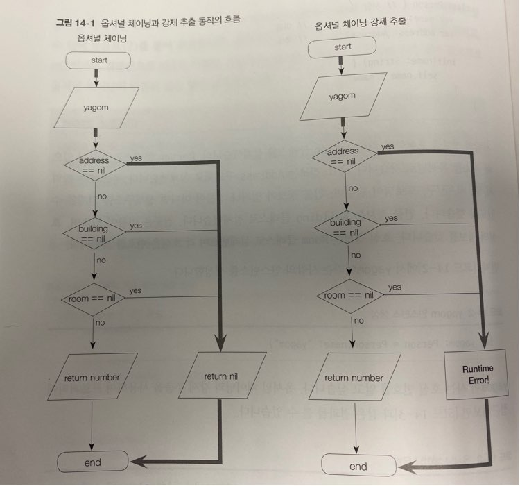

> 옵셔널은  스위프트의 특징 중 가장 안정성을 문법으로 담보하는 기능입니다. C 언어 및 objective-C에서는 찾아볼 수 없었던 콘셉트이기도 합니다 다음 아래와 같습니다.

옵셔널은 단어 뜻 그대로 '선택적인' 즉, 값이 '있을 수도, 없을 수도 있음'을 나타내는 표현입니다 <br>
이는 '변수나 상수 등에 꼭 값이 있다는 것을 보장할 수 없다. 즉, 변수 또는 상수의 값이 nil일 수도 있다'는 것을 의미합니다. <br>
라이브러리의 API 문서를 작성하거나 읽어본 사람은 문서에 `It can be NULL 또는 It can Not be NULL` 등의 부연설명을 본 적이 있을 겁니다. 그리고 전달인자로 NULL이 전달되어도 되는지 문서를 보기 전에는 알 수가 없습니다.<br>
그러나 스위프트에서는 옵셔널 하나만으로도 이 의미를 충분히 표현할 수 있기 때문에(문서에 명시하지 않아도) 문법적 표현만으로 모든 의미를 전달 할 수 있습니다.<br>
게다가 옵셔널과 옵셔널이 아닌 값은 철저히 다른 타입으로 인식 하기 때문에 오류에 걸러 내기도 합니다.

---

## 옵셔널 예제

옵셔널을 읽을 때 "해당 변수 또는 상수에는 값이 없을 수 있다. 즉, 변수 또는 상수가 nil일 수도 있으므로 사용에 주의하라" 뜻으로 직관적으로 받아들일 수 있습니다.<br>
값이 없는 옵셔널 변수 또는 상수에 접근하려면 런타임 오류가 발생합니다. 그렇게 되면 OS가 프로그램이 강제 종료시킬 확률이 높다.

```swift
//오류가 발생하는 nil 할당
var myName: String = "Youngsik"
myNmae= nil // 오류!
```

> nil은 옵셔널로 선언된 곳에서만 사용될 수 있습니다. 옵셔널 변수 또는 상수 등은 데이터 타입 뒤에 물음표(?)를 부텽 표현 해줍니다.


- 옵셔널 변수의 선언 및 nil 할당

```swift
var myName: String? = "Youngsik"

print(myName)
// 옵셔널 타입의 값을 print 함수를 통해 출력하면 Optional(youngsik이라고 출력되는 것이 정상입니다.
// 다만, 차후의 주석표현의 편의를 위하여 Optional()은 생략하고 값만 표기하도록 하겠습니다. 
//또, 옵셔널 타입을 print 함수의 매개변수로 전달하면 컴파일러 경고가 발생 할 수 있습ㄴ디ㅏ. 정상이므로 놀라지 않아도 된다.
```

위의 코드를 보면 `var myName: Optional<String>처럼  옵셔널을 조금 더 명확하게 써줄 수도 있습니다. 그러나 물음표를 붙여주는 것이 조금 더 편하고 일긱도 쉽기 때문에 굳이 긴 표현을 사용 하지는 않습니다.

## 옵셔널을 언제 사용할까?

`why!?` 왜 굳이 변수에 nil이 있음을 가정해야 할까요?
<br>

이 질문에 답할 수 있는 예로 우리가 만든 함수에 전달되는 전달인자의 값이 잘못된 값일 경우 제대로 처리하지 못했음을 nil을 반환하여 표현하는 것을 들 수 있다.
<br> 물론 기능상 심각한 오류라면 별도로 처리해야겠지만, 간단히 nil 반환해서 오류가 있음을 알릴 수 있다. <br>
또는, 매개 변수를 굳이 넘기지 않아도 된다는 뜻으로 매개변수의 타입을 옵셔널로 정의할 수 있습니다. <br>
스위프트 프로그래밍 하면서 매개변수가 옵셔널일 때 `TIP` "아, 이 매개변수에는 값이 없어도 되는구나" 라는 것을 API 문서를 보지 않고도 알아야 합니다. <br>
이렇게 물음표 하나만으로 훌륭하고 암묵적인 어플리케이션을 만들 수 있습니다. 

---

> 원시값을 통한 열거형 초기화

```swift
let primary = School(rawValue: "유치원") //  primary
let graduate = School(rawValue: "석박사") //nil

let one = Numbers(rawValue: 1) //ONE
let three = Numbers(rawValue: 3)// nil
```

> 옵션러 열거형의 정의
```swift
public enum Optional<Wrapped> : ExpressibleByNilLiteral{
    case none
    case some(Wrapped)
    public init(_ some: Wrapped)
    /// 중략...
}
```

여기서 알아야할 것은 옵셔널이 값을 갖는 케이스와 그렇지 못한 케이스 두 가지로 정의되어 있다는 것입니다. <br>즉, nil일 때는 none 케이스가 될 것이고, 값이 있는 경우는 some 케이스가 되는데 연관 값 값으로 Wrapped가 있습니다. 따라서 옵셔널에 값이 있으면 some의 연관 된 Wrapped에 값이 할당됩니다.
즉, 값이 옵셔널ㅇ이라는 열거형의 방패막에 보호되어 래핑되어 있는 모습이라는 것입니다.

<br>
옵셔널 자체가 열거형이기 때문에 옵셔널 변수는 `switch` 구문을 통해 값이 있고 없음을 확인 할 수 있다.

```swift
func checkOptionalValue(Value optionalValue: Any?){
  switch optionalValue{
    case .none:
     print("This Optional variable is nil")
    case .some(let value):
      print("Value is \(value)")
  }
}


var myName: String? = "youngsik"
checkOptionalValue(value: myName) // 

myName = nil
checkOptionalValue(value: myName)
```

여러 케이스의 조건틍 통해 검사하고자 한다면 더욱 유용하게 쓰일 수 있습니다.
그럴 땐 세련되게 where 절과 병합해서 쓰면 더욱 더 좋습니다.

```swift
let numbers: [Int?] = [2, nil, -4, nil, 100]

for number in numbers {
  switch number{
    case .some(let value) where value < 0:
      print("Negative value!! \(value)")
    case .some(let value) where value > 10:
      print("Large value!! \(value)")
    

    case .some(let value):
      print("Value \(value)")

    case .none:
      print("nil")
  }
}
```

> 이 방법보다 더 유용한 방법이 있는데 제 생각으론 너무 위험한 방법인 것 같습니다. `런타임 오류 가능성이 높다`

 - 강제 추출

 ```swift
var myName: String? = "youngsik"

// 옵셔널이 아닌 변수에는 옵션러 값이 들어갈수 있어! 추출해서 할당 해줄거다.
var youngsik: String = myName!

myName = nil
//youngsik = myName! //런타임 오류

// if 구 등 조건문을 이용해 조금 더 안전한 방법.

if myName != nil{
  print("my name is \(myName)")

} else{
  print("myName == nil")
}
 ```
 > 런타임 오류의 가능성을 항상 내포 하기 때문에 옵션러 강제 추출 방식은 사용하는 것을 지양해야 합니다.


---

스위프트는 조금 더 안잔하고 세련된 방법으로 옵셔널 바인딩을 제공합니다. <br>
옵서녈 바인딩은 옵셔널에 값이 있는지 확인할 때 사용합니다.
```swift
var myName: String? = "youngsik"

if let name = myName{
        print("My Name is \(name)")

} else{
    print(" myName == nil")
}
// My Name is youngsik

//옵셔널 바인딩을 통한 임시 변수 할당
if var name = myName{
    name = "wiz" // 변수이므로 내부에서 변경이 가능ㅎ
    print("My Name is \(name)")
} else {
    print("myName == nil")
}

// My Name is wiz
```
---


> 암시적 추출 옵셔널

때대로 nil을 할당하고 싶지만, 옵셔널 바인딩으로 매번 값을 추출하기 귀찮거나 로직상 nil 때문에 런타임 오류가 발생하지 않을 것 같다는 확신이 들 때 nil을 할당 해줄 수 있는 옵셔널이 아닌 변수나 상수가 있으면 좋을 겁니다. 이 때 사용하는 것이 바로 `암시적 추출 옵셔널`입니다.

<br>
옵셔널을 표시하고자 타입 뒤에 `물음표(?)`를 사용 했지만, 암시적 추출 옵셔널을 사용하려면 타입 뒤에 `느낌표(!)`를 사용해 주면 됩니다.

```swift
var myName: String! = "yuongsik"
print(myName)
myName = nil

//암시적 추출 옵셔널도 옵셔널이므로 당연히 바인딩을 사용할 수 있습니다.

if let name = myName{
  print("my Name is \(name)")
} else{
  print("myName == nil")
}
// myname == nil

myName.isEmpty // 오류

```
---

## Swift5_Book 레퍼런스 --> 옵셔널 체이닝과 빠른 종료 기입

> 옵셔널 체이닝이란?

 - 옵셔널에 속해 있는 nil일지도 모르는 프로퍼티, 메서드, 서브스크립션 등을 가져오거나 호출할 때 사용할 수 있는 일련의 과정이며 옵셔널 값이 있다면 프로퍼티, 메서드 서브스크립트 등을 호출 할 수 있고, 옵셔널이 nil이라면 프로퍼티, 메서드, 서브스크립트 등은 nil로 반환합니다.
 - 옵셔널을 반복 사용하여 옵셔널이 자전거 체인처럼 서로 꼬리를 물고 있는 모양이기 때문에 옵셔널 체이닝이라고 부릅니다. 또 다른 점은 옵셔널에서 값을 강제 추출해 반환하기 때문에 반환 값이 옵셔널이 아니라는 점입니다. 하지만 정말 100% `nil`이 아니라는 확신을 하더라도 사용을 지양하는 편이 좋습니다.


사람의 주소 정보 표현 설계

 ```swift
 
 class Room{ // 호실
var number: Int //호실번호

init(number: Int){
  self.number = number
}
}

class Building{ // 건물

 var name: String // 건물 이름
 var room: Room? // 호실 정보

 init(name: String) {
   self.name = name
 }
}
struct Address { // 주소
var province: String //광역시/도
var city: String // 시/군/구
var street: String // 도로명
var building: Building? // 건물
var detailAddress: String? // 건물 외 상세 주소
}

class Person{//사람
var name: String // 이름
var address: Address? //주소  
  init(name: String){
    self.name = name
  }
}
//현재 모든 클래스 및 구조체를 설계 했습니다.
 
// 인스턴스 생성

let youngsik: Person = Person(name: "Youngsik")

let youngsikRoomViaOptionalChaining: Int? = youngsik.address?.building?.room?.number // nil

let youngsikRoomViaOptionalUnwraping: Int = youngsik.address!.building!.room!.number // 오류 발생!!
 ```

 youngsik에는 아직 명확한 정보가 없습니다. `youngsikRoomViaOptionalChaining` 상수에 호실 번호를 할당하려고 옵셔널 체이닝을 사용하면 `youngsik`의 `address` 프로퍼티가 nil이므로 옵셔널 체이닝 도중 `nil`이 반환 됩니다. <br>
 그러나 `youngsikRoomViaOptionalUnwraping` 상수에 호실 번호를 할당할 때는 강제 추출을 시도 했기 떄문에 `nil`인 `address` 프로퍼티에 접근하려 할 때 런타임 오류 발생합니다.

 


> 옵셔널 바인딩 사용

 ```swift

 ```


 


