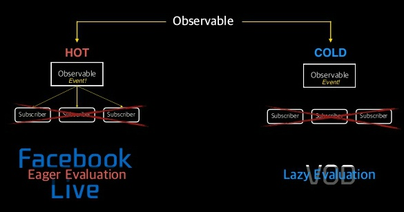

# RxSwift는 무엇일까요?

> Swift에서 반응형 프로그래밍을 하기 위한 라이브러리입니다.

- RxSwift의 핵심 요소는 (Observable, Data Flow) 2가지 있다.

### Observable란?

반응한다는 것을 구현하기 위해서 Swift에서도 Observer Patten을 사용합니다. 마찬가지로 RxSwift에서도 Observer와 유사한 Observable을 사용하고 있습니다.
- Observable은 HOT과 COLD 2가지 방식을 나뉩니다.

### HOT Observable란?

HOT Observable은 이벤트가 발생하면 그걸 구독하고 있는 Subscriber가 그 이벤트를 받을 수 있습니다. 
만약 Subscriber가 없을 경우 Observable의 이벤트가 발생하면 그래도 이벤트를 계속 발송하려고 합니다.
(예시 - Facebook Live, Youtube Live) 생방송 같은 경우 시청자가 없어도 계속 송출한다.
Eager Evaluation: 조급한 개선법

### COLD Observable란?

COLD Observable은 반면에 Subscriber가 없으면 이벤트를 전달하지 않습니다.
(예시 - VOD 다시보기 서비스) 보는 사람이 보고 싶지 않으면 송출하지 않는다.
Lazy Evaluation: 느긋한 개선법

---

# 왜 사용하면 좋을까?

- 1. 반응형 패러다임이 제공하는 명확함
 - 비동기를 동기화 된 것인양 작성할 수 있다.

- 2. 일관성이 없는 비동기 코드 해결
 - 어떤 곳에서는 DispatchQueue, 어떤 곳에서는 OperationQueue...
 - 하나의 비동기 코드로 개발이 가능.

- 3. 확장 불가능한 아키택처 패턴을 해결
 - 일관성 없는 비동기 코드를 작성하게 되어 서로 다르게 구현한 로직을 조합하거나 확장하기에 어려운 부분을 해결
 - Rx로 일관된 코드를 작성하면서 아키택처의 확장이 가능

- 4. 콜백지옥에서 벗어나기 좋음
 - UI이벤트, 네트워크 처리 및 데이터 갱신 등에서 콜백 지옥이나 이벤트 등록 후 추적, 스레드를 넘나들면서 작업 했던 경험이 있으시다면, 이제 RxSwift를 이용하여 가독성을 높이고 스레드를 쉽게 넘나들며 콜백 지옥을 탈출 할 수 있음.
 - [참고](https://www.youtube.com/watch?v=jCT-eUaD-d4) - Youtube 영상

- 5. Rx에겐 뭔가 특별한 것이 있다.
 - 위에서 언급한 라이브러리들과 용도나 동작은 같으나, Rx에는 뭔가 특별한 것이 있다. 그것이 바로 `Operator` 입니다.
 - `Async`하게 전달되는 데이터를 조작해서 사용하는 부분이 다른 비동기 유틸과 차별되는 부분이죠. 그리고 그 기능이 굉장히 다양하고 강력해서 이 부분을 어렵다고 느끼는 분들이 대다수입니다. 사실 이 부분을 대충 어떠한것들이 있는지 